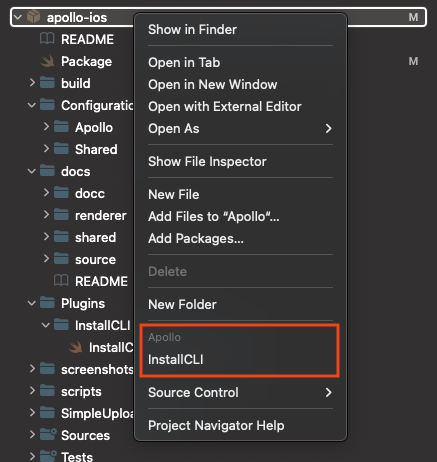

The Apollo iOS SPM package includes the Codegen CLI as an executable target. This ensures you always have a valid CLI version for your Apollo iOS version.

To simplify accessing the Codegen CLI, you can run the included `InstallCLI` SPM plugin.

This plugin builds the CLI and creates a symbolic link to the executable in your project root.

If you use Swift packages through Xcode, you can right-click on your project in the Xcode file explorer, revealing an **Install CLI** plugin command. Selecting this command presents a dialog allowing you to grant the plugin "write" access to your project directory.

After the plugin installs, it creates a symbolic link to the Codegen CLI (named `apollo-ios-cli`) in your project root folder. You can now run the CLI from the command line with `./apollo-ios-cli`.

> **Note:** Because the `apollo-ios-cli` in your project root is only a symbolic link, it only works if the compiled CLI executable exists. This is generally located in your Xcode Derived Data or the `.build` folder. If these are cleared, you can run the reinstall plugin to rebuild the CLI executable.
