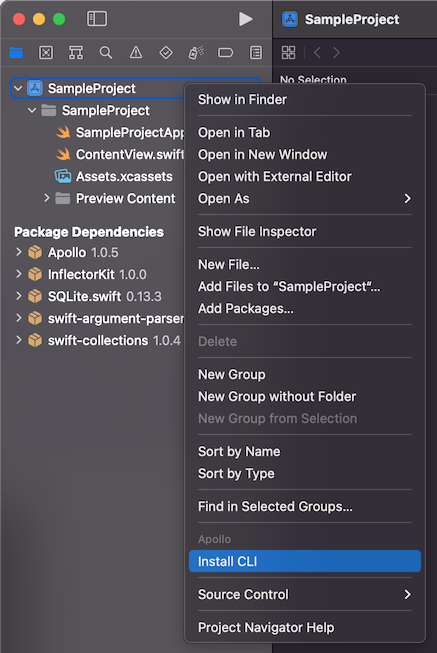

The Apollo iOS SPM package includes the Codegen CLI as an executable target. This ensures you always have a valid CLI version for your Apollo iOS version.

To simplify accessing the Codegen CLI, you can run the included `InstallCLI` SPM plugin.

This plugin builds the CLI and creates a sybmolic link to the executable in your project root.

When using a `Package.swift` file, install the CLI by running:

```bash
swift package --allow-writing-to-package-directory apollo-cli-install
```

When using Swift packages through Xcode, right-click on your project in the Xcode file explorer and at the bottom of the menu you will find the `InstallCLI` plugin command. Clicking on this will present a dialog asking for permission for the plugin to write to your project directory.



After running the installation plugin, a symbolic link to the Codegen CLI named `apollo-ios-cli` is located in your project root folder. You can now run the CLI from the command line with `./apollo-ios-cli`.

> **Note:** Because the `apollo-ios-cli` in your project root is only a symbolic link, it will only work if the compiled CLI exectuable exists. This is generally located in your Xcode Derived Data or the `.build` folder. If these are cleared, you can run the install plugin again to re-build the CLI executable.
