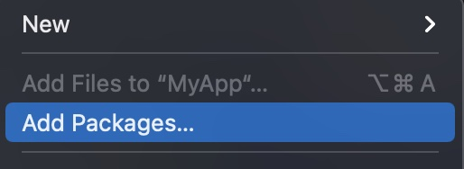
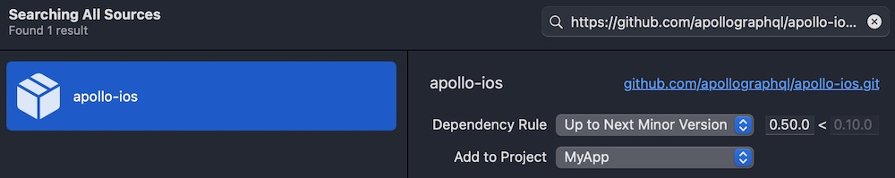
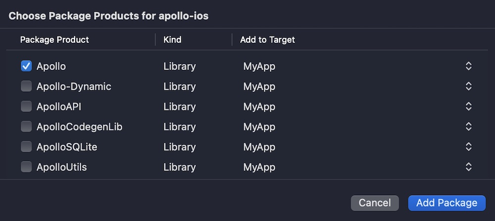

import {
  ExpansionPanel,
  ExpansionPanelList,
  ExpansionPanelListItem
} from 'gatsby-theme-apollo-docs';

<ExpansionPanel title="Swift Package Manager Installation">

> **Note:** These instructions use the Xcode 13 UI. Xcode 11 is the first version of Xcode that integrates Swift Package manager, whereas older versions require using the command line. If you're using an older version of Xcode, we recommend using CocoaPods instead.

<ExpansionPanelList>
<ExpansionPanelListItem number="1">

Go to **File > Add Packages...**

</ExpansionPanelListItem>
<ExpansionPanelListItem number="2">

In the dialog that appears, paste the URL of the Apollo iOS GitHub repo (`https://github.com/apollographql/apollo-ios.git`) into the search bar, then select the `apollo-ios` package that appears:

</ExpansionPanelListItem>
<ExpansionPanelListItem number="3">

Select which version you want to use ([see version history](https://github.com/apollographql/apollo-ios/releases)), then click **Add Package**. Note that Xcode might not automatically select the latest version number!

> Xcode automatically suggests the dependency rule `Up to Next Major`. We **strongly** suggest that until the release of Apollo iOS `1.x`, you select `Up To Next Minor` instead, because we might release breaking changes in a minor version.

</ExpansionPanelListItem>
<ExpansionPanelListItem number="4">

Select which packages you want to use. If you're getting started, we recommend selecting just the main `Apollo` library for now. You can always add other packages later if you need them.

> **Note:** Do **not** select the `Apollo-Dynamic` target. This target is only for  projects that link to Apollo iOS. Most projects do not need to do this.

Then, click **Add Package**.

</ExpansionPanelListItem>
<ExpansionPanelListItem number="check">
  You're done!
</ExpansionPanelListItem>
</ExpansionPanelList>

</ExpansionPanel>
