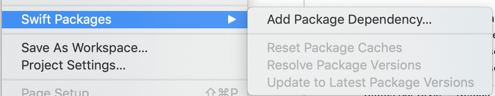
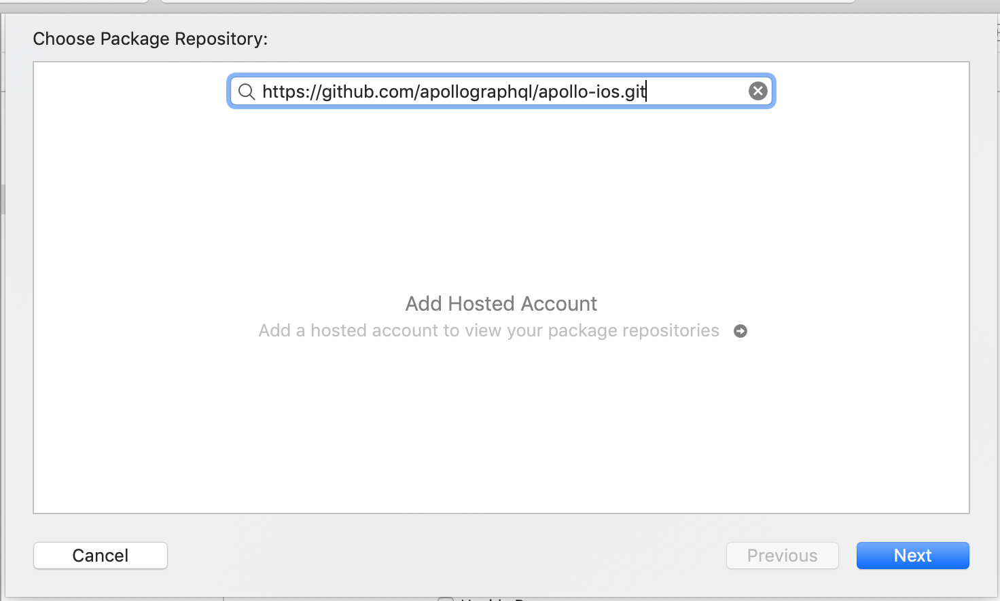
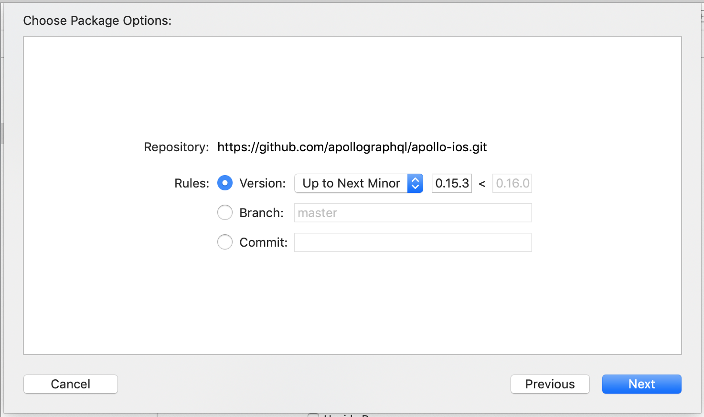

import {
  ExpansionPanel,
  ExpansionPanelList,
  ExpansionPanelListItem
} from 'gatsby-theme-apollo-docs';

<ExpansionPanel title="Swift Package Manager Installation">

**NOTE**: These instructions are intended for usage on Xcode 11 and higher. Xcode 11 is the first version of Xcode that integrates Swift Package manager and makes it _way_ easier to use than it was at the command line. If you are using older versions of Xcode, we recommend using CocoaPods.

<ExpansionPanelList>
<ExpansionPanelListItem number="1">

Go to **File > Swift Packages > Add Package Dependency...**

</ExpansionPanelListItem>
<ExpansionPanelListItem number="2">

Paste the URL to the Apollo iOS repo on GitHub ([https://github.com/apollographql/apollo-ios.git](https://github.com/apollographql/apollo-ios.git)) into the search bar, then hit the **Next** button: 

</ExpansionPanelListItem>
<ExpansionPanelListItem number="3">

Select what version you want to use, then hit next. Xcode will automatically suggest the current version `Up to Next Major`, we **strongly** suggest that while the iOS SDK is on a `0.x.x` version scheme, you select `Up To Next Minor` instead, as we will still be releasing breaking changes on minor versions:

</ExpansionPanelListItem>
<ExpansionPanelListItem number="4">
  
Select which packages you want to use. If you're just getting started, try selecting just the main `Apollo` library first - you can always come back and add the other packages later if you need them. Then hit finish.

</ExpansionPanelListItem>
<ExpansionPanelListItem number="check">
  You're done!
</ExpansionPanelListItem>
</ExpansionPanelList>

</ExpansionPanel>