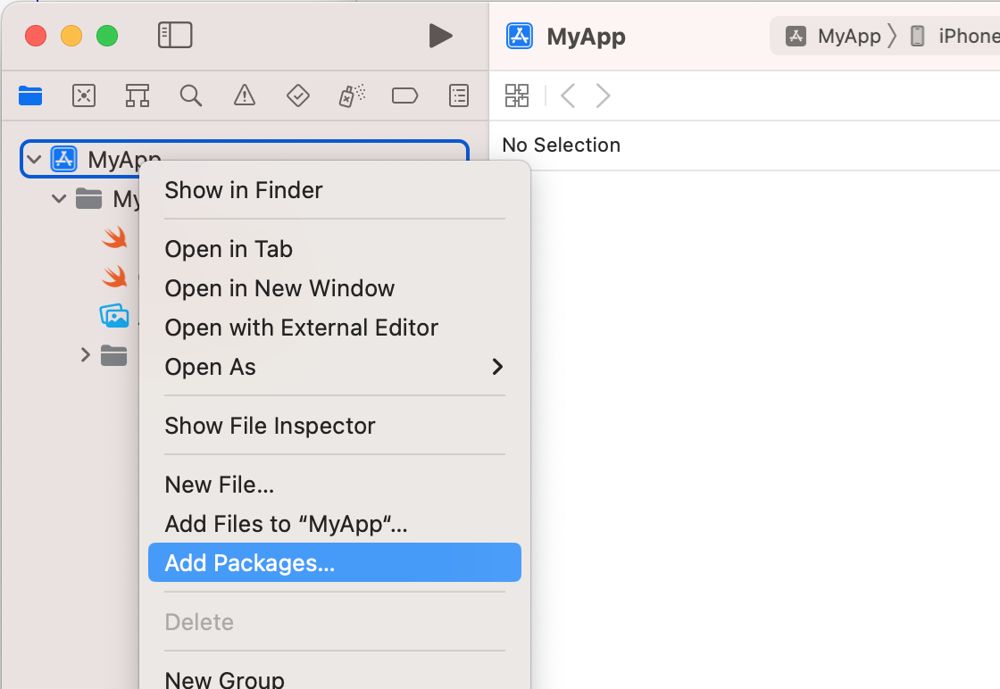
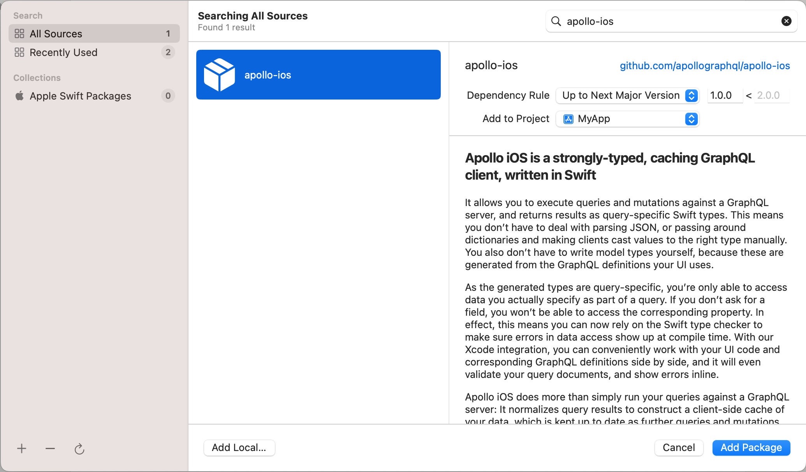
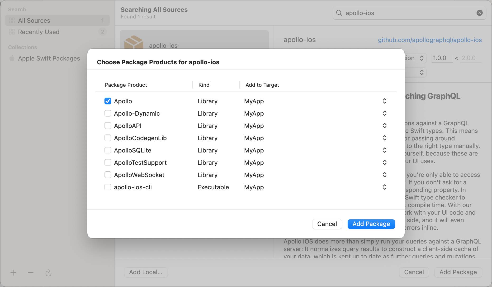

<ExpansionPanel title="SPM with Xcode Project">

If using Swift Package Manager within an Xcode project or workspace, use the Xcode project configuration UI to add the Apollo iOS package.

<ExpansionPanelList>
<ExpansionPanelListItem>

Go to **File > Add Packages...**

</ExpansionPanelListItem>
<ExpansionPanelListItem>

In the dialog that appears, paste the URL of the Apollo iOS GitHub repo (`https://github.com/apollographql/apollo-ios.git`) into the search bar, then select the `apollo-ios` package that appears:

</ExpansionPanelListItem>
<ExpansionPanelListItem>

Select which version you want to use ([see version history](https://github.com/apollographql/apollo-ios/releases)), then click **Add Package**.

> **Note:** Xcode might not automatically select the latest version number, please check.

</ExpansionPanelListItem>
<ExpansionPanelListItem>

Select which packages you want to use. If you're getting started, we recommend selecting just the main `Apollo` library for now. You can always add other packages later if you need them.

> **Note:** Do **not** select the `Apollo-Dynamic` target. This target is only for projects that link to Apollo iOS. Most projects do not need to do this.

Then, click **Add Package**.

</ExpansionPanelListItem>
<ExpansionPanelListItem>

You're done!

</ExpansionPanelListItem>
</ExpansionPanelList>

</ExpansionPanel>
