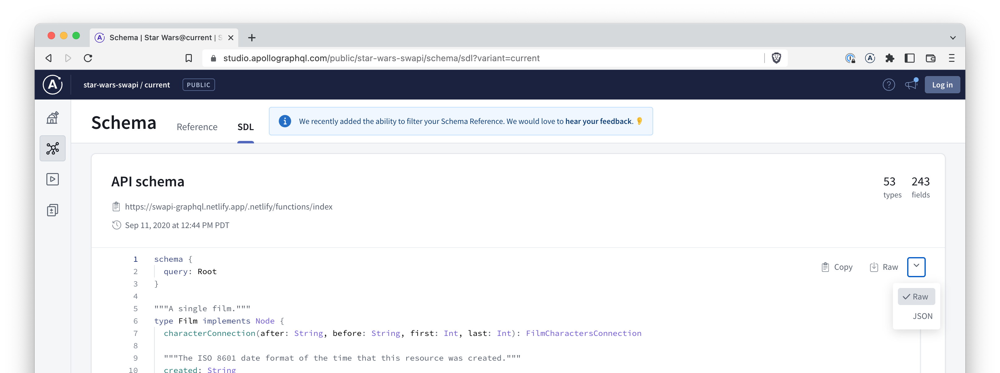

Apollo iOS requires a GraphQL schema file as input to its code generation process. You can provide your schema either in JSON format (most commonly the result of an introspection query) or in GraphQL SDL (Schema Definition Language).

> Conventionally, JSON files have the `.json` extension and SDL files use the `.graphqls` extension.

There are a few ways to download a GraphQL schema:

### 1. Apollo Studio

Apollo Studio is a cloud platform that helps you build, validate, and secure your organization's graph.

In the SDL view of the Schema tab of Apollo Studio there is a drop-down menu where you can download the linked schema in SDL or JSON format.

Below is a screenshot showing the [StarWars GraphQL API](https://studio.apollographql.com/public/star-wars-swapi/home?variant=current) in an Apollo Studio [public example](https://studio.apollographql.com/public/star-wars-swapi/schema/sdl?variant=current). On the right-hand side you can see the drop-down allowing downloads of both formats.

Please see the [documentation](https://www.apollographql.com/docs/studio/) for further details on how to use Apollo Studio.

### 2. Codegen CLI

The codegen CLI provides a convenient command-line tool for fetching a GraphQL schema and writing it to a file.

> See the documentation on the [`fetch-schema`](./codegen-cli#fetch-schema) command for details of how to use it.

The codegen CLI also supports fetching a GraphQL schema as an initial step in the code generation process. This automates fetching the schema and ensures you are always using the most up-to-date schema.

> See the documentation on the [`generate`](./codegen-cli#generate) command for details of how to use it.

The Apollo schema registry and GraphQL introspection are both supported as methods for downloading.

#### Apollo schema registry

The Apollo schema registry serves as a central hub for managing your graph. At its core, the schema registry is a version control system for schemas. It stores a schema's change history, tracking the types and fields that were added, modified, and removed. In order to fetch a schema from the schema registry using the codegen CLI you will need credentials detailed in [configuration](./codegen-configuration#1-apollo-server-registry).

#### GraphQL introspection

GraphQL introspection enables you to query a GraphQL server for information about the underlying schema. This includes data like types, fields, queries, mutations, and even the field-level descriptions.

> See the GraphQL spec for full details on the [introspection](https://spec.graphql.org/draft/#sec-Introspection) feature.

> Note: Many production servers disable introspection for security reasons. If your introspection query is failing check that it is not disabled.
