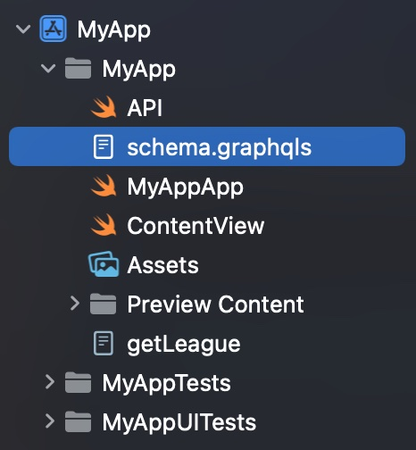

Apollo iOS requires a GraphQL schema file as input to its code generation process. You can provide your schema either as a JSON file (most commonly the result of an introspection query) or as a `.graphqls` file that uses GraphQL SDL syntax. Conventionally, this file is named `schema.json` or `schema.graphqls` (depending on its format), and you store it in the same folder as your project's `App`:



You can use the [Apollo CLI](https://www.apollographql.com/docs/devtools/cli/) to download a GraphQL schema by sending an introspection query to the server. If you've installed the CLI globally, you can use the following command to download your schema:

```sh
apollo schema:download --endpoint=http://localhost:8080/graphql schema.json
```

Note that if you're using the local version set up for codegen, you should use the same method you're using in the [Add a code generation build step](./installation/#5-add-a-code-generation-build-step) instructions to access that specific CLI. For example, if you're using CocoaPods, you can set it up like this to download your schema:

```bash
SCRIPT_PATH="${PODS_ROOT}/Apollo/scripts"
cd "${SRCROOT}/${TARGET_NAME}"
"${SCRIPT_PATH}"/run-bundled-codegen.sh schema:download --endpoint=http://localhost:8080/graphql schema.json
```

If needed, you can use the `header` option to add additional HTTP headers to the request. For example, to include an authentication token, use `--header "Authorization: Bearer <token>"`:

```sh
[your apollo version] schema:download --endpoint=http://localhost:8080/graphql --header="Authorization: Bearer <token>"
```
