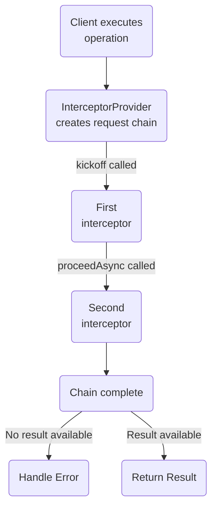
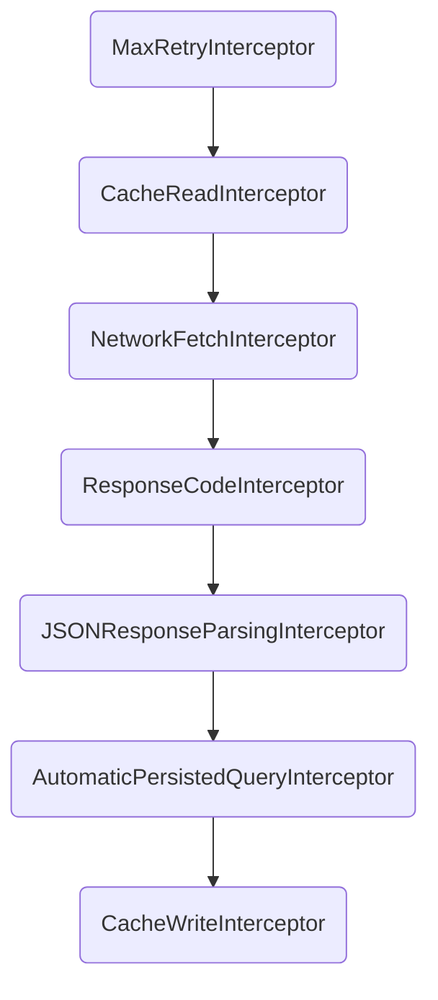

import {ExpansionPanel} from 'gatsby-theme-apollo-docs';

Before you can execute GraphQL operations in your app, you need to initialize an `ApolloClient` instance.

## Basic client creation

In most cases, you can create a single shared instance of `ApolloClient` and point it at your GraphQL server. The recommended way to do this is to create a singleton like so:

```swift
import Foundation
import Apollo

class Network {
  static let shared = Network()

  private(set) lazy var apollo = ApolloClient(url: URL(string: "http://localhost:4000/graphql")!)
}
```

Under the hood, this creates a client using the default network transport (`RequestChainNetworkTransport`) and default configuration. You can then use this client from anywhere in your code with `Network.shared.apollo`.

> You should use this initializer unless you need to customize your client's network communication, such as to enable subscription operations.

## Advanced client creation

For advanced use cases, you can use a different `ApolloClient` initializer that enables you to customize your client's network transport:

```swift
public init(networkTransport: NetworkTransport,
            store: ApolloStore)
```

Apollo iOS provides the following classes that conform to the [`NetworkTransport` protocol](https://github.com/apollographql/apollo-ios/blob/main/Sources/Apollo/NetworkTransport.swift):

| Class | Description |
|-------|-------------|
| `RequestChainNetworkTransport` | Passes a request through a chain of interceptors that can interact with the request both before and after it's transmitted. Uses standard HTTP requests to communicate with the server. |
| `WebSocketTransport` | Transmits _all_ GraphQL operations via WebSocket. Requires the `Apollo/WebSocket` sub-spec. |
| `SplitNetworkTransport` | Transmits subscription operations via WebSocket and other operations via HTTP. Requires the `Apollo/WebSocket` sub-spec. |

> For more information on `WebSocketTransport` and `SplitNetworkTransport`, see [Subscriptions](/subscriptions/).

## Using `RequestChainNetworkTransport`

Most `ApolloClient` instances use the `RequestChainNetworkTransport` to execute GraphQL operations on a remote server. Appropriately, this network transport uses a structure called a **request chain** (covered below) to process each operation in individual steps.

### Initializer options

The initializer for `RequestChainNetworkTransport` accepts the following properties, which provide you with fine-grained control of your HTTP requests and responses:

<table class="field-table api-ref">
  <thead>
    <tr>
      <th>Name /<br/>Type</th>
      <th>Description</th>
    </tr>
  </thead>

<tbody>
<tr class="required">
<td>

##### `interceptorProvider`

`InterceptorProvider`
</td>
<td>

**Required.** The interceptor provider to use when constructing a [request chain](#understanding-request-chains). See below for details on interceptor providers.
</td>
</tr>

<tr class="required">
<td>

##### `endpointURL`

`URL`
</td>
<td>

**Required.** The GraphQL endpoint URL to use for all operations.
</td>
</tr>

<tr>
<td>

##### `additionalHeaders`

`Dictionary`
</td>
<td>

Any additional HTTP headers that should be added to **every** request, such as an API key or a language setting.

If a header should only be added to _certain_ requests, or if its value might differ between requests, you should add that header in an interceptor instead.

The default value is an empty dictionary.
</td>
</tr>


<tr>
<td>

##### `autoPersistQueries`

`Bool`
</td>
<td>

If `true`, Apollo iOS uses [Automatic Persisted Queries](https://www.apollographql.com/docs/apollo-server/performance/apq/) (APQ) to send an operation's hash instead of the full operation body by default.

**Note:** To use APQ, make sure to generate your types with operation identifiers. In your Swift Script, make sure to pass a non-`nil` `operationIDsURL` to have this output. Also make sure you're using the `AutomaticPersistedQueryInterceptor` in your chain after a network request has come back to handle known APQ errors.

The default value is `false`.
</td>
</tr>


<tr>
<td>

##### `requestBodyCreator`

`RequestBodyCreator`
</td>
<td>

The `RequestBodyCreator` object to use to build your `URLRequest`s.

The default value is an `ApolloRequestBodyCreator` initialized with the default configuration.
</td>
</tr>


<tr>
<td>

##### `useGETForQueries`

`Bool`
</td>
<td>

If `true`, Apollo iOS sends all query operations using `GET` instead of `POST`. Mutation operations always use `POST`.

This can improve performance if your GraphQL server uses a CDN (Content Delivery Network) to cache the results of queries that rarely change.

The default value is `false`.
</td>
</tr>


<tr>
<td>

##### `useGETForPersistedQueryRetry`

`Bool`
</td>
<td>

If `true`, Apollo iOS sends a full query operation using `GET` instead of `POST` after the GraphQL server reports that an APQ hash is not available in its cache.

The default value is `false`.
</td>
</tr>
</tbody>
</table>

## Understanding request chains

A **request chain** contains an array of **interceptors** that run in order for a given GraphQL operation. One interceptor might add custom HTTP headers to a request, while the next might be responsible for actually _sending_ the request over HTTP and handling the response.

When an operation is executed, an object called an ** `InterceptorProvider`** generates a `RequestChain` for the operation. Then, `kickoff` is called on the `RequestChain`, which runs the first interceptor in the chain:



Interceptors can perform arbitrary, asynchronous logic on any thread. When an interceptor finishes running, it calls `proceedAsync` on the `RequestChain`, which advances to the next interceptor.

By default when the last interceptor in the chain finishes, if you have a parsed result available, this result is returned to the caller. Otherwise, error-handling logic is called.

**Each request has its own short-lived `RequestChain`.** This means that the array of interceptors can differ for each operation.

### Default `RequestChain`

If you provide a `DefaultInterceptorProvider` to your `RequestChainNetworkTransport` initializer (or use the `ApolloClient` initializer in [Basic client creation](#basic-client-creation)), Apollo iOS uses the following `RequestChain` for _every_ operation, as shown in the [source](https://github.com/apollographql/apollo-ios/blob/57c07f1fa046b98ce86107ebacb521dd7cd9855c/Sources/Apollo/DefaultInterceptorProvider.swift#L30-L40):

<ExpansionPanel title="Click to expand">



</ExpansionPanel>

> These built-in interceptors are described [below](#available-interceptors).

If you [define a custom `InterceptorProvider`](#creating-an-interceptorprovider), it should almost always return a `RequestChain` that uses a similar structure to the default, but that includes additions or modifications as needed for particular operations.

## Creating an `InterceptorProvider`

When Apollo iOS uses a `RequestChainNetworkTransport`, each operation is passed to an `InterceptorProvider`. An object conforming to this protocol creates the request chain of interceptors for the operation based on its details.

Interceptors themselves are designed to be **short-lived**. A new set of interceptors should be provided for each request in order to avoid having multiple calls hitting the same instance of a single interceptor at the same time.

Holding references to individual interceptors (outside of test verification) is generally not recommended. Instead, you can create an interceptor that holds on to a longer-lived object, and the provider can pass this object into each new set of interceptors. That way an interceptor itself can be easily disposable, but you don't have to recreate the underlying object doing heavier work.

`DefaultInterceptorProvider` is a default implementation of an interceptor provider. It works with our existing parsing and caching system and tries to replicate the experience of using the old `HTTPNetworkTransport` as closely as possible. It takes a `URLSessionClient` and an `ApolloStore` to pass into the interceptors it uses. **This is the provider that developers will want to use at this time.** You can also sublcass this interceptor provider if you only need to insert interceptors at the beginning or end of the chain rather than intersperse them throughout.

If you wish to make your own `InterceptorProvider` instead of using the provided one, you can take advantage of several interceptors that are included in the library:

### Available interceptors

Apollo iOS provides a collection of built-in interceptors you can use in your `RequestChain`:

<table class="field-table api-ref">
  <thead>
    <tr>
      <th>Name</th>
      <th>Description</th>
    </tr>
  </thead>

<tbody>
<tr>
<td colspan="2">

**Pre-network**
</td>
</tr>

<tr>
<td>

##### `MaxRetryInterceptor`

[View source](https://github.com/apollographql/apollo-ios/blob/main/Sources/Apollo/MaxRetryInterceptor.swift)
</td>
<td>

Enforces a maximum number of retries for a GraphQL operation that initially fails (default three retries).
</td>
</tr>

<tr>
<td>

##### `CacheReadInterceptor`

[View source](https://github.com/apollographql/apollo-ios/blob/main/Sources/Apollo/CacheReadInterceptor.swift)
</td>
<td>

Reads data from the Apollo iOS cache _before_ an operation is executed on the server, according to that operation's `cachePolicy`.

If cached data is found that fully resolves the operation, that data is returned. The request chain then continues or terminates according to the operation's `cachePolicy`.
</td>
</tr>

<tr>
<td colspan="2">

**Network**
</td>
</tr>

<tr>
<td>

##### `NetworkFetchInterceptor`

[View source](https://github.com/apollographql/apollo-ios/blob/main/Sources/Apollo/NetworkFetchInterceptor.swift)
</td>
<td>

Takes a URLSessionClient and uses it to send the prepared HTTPRequest (or subclass thereof) to the GraphQL server.

If you're sending operations over the network, your `RequestChain` requires this interceptor (or a custom interceptor that handles network communication).

</td>
</tr>

<tr>
<td colspan="2">

**Post-network**
</td>
</tr>


<tr>
<td>

##### `ResponseCodeInterceptor`

[View source](https://github.com/apollographql/apollo-ios/blob/main/Sources/Apollo/ResponseCodeInterceptor.swift)
</td>
<td>

For unsuccessfully executed operations, checks the response code of the GraphQL server's HTTP response and passes it to the `RequestChain`'s `handleErrorAsync` callback.

Note that most errors at the GraphQL level are returned with a `200` status code and information in the `errors` array (per the [GraphQL spec](https://spec.graphql.org/October2021/#sec-Response-Format)). This interceptor helps with server-level errors (such as `500`s) and errors that are returned by middleware.

For more information, see [this article on error handling in GraphQL](https://medium.com/@sachee/200-ok-error-handling-in-graphql-7ec869aec9bc).

</td>
</tr>

<tr>
<td>

##### `AutomaticPersistedQueryInterceptor`

[View source](https://github.com/apollographql/apollo-ios/blob/main/Sources/Apollo/AutomaticPersistedQueryInterceptor.swift)
</td>
<td>

Checks a GraphQL server's response _after_ execution to see whether the provided APQ hash for the operation was successfully found by the server. If it _wasn't_, the interceptor restarts the chain and the operation is retried with the full query string.

</td>
</tr>

<tr>
<td>

##### `JSONResponseParsingInterceptor`

[View source](https://github.com/apollographql/apollo-ios/blob/main/Sources/Apollo/JSONResponseParsingInterceptor.swift)
</td>
<td>

Parses a GraphQL server's JSON response into a `GraphQLResult` object and attaches it to the `HTTPResponse`.

</td>
</tr>

<tr>
<td>

##### `CacheWriteInterceptor`

[View source](https://github.com/apollographql/apollo-ios/blob/main/Sources/Apollo/CacheWriteInterceptor.swift)
</td>
<td>

Writes response data to the Apollo iOS cache _after_ an operation is executed on the server, according to that operation's `cachePolicy`.

</td>
</tr>


</tbody>
</table>

#### The "additional error interceptor"

An `InterceptorProvider` can optionally provide an `additionalErrorInterceptor` that's called before an error is returned to the caller. This is mostly useful for logging and tracing errors. This interceptor must conform to the [`ApolloErrorInterceptor` protocol](https://github.com/apollographql/apollo-ios/blob/main/Sources/Apollo/ApolloErrorInterceptor.swift).

The `additionalErrorInterceptor` is _not_ part of the request chain. Instead, any other interceptor can invoke this interceptor by calling `chain.handleErrorAsync`.

Note that for _expected_ errors with a clear resolution (such as renewing an expired authentication token), you should define an interceptor _within_ your request chain that can resolve the issue and retry the operation.

### Other stuff

If you want to directly return a value to the caller, call `returnValueAsync`. If you want to have the chain return an error, call `handleErrorAsync`. Both of these methods will call your completion block on the queue specified when creating the `RequestChain`.

Note that calling `returnValue` does **NOT** forbid calling `handleError` - or calling each more than once. For example, if you want to return data from the cache to the UI while a network fetch executes, you'd want to make sure that `returnValueAsync` was called twice.

The chain also includes a `retry` mechanism, which will go all the way back to the first interceptor in the chain, then start running through the interceptors again.

**IMPORTANT**: Do not call `retry` blindly. If your server is returning 500s or if the user has no internet, this will create an infinite loop of requests that are retrying (especially if you're not using something like the `MaxRetryInterceptor` to limit how many retries are made). This **will** kill your user's battery, and might also run up the bill on their data plan. Make sure to only request a retry when there's something your code can actually do about the problem!

### Setting up `ApolloInterceptor` chains with `InterceptorProvider`


#### Post-Network


- `JSONResponseParsingInterceptor` parses code generated by our current Typescript-based code generation.


### The URLSessionClient class

Since `URLSession` only supports use in the background using the delegate-based API, we have created our own `URLSessionClient` which handles the basics of setup for that.

One thing to be aware of: Because setting up a delegate is only possible in the initializer for `URLSession`, you can only pass in a `URLSessionConfiguration`, **not** an existing `URLSession`, to this class's initializer.

By default, instances of `URLSessionClient` use `URLSessionConfiguration.default` to set up their URL session, and instances of `DefaultInterceptorProvider` use the default initializer for `URLSessionClient`.

The `URLSessionClient` class and most of its methods are `open` so you can subclass it if you need to override any of the delegate methods for the `URLSession` delegates we're using or you need to handle additional delegate scenarios.

### Example Advanced Client Setup

Here's a sample how to use an advanced client with some custom interceptors. This code assumes you've got the following classes in your own code (**these are not part of the Apollo library**):

- **`UserManager`** to check whether the user is logged in, perform associated checks on errors and responses to see if they need to renew their token, and perform that renewal
- **`Logger`** to handle printing logs based on their level, and which supports `.debug`, `.error`, or `.always` log levels.

#### Example interceptors

##### Sample `UserManagementInterceptor`

An interceptor which checks if the user is logged in and then renews the user's token if it is expired asynchronously before continuing the chain, using the above-mentioned `UserManager` class:

```swift
import Apollo

class UserManagementInterceptor: ApolloInterceptor {

    enum UserError: Error {
        case noUserLoggedIn
    }

    /// Helper function to add the token then move on to the next step
    private func addTokenAndProceed<Operation: GraphQLOperation>(
        _ token: Token,
        to request: HTTPRequest<Operation>,
        chain: RequestChain,
        response: HTTPResponse<Operation>?,
        completion: @escaping (Result<GraphQLResult<Operation.Data>, Error>) -> Void) {

        request.addHeader(name: "Authorization", value: "Bearer \(token.value)")
        chain.proceedAsync(request: request,
                           response: response,
                           completion: completion)
    }

    func interceptAsync<Operation: GraphQLOperation>(
        chain: RequestChain,
        request: HTTPRequest<Operation>,
        response: HTTPResponse<Operation>?,
        completion: @escaping (Result<GraphQLResult<Operation.Data>, Error>) -> Void) {

        guard let token = UserManager.shared.token else {
            // In this instance, no user is logged in, so we want to call
            // the error handler, then return to prevent further work
            chain.handleErrorAsync(UserError.noUserLoggedIn,
                                   request: request,
                                   response: response,
                                   completion: completion)
            return
        }

        // If we've gotten here, there is a token!
        if token.isExpired {
            // Call an async method to renew the token
            UserManager.shared.renewToken { [weak self] tokenRenewResult in
                guard let self = self else {
                    return
                }

                switch tokenRenewResult {
                case .failure(let error):
                    // Pass the token renewal error up the chain, and do
                    // not proceed further. Note that you could also wrap this in a
                    // `UserError` if you want.
                    chain.handleErrorAsync(error,
                                           request: request,
                                           response: response,
                                           completion: completion)
                case .success(let token):
                    // Renewing worked! Add the token and move on
                    self.addTokenAndProceed(token,
                                            to: request,
                                            chain: chain,
                                            response: response,
                                            completion: completion)
                }
            }
        } else {
            // We don't need to wait for renewal, add token and move on
            self.addTokenAndProceed(token,
                                    to: request,
                                    chain: chain,
                                    response: response,
                                    completion: completion)
        }
    }
}
```

##### Sample `RequestLoggingInterceptor`

An interceptor which logs the outgoing request using the above-mentioned `Logger` class, then moves on:

```swift
import Apollo

class RequestLoggingInterceptor: ApolloInterceptor {

    func interceptAsync<Operation: GraphQLOperation>(
        chain: RequestChain,
        request: HTTPRequest<Operation>,
        response: HTTPResponse<Operation>?,
        completion: @escaping (Result<GraphQLResult<Operation.Data>, Error>) -> Void) {

        Logger.log(.debug, "Outgoing request: \(request)")
        chain.proceedAsync(request: request,
                           response: response,
                           completion: completion)
    }
}
```

##### Sample `‌ResponseLoggingInterceptor`

An interceptor using the above-mentioned `Logger` which logs the incoming response if it exists, and moves on.

Note that this is an example of an interceptor which can both proceed **and** throw an error - we don't necessarily want to stop processing if this was set up in the wrong place, but we do want to know about it.

```swift
import Apollo

class ResponseLoggingInterceptor: ApolloInterceptor {

    enum ResponseLoggingError: Error {
        case notYetReceived
    }

    func interceptAsync<Operation: GraphQLOperation>(
        chain: RequestChain,
        request: HTTPRequest<Operation>,
        response: HTTPResponse<Operation>?,
        completion: @escaping (Result<GraphQLResult<Operation.Data>, Error>) -> Void) {

        defer {
            // Even if we can't log, we still want to keep going.
            chain.proceedAsync(request: request,
                               response: response,
                               completion: completion)
        }

        guard let receivedResponse = response else {
            chain.handleErrorAsync(ResponseLoggingError.notYetReceived,
                                   request: request,
                                   response: response,
                                   completion: completion)
            return
        }

        Logger.log(.debug, "HTTP Response: \(receivedResponse.httpResponse)")

        if let stringData = String(bytes: receivedResponse.rawData, encoding: .utf8) {
            Logger.log(.debug, "Data: \(stringData)")
        } else {
            Logger.log(.error, "Could not convert data to string!")
        }
    }
}
```

#### Example Custom Interceptor Provider

This `InterceptorProvider` uses all of the interceptors that (as of this writing) are in the `DefaultInterceptorProvider`, interspersed at the appropriate points with the sample interceptors created above:

```swift
import Foundation
import Apollo

struct NetworkInterceptorProvider: InterceptorProvider {

    // These properties will remain the same throughout the life of the `InterceptorProvider`, even though they
    // will be handed to different interceptors.
    private let store: ApolloStore
    private let client: URLSessionClient

    init(store: ApolloStore,
         client: URLSessionClient) {
        self.store = store
        self.client = client
    }

    func interceptors<Operation: GraphQLOperation>(for operation: Operation) -> [ApolloInterceptor] {
        return [
            MaxRetryInterceptor(),
            CacheReadInterceptor(store: self.store),
            UserManagementInterceptor(),
            RequestLoggingInterceptor(),
            NetworkFetchInterceptor(client: self.client),
            ResponseLoggingInterceptor(),
            ResponseCodeInterceptor(),
            JSONResponseParsingInterceptor(cacheKeyForObject: self.store.cacheKeyForObject),
            AutomaticPersistedQueryInterceptor(),
            CacheWriteInterceptor(store: self.store)
        ]
    }
}
```

#### Example Network Singleton Setup

This is the equivalent of what you'd set up in the [Basic Client Creation](#basic-client-creation) section, and what you'd call into from your application.

```swift
import Foundation
import Apollo

class Network {
  static let shared = Network()

  private(set) lazy var apollo: ApolloClient = {
      // The cache is necessary to set up the store, which we're going to hand to the provider
      let cache = InMemoryNormalizedCache()
      let store = ApolloStore(cache: cache)

      let client = URLSessionClient()
      let provider = NetworkInterceptorProvider(store: store, client: client)
      let url = URL(string: "https://apollo-fullstack-tutorial.herokuapp.com/graphql")!

      let requestChainTransport = RequestChainNetworkTransport(interceptorProvider: provider,
                                                               endpointURL: url)


      // Remember to give the store you already created to the client so it
      // doesn't create one on its own
      return ApolloClient(networkTransport: requestChainTransport,
                          store: store)
  }()
}
```


An example of setting up a client which can handle web sockets and subscriptions is included in the [subscription documentation](subscriptions/#sample-subscription-supporting-initializer).
