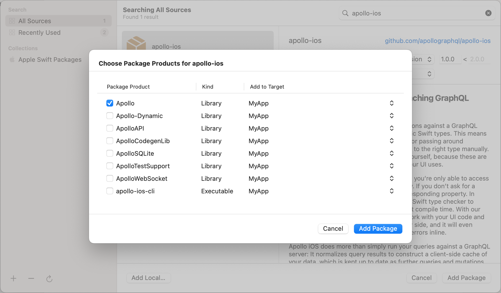

Apollo iOS requires the latest Xcode, which can be installed from the [Mac App Store](http://appstore.com/mac/apple/xcode).

Follow along with these steps (described in detail below) to use Apollo iOS in your app:

1. Install the Apollo framework into your project and link it to your application target
1. Add a schema file to your target directory
1. (optional) Install the Xcode add-ons to get syntax highlighting for your `.graphql` files 
1. Create `.graphql` files with your queries or mutations and add them to your target
1. Add a code generation build step to your target
1. Build your target
1. Add the generated API file to your target

## Installing the Apollo framework

You can install `Apollo.framework` into your project using [Swift Package Manager](#swift-package-manager-installation), [CocoaPods](#cocoapods-installation), [Carthage](#carthage-installation), or by [manually integrating it with Xcode](#manual-integration).

### Swift Package Manager Installation

> **NOTE**: These instructions are intended for usage on Xcode 11 and higher. Xcode 11 is the first version of Xcode that integrates Swift Package manager and makes it _way_ easier to use than it was at the command line. If you are using older versions of Xcode, we recommend using [CocoaPods](#cocoapods-installation)

1. Go to **File > Swift Packages > Add Package Dependency... **

  

1. Paste the URL to the Apollo iOS repo on GitHub ([https://github.com/apollographql/apollo-ios.git](https://github.com/apollographql/apollo-ios.git)) into the search bar, then hit the **Next** button: 

  

1. Select what version you want to use, then hit next. Xcode will automatically suggest the current version `Up to Next Major`, we **strongly** suggest that while the iOS SDK is on a `0.x.x` version scheme, you select `Up To Next Minor` instead, as we will still be releasing breaking changes on minor versions:

  
  
1. Select which packages you want to use. If you're just getting started, try selecting just the main `Apollo` library first - you can always come back and add the other packages later if you need them. Then hit finish.

  

### CocoaPods Installation

 1. Because Apollo iOS has been written using Swift 5, you need to use version `1.7.0` or higher. You can install CocoaPods using:

 ```sh
 gem install cocoapods
 ```

 1. Add `pod "Apollo"` to your Podfile.
  - If you also want to use the `ApolloSQLite` framework, also add `pod "Apollo/SQLite"`
  - If you also want to use the `ApolloWebSocket` framework, also add `pod "Apollo/WebSocket"`

 1. Run `pod install`.

 1. Use the `.xcworkspace` file generated by CocoaPods to work on your project.

### Carthage Installation

Since Carthage [does not allow choosing which schemes in a repo to build](https://github.com/Carthage/Carthage/issues/1874), we've moved our dependencies to a [`Cartfile.private`](https://github.com/apollographql/apollo-ios/blob/master/Cartfile.private) file so that those dependencies are not forced on people using only the `Apollo` framework and not either of our optional frameworks, `ApolloSQLite` or `ApolloWebSocket`. 

This makes setup a hair more complicated if you *are* using those, but is a big help in preventing dependency conflicts if you're not. 

1. Add `github "apollographql/apollo-ios"` to your Cartfile. 
  - If you also plan on using the `ApolloSQLite` framework, you should also add `github "stephencelis/SQLite.swift"`. You may want to lock it to the version specified in `Cartfile.private` to prevent dependency conflicts. 
  - If you also plan on using the `ApolloWebSocket` framework, you should also add `github "daltoniam/Starscream"`. You may want to lock it to the version specified in `Cartfile.private` to prevent dependency conflicts.

1. Run `carthage update --platform ios` (or `--platform ios,macos` to build both Mac and iOS). **NOTE:** There's an issue with Carthage that has been causing [some frustration](https://github.com/apollographql/apollo-ios/issues/386) for folks trying to build for watch and tvOS - don't build those targets if you don't need to. 

1. Drag and drop `Apollo.framework` from the appropriate `Carthage/Build/iOS` or `Carthage/Build/Mac` folder to the **Embedded Binaries** section of your application target's **General** settings tab. This should also cause them to appear in the **Linked Frameworks And Libraries** section automatically.
  - If you also plan on using the `ApolloSQLite` library, also drag `ApolloSQLite.framework` and `SQLite.framework` to this area as well.
  - If you also plan on using the `ApolloWebSocket` library, also drag `ApolloWebSocket.framework` and `Starscream.framework` to this area as well.

1. On your application target's **Build Phases** settings tab, click the **+** icon and choose **New Run Script Phase**. Create a Run Script in which you specify your shell (ex: `bin/sh`), add the following contents to the script area below the shell:

 ```sh
 /usr/local/bin/carthage copy-frameworks
 ```

 and add the paths to the frameworks you want to use under **Input Files**, e.g.:

 ```
 $(SRCROOT)/Carthage/Build/iOS/Apollo.framework
 ```
 
 Again, if you're adding `ApolloSQLite` or `ApolloWebSocket`, please make sure to add the other frameworks you added as Input Files. 
 
 This script works around an [App Store submission bug](http://www.openradar.me/radar?id=6409498411401216) triggered by universal binaries and ensures that necessary bitcode-related files and dSYMs are copied when archiving.

### Manual Integration

You can also manually clone the [`apollo-ios` repository](https://github.com/apollostack/apollo-ios), drag `Apollo.xcodeproj` into your project or workspace, add a dependency on `Apollo.framework` to your target.

## Adding a schema file to your target directory

You'll have to copy or [download a schema](/downloading-schema/) to your target's directory before generating code.

Apollo iOS requires a GraphQL schema file as input to the code generation process. A schema file is a JSON file that contains the results of an an introspection query. Conventionally this file is called `schema.json`.

Note that you need to add this in the folder where most of your code is, NOT in the same folder where the `.xcodeproj` and/or `.xcworkspace` are located. Here is a rough ASCII representation of what this should look like: 

```
| - your_project_folder
    | your_project.xcodeproj
    | - your_target_folder 
        | schema.json
        | AppDelegate.swift
        | ViewController.swift
        | etc...
    | - another_target_folder
        | etc...
```

> **NOTE:** You _can_ add this file someplace else, but if you do, you will need to update the relative paths in the scripts in the steps below. 

## [Optional] Installing the Xcode add-ons to get syntax highlighting

1. Clone the [`xcode-apollo` repository](https://github.com/apollostack/xcode-apollo) to your computer.
1. Close Xcode if it is currently running.
1. You may need to create these folders inside of `~/Library/Developer/Xcode`:

 `mkdir ~/Library/Developer/Xcode/Plug-ins ~/Library/Developer/Xcode/Specifications`

1. Copy `GraphQL.ideplugin` to `~/Library/Developer/Xcode/Plug-ins`.

 `cp -R GraphQL.ideplugin ~/Library/Developer/Xcode/Plug-ins`

1. Copy `GraphQL.xclangspec` to `~/Library/Developer/Xcode/Specifications`.

 `cp -R GraphQL.xclangspec ~/Library/Developer/Xcode/Specifications`

You may receive a warning the first time you start up Xcode after installing these add-ons - once you agree to load the plugin, you will no longer see this warning. 


## Creating `.graphql` files with your queries or mutations

Apollo iOS will generate code from queries and mutations contained in `.graphql` files in your target.

A useful convention is to colocate queries, mutations or fragments with the Swift code that uses them by creating `<name>.graphql` next to `<name>.swift`.

If you have the Xcode add-ons installed, you can use the Xcode companion view to show a `.swift` file and the corresponding `.graphql` file side by side.

> NOTE: If you don't have pre-existing `.graphql` files in your file tree, create a very simple query and add it to a `.graphql` file in your file tree so that when you run the code generation build step, it actually finds something. If you don't, you'll get the error `No operations or fragments found to generate code for`. 

## Adding a code generation build step

Code generation uses your `.graphql` files to generate API code that will help you send queries, subscriptions, and mutations, as well as parse and cache responses. To run code generation as part of the Xcode build process, you need to create a build step that runs before "Compile Sources" to invoke a wrapper script. 

The wrapper will call through to the included binaries and files that constitute the `apollo` command-line interface. This ensures that you can use our tooling without having to worry about NPM Version Hell™, and that the version of the framework you're using is compatible with the version of the codegen you're using.

The location of this wrapper script is slightly different based on how you've integrated Apollo into your project, but the first steps are the same everywhere: 

1. On your application target's **Build Phases** settings tab, click the **+** icon and choose **New Run Script Phase**. 
2. In the created Run Script, change its name to **Generate Apollo GraphQL API** 
3. Drag this new run script just above **Compile Sources** in your list of **Build Phases** so that it executes before your code is compiled.
4. Add the contents of the appropriate run script for the package manager you're using from this list:

  - [Swift Package Manager](#swift-package-manager-run-script)
  - [CocoaPods](#cocoapods-run-script)
  - [Carthage](#carthage-run-script)
  - [Manual Integration](#manual-integration-run-script)

### Swift Package Manager Run Script

If you're using Xcode 11 or higher, SPM will check out the appropriate build script along with the rest of the files when it checks out the repo. Add the following to your Run Script build phase: 

```sh
# Go to the build root and search up the chain to find the Derived Data Path where the source packages are checked out.
DERIVED_DATA_CANDIDATE="${BUILD_ROOT}"

while ! [ -d "${DERIVED_DATA_CANDIDATE}/SourcePackages" ]; do
  if [ "${DERIVED_DATA_CANDIDATE}" = / ]; then
    echo >&2 "error: Unable to locate SourcePackages directory from BUILD_ROOT: '${BUILD_ROOT}'"
    exit 1
  fi

  DERIVED_DATA_CANDIDATE="$(dirname "${DERIVED_DATA_CANDIDATE}")"
done

# Grab a reference to the directory where scripts are checked out
APOLLO_SCRIPT_PATH="${DERIVED_DATA_CANDIDATE}/SourcePackages/checkouts/apollo-ios/scripts"

if [ -z "${APOLLO_SCRIPT_PATH}" ]; then
    echo >&2 "error: Couldn't find the CLI script in your checked out SPM packages; make sure to add the framework to your project."
    exit 1
fi

cd "${SRCROOT}/${TARGET_NAME}"
"${APOLLO_SCRIPT_PATH}"/run-bundled-codegen.sh codegen:generate --target=swift --includes=./**/*.graphql --localSchemaFile="schema.json" API.swift
```

> NOTE: If you try to use this with command line SPM, when you regenerate your `xcodeproj` this build script will get wiped out. We strongly recommend using Xcode 11's built-in SPM handling rather than the command line because of this.

### CocoaPods Run Script

Our CocoaPods install includes the code-generation scripts and binaries of the `apollo` CLI client as files which will not be added to the framework, but which you can still call from a Run Script Build Phase. Add the following to the Run Script:

```sh
SCRIPT_PATH="${PODS_ROOT}/Apollo/scripts"
cd "${SRCROOT}/${TARGET_NAME}"
"${SCRIPT_PATH}"/run-bundled-codegen.sh codegen:generate --target=swift --includes=./**/*.graphql --localSchemaFile="schema.json" API.swift
```

### Carthage Run Script

In the never-ending battle of what's going to be more painful when it comes to dependency management, we've decided to make working with Carthage a bit more of a pain in order to make working with NPM way less of a pain. 

The scripts and binaries which you need to generate code will be included in the `Carthage/Checkouts` folder. If this folder is not checked into version control, all developers on a team (and your CI machine) will need to run `carthage checkout` when changes are made to the version to ensure they have the correct underlying binaries and scripts.

Once everyone's on the same page about that, you should be able to use this build script:

```sh
SCRIPT_PATH="${SRCROOT}/Carthage/Checkouts/apollo-ios/scripts"
cd "${SRCROOT}/${TARGET_NAME}"
"${SCRIPT_PATH}"/run-bundled-codegen.sh codegen:generate --target=swift --includes=./**/*.graphql --localSchemaFile="schema.json" API.swift
```

### Manual Integration Run Script

You'll need to find the place where you've downloaded the Apollo iOS SDK, and manually set the `SCRIPT_PATH` to that folder. Usually this works best if it's related to `SRCROOT` so it's always the same 

Replace `__YOUR_PATH_TO_THE_SCRIPT_FOLDER__` with (you guessed it) your path to the script folder in this script: 

```sh
SCRIPT_PATH=__YOUR_PATH_TO_THE_SCRIPT_FOLDER__
cd "${SRCROOT}/${TARGET_NAME}"
"${SCRIPT_PATH}"/run-bundled-codegen.sh codegen:generate --target=swift --includes=./**/*.graphql --localSchemaFile="schema.json" API.swift
```


## Build your target

At this point, you can try building your target in Xcode. This will verify that the `schema.json` file can be found by the `apollo` script created above, and run the codegen.

### Troubleshooting

If you get this error: 

> Cannot find GraphQL schema file [...]

The script is not able to find your schema file - double check the path you've used.

If you get this error: 

> No operations or fragments found to generate code for.

If you don't have any `.graphql` files in your build tree, and you need to create at least `.graphql` file with a valid query. If you need to validate the structure of your query, please use [the GraphQL Formatter tool](http://toolbox.sangria-graphql.org/format).

## Adding the generated API file to your target

Drag the generated `API.swift` file to your target.

> Note that because Apollo iOS generates query-specific result types, `API.swift` will be mostly empty at this point unless you've already added some `.graphql` files with queries or mutations to your target directory.

Make sure to uncheck the "Copy Files If Needed" checkbox, since it should already be within your project's folder system. Then, make sure you've checked all the Targets the API file needs to be included in.
