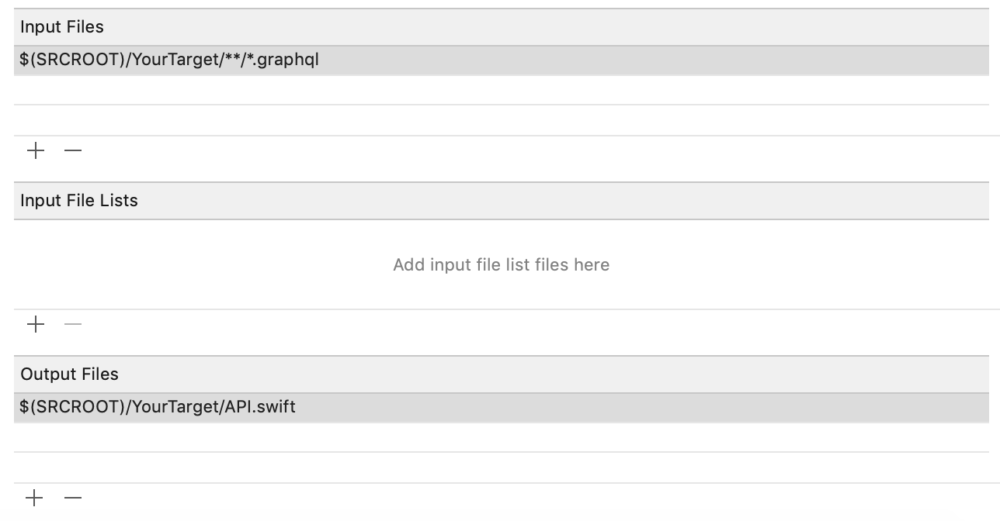

import SPMXcodeInstallationPanel from "../shared/spm-xcode-installation-panel.mdx"
import SPMPackageInstallationPanel from "../shared/spm-package-installation-panel.mdx"
import SPMRunScriptPanel from "../shared/spm-run-script-panel.mdx"
import PodsInstallationPanel from "../shared/pods-installation-panel.mdx"
import PodsRunScriptPanel from "../shared/pods-run-script-panel.mdx"
import CarthageInstallationPanel from "../shared/carthage-installation-panel.mdx"
import CarthageRunScriptPanel from "../shared/carthage-run-script-panel.mdx"

Follow the steps below to add Apollo iOS to your app:

## 1. Install the Apollo frameworks

You can install Apollo iOS into your project using any of the three major Cocoa ecosystem package managers: Swift Package Manager, CocoaPods, or Carthage.

<a name="spm-package-installation" />
<SPMPackageInstallationPanel />

<a name="spm-xcode-installation" />
<SPMXcodeInstallationPanel />

<a name="cocoapods-installation" />
<PodsInstallationPanel />

<a name="carthage-installation" />
<CarthageInstallationPanel />

## 3. Add a schema file to your target directory

For Apollo iOS to generate models for your GraphQL operations, you need a local copy of your GraphQL server's schema. To acquire this schema, see [Downloading a schema](./downloading-schema/).

Make sure to add your `schema.json`/`schema.graphqls` file to the folder where most of your code is, _not_ to the folder where your `.xcodeproj` and/or `.xcworkspace` files are located.

Here's an example file structure:

```{4}
| - your_project_folder
    | your_project.xcodeproj
    | - your_target_folder
        | schema.json or schema.graphqls
        | AppDelegate.swift
        | ViewController.swift
        | etc...
    | - another_target_folder
        | etc...
```

> **Note:** You _can_ put the schema file in a different location, but if you do, you need to modify all relative paths to the file shown in future steps.

## 3. Install the Xcode add-ons for syntax highlighting (optional)

Check out the [`xcode-apollo`](https://github.com/apollographql/xcode-graphql) repository and follow its [installation guide](https://github.com/apollographql/xcode-graphql#installation).

## 4. Create `.graphql` files for your GraphQL operations

Apollo iOS generates code from GraphQL queries and mutations defined in `.graphql` files in your target. As a useful convention, you can define each `[operation].graphql` file alongside whichever `[operation].graphql.swift` file uses the corresponding operation.

If you have the Xcode add-ons installed, you can use the Xcode companion view to show a `.swift` file and its corresponding `.graphql` file side by side.

> **Note:** If you don't have _any_ `.graphql` files in your build tree yet, create one that contains a basic valid operation. If you don't, the code generation build step generates the error `No operations or fragments found to generate code for`.

## 5. Add a code generation build step

Apollo iOS code generation uses your `.graphql` files to generate API code that helps you execute all forms of GraphQL operations, as well as parse and cache  operation responses. To run code generation as part of the Xcode build process, you need to create a build step that runs before "Compile Sources" to invoke a wrapper script.

The wrapper script calls through to the included binaries and files that constitute the `apollo` command-line interface. This helps ensure that you can use our tooling without having to worry about mismatched versioning between libraries.

> 📣 **Check it out:** Instead of writing the rest of this in Bash, try using our new [Swift Scripting Library](./swift-scripting), now in Beta! It supports downloading a schema and generating code.

The location of this wrapper script depends on how you've integrated Apollo into your project, but these first steps are always the same:

1. On your application target's **Build Phases** settings tab, click the **+** icon and choose **New Run Script Phase**.
2. In the created Run Script, change its name to **Generate Apollo GraphQL API**.
3. Drag this new run script just above **Compile Sources** in your list of **Build Phases** so that it executes _before_ your code is compiled.
4. Add the contents of the appropriate run script for the package manager you're using:

<a name="swift-package-manager-run-script" />
<SPMRunScriptPanel />

<a name="cocoapds-run-script" />
<PodsRunScriptPanel />

<a name="carthage-run-script" />
<CarthageRunScriptPanel />

## 6. Build your target

At this point, you can try building your target in Xcode. This verifies that the code generation build step can correctly locate your schema file.

### Troubleshooting

If you get this error:

> `Cannot find GraphQL schema file [...]`

The script can't locate your schema file. Double check the path you've used.

If you get this error:

> `No operations or fragments found to generate code for.`

You haven't defined at least one `.graphql` file with a valid operation in your build tree.

If you need to validate the structure of a GraphQL operation, you can test it against your GraphQL server using [Apollo Sandbox](https://studio.apollographql.com/sandbox).

## 7. Add the generated API file to your target

Drag the generated `API.swift` file to your target.

> **Note:** Because Apollo iOS generates operation-specific result types, `API.swift` is mostly empty at this point unless you've already added multiple `.graphql` files to your target directory.

Make sure to uncheck the "Copy Files If Needed" checkbox, because it should already be in your project's folder system. Then, make sure you've checked all the Targets the API file needs to be included in.

**Installation complete!** You can now start executing GraphQL operations in your app. To learn how, next check out [Creating a client](./initialization/) and [Fetching queries](./fetching-queries/).

You can also continue reading below for some [advanced codegen tips](#advanced-codegen-tips-and-tricks).

## Advanced codegen tips and tricks

After you get up and running, here are a few improvements you can make to your codegen process.

### Prevent unnecessary recompilation

#### Set up input and output files in your build phase

If you're using a tool like Interface Builder or SwiftUI to talk to a module with its own code generation build step, this is helpful to prevent the `API.swift` file from causing an auto-regeneration loop.

For example, if you're using something like this to run your code generation for a target called `YourTarget`:

```
"${SCRIPT_PATH}"/run-bundled-codegen.sh codegen:generate --target=swift --includes=./**/*.graphql --localSchemaFile="schema.json" API.swift
```

Assuming you've set the script to run from `$(SRCROOT)/YourTarget`, you can add `$(SRCROOT)/YourTarget/**/*.graphql` (the path you're running it from + the glob you're passing to the `includes` CLI parameter) to the list of `Input Files` for your Apollo Run Script Build phase. Then, you can add `$(SRCROOT)/YourTarget/API.swift` (the path you're running it from + the output file) to the list of `Output Files`:



This should prevent automatic rebuild cycles if none of the `InputFiles` are changed. The script *will* still run if you explicitly build and run.

There's an [open issue to auto-generate input and output file lists](https://github.com/apollographql/apollo-ios/issues/636) which will be addressed as part of Apollo iOS 1.0, but this will help until that's done.

#### Write to a temporary file

If for some reason the input/output file setup above doesn't work for you, you can also decide to first write the file to a temporary location, and then compare this temporary file to the current one. Then, only when the files differ you move the temporary file into place.

For a target called `YourTarget`, the script could look something like this:

```bash
"${SCRIPT_PATH}"/run-bundled-codegen.sh codegen:generate --target=swift --includes=./**/*.graphql --localSchemaFile="schema.json" "${SRCROOT}/YourTarget/API.swift.new"
if ! diff -q "${SRCROOT}/YourTarget/API.swift.new" "${SRCROOT}/YourTarget/API.swift"; then
  mv "${SRCROOT}/YourTarget/API.swift.new" "${SRCROOT}/YourTarget/API.swift"
else
  rm "${SRCROOT}/YourTarget/API.swift.new"
fi
```

### Generate multiple files in a folder instead of one large file

Instead of passing a single `API.swift` file, you can pass a (pre-existing) relative folder path such as `API` as the final parameter. This causes the codegen to create individual files and place them in that folder.

With small sets of `graphql` files this is usually unnecessary, but with large sets that can cause `API.swift` to be huge. Dividing it up like this can help significantly reduce compilation time.
