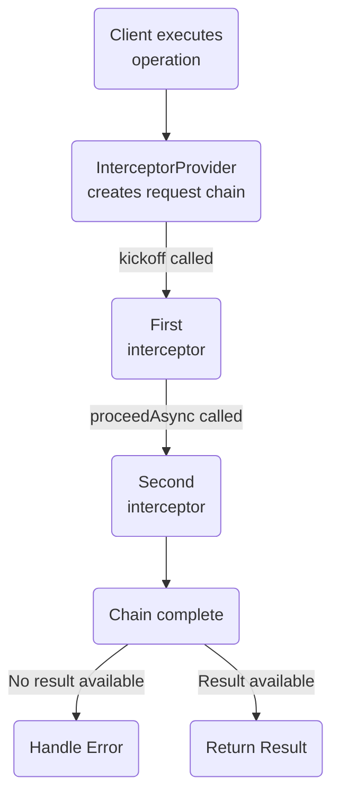
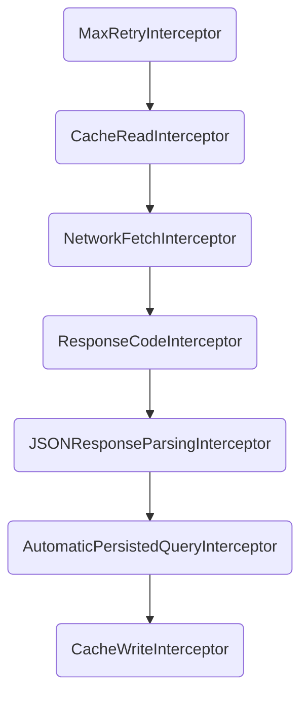

In Apollo iOS, the [`ApolloClient`](https://www.apollographql.com/docs/ios/docc/documentation/apollo/apolloclient) uses a [`NetworkTransport`](https://www.apollographql.com/docs/ios/docc/documentation/apollo/networktransport) object to fetch GraphQL queries from a remote GraphQL server.

The default `NetworkTransport` is the [`RequestChainNetworkTransport`](https://www.apollographql.com/docs/ios/docc/documentation/apollo/requestchainnetworktransport). Appropriately, this network transport uses a structure called a **request chain** to process each operation in individual steps.

> To learn about configuring your client to support sending subscription operations over a web socket, see [Enabling subscription support](./../fetching/subscriptions#enabling-graphql-subscription-support).

## Request chains

A **request chain** defines a sequence of **interceptors** that handle the lifecycle of a particular GraphQL operation's execution. One interceptor might add custom HTTP headers to a request, while the next might be responsible for actually _sending_ the request to a GraphQL server over HTTP. A third interceptor might then write the operation's result to the Apollo iOS cache.

When an operation is executed, an object called an **`InterceptorProvider`** generates a `RequestChain` for the operation. Then, `kickoff` is called on the request chain, which runs the first interceptor in the chain:



An interceptor can perform arbitrary, asynchronous logic on any thread. When an interceptor finishes running, it calls `proceedAsync` on its `RequestChain`, which advances to the next interceptor.

By default when the last interceptor in the chain finishes, if a parsed operation result is available, that result is returned to the operation's original caller. Otherwise, error-handling logic is called.

**Each request has its own short-lived `RequestChain`.** This means that the sequence of interceptors can differ for each operation.

## Interceptor providers

To generate a [request chain](#request-chains) for each GraphQL operation, Apollo iOS passes operations to an object called an **interceptor provider**. This object conforms to the [`InterceptorProvider` protocol](https://www.apollographql.com/docs/ios/docc/documentation/apollo/interceptorprovider).

### Default provider

`DefaultInterceptorProvider` is a default implementation of an interceptor provider. This default interceptor provider supports:
  - Reading/writing response data to the normalized cache.
  - Sending network requests using `URLSession`.
  - Parsing GraphQL response data in JSON format
  - [Automatic Persisted Queries](./../fetching/apqs).

The `DefaultInterceptorProvider` is initialized with a `URLSessionClient` and an `ApolloStore` to pass into the interceptors it creates. By configuring these two objects the `DefaultInterceptorProvider` can support most common use cases.

> If you need to customize your request pipeline further, you can create a [custom interceptor provider](#custom-interceptor-providers).

#### Default interceptors

The `DefaultInterceptorProvider` creates a request chain with the following interceptors for _every_ operation.

<ExpansionPanel title="Show default request chain">



</ExpansionPanel>

> These built-in interceptors are described [below](#built-in-interceptors).

### Custom interceptor providers

> [See an example interceptor provider.](#example-interceptor-provider)

If your use case requires it, you can create a custom struct or class that conforms to the [`InterceptorProvider` protocol](https://www.apollographql.com/docs/ios/docc/documentation/apollo/interceptorprovider).

If you define a custom `InterceptorProvider`, it should almost always create a `RequestChain` that uses a similar structure to the [default](#default-interceptors), but that includes additions or modifications as needed for particular operations.

> **Tip:** If you only need to add interceptors to the beginning or end of the default request chain, you can _subclass_ `DefaultInterceptorProvider` instead of creating a new class from scratch.

When creating request chains in your custom interceptor provider, note the following:

* Interceptors are designed to be **short-lived**. Your interceptor provider should provide a completely new set of interceptors for each request to avoid having multiple calls use the same interceptor instance simultaneously.
* Holding references to individual interceptors (outside of test verification) is generally not recommended. Instead, you can create an interceptor that holds onto a longer-lived object, and the provider can pass this object into each new set of interceptors. This way, each interceptor is disposable, but you don't have to recreate the underlying object that does heavier work.

If you do create your own `InterceptorProvider`, you can use any of the built-in interceptors that are included in Apollo iOS:

### Built-in interceptors

Apollo iOS provides a collection of built-in interceptors you can create in a [custom interceptor provider](#custom-interceptor-providers). You can also create a custom interceptor by defining a class that conforms to the [`ApolloInterceptor` protocol](https://www.apollographql.com/docs/ios/docc/documentation/apollo/apollointerceptor).

> [See examples of custom interceptors](#example-interceptors)

<table class="field-table api-ref">
  <thead>
    <tr>
      <th>Name</th>
      <th>Description</th>
    </tr>
  </thead>

<tbody>
<tr>
<td colspan="2">

**Pre-network**
</td>
</tr>

<tr>
<td>

##### [`MaxRetryInterceptor`](https://www.apollographql.com/docs/ios/docc/documentation/apollo/maxretryinterceptor)

</td>
<td>

Enforces a maximum number of retries for a GraphQL operation that initially fails (default three retries).
</td>
</tr>

<tr>
<td>

##### [`CacheReadInterceptor`](https://www.apollographql.com/docs/ios/docc/documentation/apollo/cachereadinterceptor)

</td>
<td>

Reads data from the Apollo iOS cache _before_ an operation is executed on the server, according to that operation's `cachePolicy`.

If cached data is found that fully resolves the operation, that data is returned. The request chain then continues or terminates according to the operation's `cachePolicy`.
</td>
</tr>

<tr>
<td colspan="2">

**Network**
</td>
</tr>

<tr>
<td>

##### [`NetworkFetchInterceptor`](https://www.apollographql.com/docs/ios/docc/documentation/apollo/networkfetchinterceptor)

</td>
<td>

Takes a [`URLSessionClient`](#the-urlsessionclient-class) and uses it to send the prepared `HTTPRequest` (or subclass thereof) to the GraphQL server.

If you're sending operations over the network, your `RequestChain` requires this interceptor (or a custom interceptor that handles network communication).

</td>
</tr>

<tr>
<td colspan="2">

**Post-network**
</td>
</tr>


<tr>
<td>

##### [`ResponseCodeInterceptor`](https://www.apollographql.com/docs/ios/docc/documentation/apollo/responsecodeinterceptor)

</td>
<td>

For unsuccessfully executed operations, checks the response code of the GraphQL server's HTTP response and passes it to the `RequestChain`'s `handleErrorAsync` callback.

Note that most errors at the GraphQL level are returned with a `200` status code and information in the `errors` array (per the [GraphQL spec](https://spec.graphql.org/draft/#sec-Response-Format)). This interceptor helps with server-level errors (such as `500`s) and errors that are returned by middleware.

For more information, see [this article on error handling in GraphQL](https://medium.com/@sachee/200-ok-error-handling-in-graphql-7ec869aec9bc).

</td>
</tr>

<tr>
<td>

##### [`AutomaticPersistedQueryInterceptor`](https://www.apollographql.com/docs/ios/docc/documentation/apollo/automaticpersistedqueryinterceptor)

</td>
<td>

Checks a GraphQL server's response _after_ execution to see whether the provided APQ hash for the operation was successfully found by the server. If it _wasn't_, the interceptor restarts the chain and the operation is retried with the full query string.

</td>
</tr>

<tr>
<td>

##### [`JSONResponseParsingInterceptor`](https://www.apollographql.com/docs/ios/docc/documentation/apollo/jsonresponseparsinginterceptor)

</td>
<td>

Parses a GraphQL server's JSON response into a `GraphQLResult` object and attaches it to the `HTTPResponse`.

</td>
</tr>

<tr>
<td>

##### [`CacheWriteInterceptor`](https://www.apollographql.com/docs/ios/docc/documentation/apollo/cachewriteinterceptor)

</td>
<td>

Writes response data to the Apollo iOS cache _after_ an operation is executed on the server, according to that operation's `cachePolicy`.

</td>
</tr>


</tbody>
</table>

#### The `additionalErrorInterceptor`

An `InterceptorProvider` can optionally provide an `additionalErrorInterceptor` that's called before an error is returned to the caller. This is mostly useful for logging and tracing errors. This interceptor must conform to the [`ApolloErrorInterceptor` protocol](https://www.apollographql.com/docs/ios/docc/documentation/apollo/apolloerrorinterceptor).

The `additionalErrorInterceptor` is _not_ part of the request chain. Instead, any other interceptor can invoke this interceptor by calling `chain.handleErrorAsync`.

> **Note:** For _expected_ errors with a clear resolution (such as renewing an expired authentication token), you should define an interceptor _within_ your request chain that can resolve the issue and retry the operation.

## Interceptor flow

Most interceptors execute their logic and then call `chain.proceedAsync` to proceed to the next interceptor in the request chain. However, interceptors can call other methods to override this default flow.

### Retrying an operation

Any interceptor can call `chain.retry` to immediately restart the current request chain from the beginning. This can be helpful if the interceptor needed to refresh an access token or modify other configuration for the operation to succeed.

> **Important:** Do not call `retry` in an unbounded way. If your server is returning `500`s or if the user has no internet connection, repeatedly retrying can create an infinite loop of requests (especially if you aren't using the `MaxRetryInterceptor` to limit the number of retries).
>
> Unbounded retries will drain your user's battery and might also run up their data usage. Make sure to only `retry` when there's something your code can do about the original failure!

### Returning a value

An interceptor can directly return a value to the operation's original caller, instead of waiting for the request chain to complete. To do so, the interceptor can call `chain.returnValueAsync`.

**This does not prevent the rest of the request chain from executing.** An interceptor can still call `chain.proceedAsync` as usual after calling `chain.returnValueAsync`.

You can even call `chain.returnValueAsync` multiple times within a request chain! This is helpful when initially returning a _locally cached_ value before returning a value returned by the GraphQL server.

### Returning an error

If an interceptor encounters an error, it can return the details of that error by calling `chain.handleErrorAsync`.

**This does not prevent the rest of the request chain from executing.** An interceptor can still call `chain.proceedAsync` as usual after calling `chain.handleErrorAsync`. However, if the encountered error will cause the operation to fail, you can skip calling `chain.proceedAsync` to end the request chain.

## Examples

The following example snippets demonstrate how to use an advanced request pipeline with custom interceptors. This code assumes you have the following _hypothetical_ classes in your own code (these classes are _not_ part of Apollo iOS):

- **`UserManager`:** Checks whether the active user is logged in, performs associated checks on errors and responses to see if they need to renew their token, and performs that renewal when necessary.
- **`Logger`:** Handles printing logs based on their level. Supports `.debug`, `.error`, and `.always` log levels.

### Example interceptors

#### `UserManagementInterceptor`

This example interceptor checks whether the active user is logged in. If so, it asynchronously renews that user's access token if it's expired. Finally, it adds the access token to an `Authorization` header before proceeding to the next interceptor in the request chain.

```swift
import Apollo

class UserManagementInterceptor: ApolloInterceptor {

  enum UserError: Error {
    case noUserLoggedIn
  }

  /// Helper function to add the token then move on to the next step
  private func addTokenAndProceed<Operation: GraphQLOperation>(
    _ token: Token,
    to request: HTTPRequest<Operation>,
    chain: RequestChain,
    response: HTTPResponse<Operation>?,
    completion: @escaping (Result<GraphQLResult<Operation.Data>, Error>) -> Void
  ) {
    request.addHeader(name: "Authorization", value: "Bearer \(token.value)")
    chain.proceedAsync(request: request,
                        response: response,
                        completion: completion)
  }

  func interceptAsync<Operation: GraphQLOperation>(
    chain: RequestChain,
    request: HTTPRequest<Operation>,
    response: HTTPResponse<Operation>?,
    completion: @escaping (Result<GraphQLResult<Operation.Data>, Error>) -> Void
  ) {
    guard let token = UserManager.shared.token else {
      // In this instance, no user is logged in, so we want to call
      // the error handler, then return to prevent further work
      chain.handleErrorAsync(
        UserError.noUserLoggedIn,
        request: request,
        response: response,
        completion: completion
      )
      return
    }

    // If we've gotten here, there is a token!
    if token.isExpired {
      // Call an async method to renew the token
      UserManager.shared.renewToken { [weak self] tokenRenewResult in
        guard let self = self else {
            return
        }

        switch tokenRenewResult {
        case .failure(let error):
          // Pass the token renewal error up the chain, and do
          // not proceed further. Note that you could also wrap this in a
          // `UserError` if you want.
          chain.handleErrorAsync(
            error,
            request: request,
            response: response,
            completion: completion
          )

        case .success(let token):
          // Renewing worked! Add the token and move on
          self.addTokenAndProceed(
            token,
            to: request,
            chain: chain,
            response: response,
            completion: completion
          )
        }
      }
    } else {
      // We don't need to wait for renewal, add token and move on
      self.addTokenAndProceed(
        token,
        to: request,
        chain: chain,
        response: response,
        completion: completion
      )
    }
  }
}
```

#### `RequestLoggingInterceptor`

This example interceptor logs the outgoing request using the hypothetical `Logger` class, then proceeds to the next interceptor in the request chain:

```swift
import Apollo

class RequestLoggingInterceptor: ApolloInterceptor {

  func interceptAsync<Operation: GraphQLOperation>(
    chain: RequestChain,
    request: HTTPRequest<Operation>,
    response: HTTPResponse<Operation>?,
    completion: @escaping (Result<GraphQLResult<Operation.Data>, Error>) -> Void
  ) {
    Logger.log(.debug, "Outgoing request: \(request)")
    chain.proceedAsync(
      request: request,
      response: response,
      completion: completion
    )
  }
}
```

#### `‌ResponseLoggingInterceptor`

This example interceptor uses the hypothetical `Logger` class to log the request's response if it exists, then proceeds to the next interceptor in the request chain.

This is an example of an interceptor that can both proceed _and_ throw an error. We don't necessarily want to stop processing if this interceptor was added in wrong place, but we _do_ want to know about that error.

```swift
import Apollo

class ResponseLoggingInterceptor: ApolloInterceptor {

  enum ResponseLoggingError: Error {
    case notYetReceived
  }

  func interceptAsync<Operation: GraphQLOperation>(
    chain: RequestChain,
    request: HTTPRequest<Operation>,
    response: HTTPResponse<Operation>?,
    completion: @escaping (Result<GraphQLResult<Operation.Data>, Error>) -> Void
  ) {
    defer {
      // Even if we can't log, we still want to keep going.
      chain.proceedAsync(
        request: request,
        response: response,
        completion: completion
      )
    }

    guard let receivedResponse = response else {
      chain.handleErrorAsync(
        ResponseLoggingError.notYetReceived,
        request: request,
        response: response,
        completion: completion
      )
      return
    }

    Logger.log(.debug, "HTTP Response: \(receivedResponse.httpResponse)")

    if let stringData = String(bytes: receivedResponse.rawData, encoding: .utf8) {
      Logger.log(.debug, "Data: \(stringData)")
    } else {
      Logger.log(.error, "Could not convert data to string!")
    }
  }
}
```

### Example interceptor provider

This `InterceptorProvider` creates request chains using all of the [default interceptors](#default-interceptors) in their usual order, with all of the [example interceptors](#example-interceptors) defined above added at the appropriate points in the request pipeline:

```swift
import Foundation
import Apollo

struct NetworkInterceptorProvider: InterceptorProvider {

  // These properties will remain the same throughout the life of the `InterceptorProvider`, even though they
  // will be handed to different interceptors.
  private let store: ApolloStore
  private let client: URLSessionClient

  init(store: ApolloStore, client: URLSessionClient) {
    self.store = store
    self.client = client
  }

  func interceptors<Operation: GraphQLOperation>(for operation: Operation) -> [ApolloInterceptor] {
    return [
      MaxRetryInterceptor(),
      CacheReadInterceptor(store: self.store),
      UserManagementInterceptor(),
      RequestLoggingInterceptor(),
      NetworkFetchInterceptor(client: self.client),
      ResponseLoggingInterceptor(),
      ResponseCodeInterceptor(),
      JSONResponseParsingInterceptor(cacheKeyForObject: self.store.cacheKeyForObject),
      AutomaticPersistedQueryInterceptor(),
      CacheWriteInterceptor(store: self.store)
    ]
  }
}
```

### Example `ApolloClient` setup

Here's what it looks like to setup an `ApolloClient` with our example `NetworkInterceptorProvider`.

```swift
import Foundation
import Apollo

let client: ApolloClient = {
  // The cache is necessary to set up the store, which we're going
  // to hand to the provider
  let cache = InMemoryNormalizedCache()
  let store = ApolloStore(cache: cache)

  let client = URLSessionClient()
  let provider = NetworkInterceptorProvider(store: store, client: client)
  let url = URL(string: "https://apollo-fullstack-tutorial.herokuapp.com/graphql")!

  let requestChainTransport = RequestChainNetworkTransport(
    interceptorProvider: provider,
    endpointURL: url
  )

  // Remember to give the store you already created to the client so it
  // doesn't create one on its own
  return ApolloClient(networkTransport: requestChainTransport, store: store)
}()
```

> An example of setting up a client that can handle WebSocket and subscriptions is included in the [subscriptions documentation](./../fetching/subscriptions#creating-an-apolloclient-with-subscription-support).

## The `URLSessionClient` class

Because `URLSession` only supports use in the background using the delegate-based API, Apollo iOS provides a [`URLSessionClient`](https://www.apollographql.com/docs/ios/docc/documentation/apollo/urlsessionclient) class that helps manage the `URLSessionDelegate`.

> Note that because setting up a delegate is only possible in the initializer for `URLSession`, you can only pass `URLSessionClient`'s initializer a `URLSessionConfiguration`, **not** an existing `URLSession`.

By default, instances of `URLSessionClient` use `URLSessionConfiguration.default` to set up their session, and instances of `DefaultInterceptorProvider` use the default initializer for `URLSessionClient`.

The `URLSessionClient` class and most of its methods are `open`, so you can subclass it if you need to override any of the delegate methods for the `URLSession` delegates we're using, or if you need to handle additional delegate scenarios.
