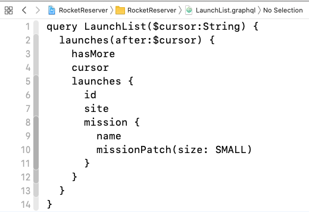
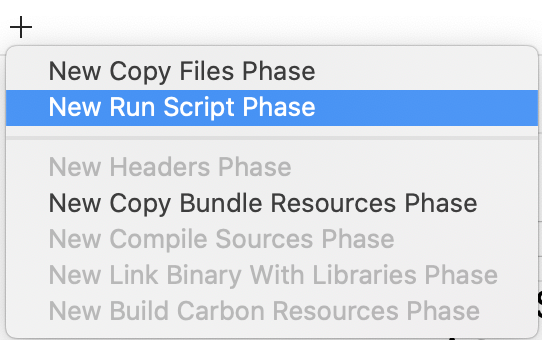

Apollo Client for iOS enables you to use Swift scripting to perform certain operations that otherwise require the command line. 

This document guides you through setting up a Swift Package Manager executable project using our template, and then using that project to: 

- Download a schema
- Generate Swift code for your model objects based on your schema and operations

## Conceptual background

Apollo's code generation requires both of the following to run:

* Your **schema**, which defines what it's *possible* for you to request from or send to your server
* One or more **operations**, which define what you are *actually* requesting from the server

If you're missing either of these, codegen can't run. If you define operations but no schema, the operations can't be validated. If you define a schema but no operations, there's nothing to validate or generate code for. 

Or, more succinctly:

```
schema + operations = code
```

Each operation you define can be one of the following:

- A **query**, which is a one-time request for specific data
- A **mutation**, which changes data on the server and then receives updated data back
- A **subscription**, which allows you to listen for changes to a particular object or type of object

Code generation takes your operations and compares them to the schema to confirm that they're valid. If an operation _isn't_ valid, the whole process errors out. If all operations are valid, codegen generates Swift code that gives you end-to-end type safety for each operation. 

The rest of this guide will help you set up a Swift Package Manager executable that will live alongside your main `xcodeproj` and which can be used either from your main `xcodeproj` or on its own to download a schema, generate code, or both.

## Setup

We've created a template of a Swift Package Manager Executable to speed things along.

This project is provided as a template for an executable rather than a compiled executable to allow you to make changes to the executable relevant to your setup. This allows you to customize while still using Swift as much as possible and bash as little as possible, to preserve both type safety and readability. 

You can download the current version of the template from the [iOSCodegenTemplate Repository](https://github.com/apollographql/iOSCodegenTemplate/tree/1.0.0-alpha).

When you unzip the downloaded repo, you'll see that there's a folder called **`ApolloCodgen`**. 

If you're using the default target structure for an Xcode project, your project's file structure will look essentially like this in Finder: 

```txt title="Sample Project Structure"
MyProject                  // Source root
├─ MyProject.xcodeproj
├─ MyProject/              // Contains app target source files
├─ MyLibraryTarget/        // Contains lib target source files
├─ MyProjectTests/         // Contains test files
```

Drag the `ApolloCodegen` folder in **at the same level as your other targets** (in Finder, not in Xcode): 

```txt title="Sample Project Structure"
MyProject                  // Source root
├─ MyProject.xcodeproj
├─ MyProject/              // Contains app target source files
├─ MyLibraryTarget/        // Contains lib target source files
├─ MyProjectTests/         // Contains test files
├─ ApolloCodegen/          // Contains the swift scripting files you just downloaded and dragged in
```

Double-click `Package.swift` in the `ApolloCodegen` folder to open the executable's package in Xcode. 

**Important!** Since a particular version of code generation is tied to a particular version of the SDK, you need to make sure that the `dependencies` section of `Package.swift` is set to grab the same version of the `apollo-ios` library you're using in your main application: 

```swift title="Package.swift"
.package(name: "Apollo",
         url: "https://github.com/apollographql/apollo-ios.git", 
         from: "1.0.0-alpha-1")
```

Note that these instructions are updated along with newer versions of the library - if you're seeing something that doesn't compile, please check that you're on the most recent version of the SDK both in your app and in your Codegen project. 

## A Tour Of The Template Project

This section will walk you through the already-set up code in the template project. There are two files: `main.swift` and `FileStructure.swift`. 

### SwiftScript

This object uses the [Swift Argument Parser](https://github.com/apple/swift-argument-parser) to create an outer root command which can be run either from the command line if a binary is exported, or run directly by using `swift run` (recommended).  

There are sub-commands to run specific tasks - these are most often what you'll want to focus on, and where you'll need to make changes appropriate to your project's name and structure. 

#### DownloadSchema

This command will download a GraphQL schema. There are two pieces you definitely need to fill in: 

- The place you want to download your schema from. This is usually via introspection of your GraphQL endpoint, so the default is set to use this, you just need to replace the `localhost` URL with the URL of your GraphQL endpoint. If you've got it set up, you can also download your schema from the Apollo Schema Registry. You'll need to add your API Key and Graph ID for this, which you can get from Apollo Studio. 
- The name of the folder where you want the schema downloaded. If you've followed the template above, you'll want to place the schema in the folder where your target's code lives. 

You can also use [options provided by the `ApolloSchemaDownloadConfiguration` object](https://www.apollographql.com/docs/ios/api/ApolloCodegenLib/structs/ApolloSchemaDownloadConfiguration/) to further configure how and where you want to download your schema. 

#### GenerateCode

This command will take your downloaded schema and your local operations and combine them to generate code. Note that if you don't have a schema _or_ don't have any local operations, code generation will fail. 

You will need to replace one placeholder: The location of your target's root folder. 

## Running as a script

To run the script using the command line, `cd` into the `ApolloCodegen` directory and run the following command: 

```
swift run ApolloCodegen [subcommand]
```

This will build and run the executable, and then run the specified subcommand. The first build may take a minute since it will need to check out dependencies, but the Swift build system's caching will prevent any steps that haven't had changes  (including dependency fetching) from re-executing.

If you don't provide a subcommand, a list of available subcommands will be printed. 

### Downloading a schema

Update the `downloadSchema` command to have the correct download method and download path within the Swift file. Then, from the command line, run: 

```
swift run ApolloCodegen downloadSchema
```

If you're using the template code and following the sample project structure, the schema should download here: 

```txt title="Sample Project Structure"
MyProject                  // SourceRoot
├─ MyProject.xcodeproj
├─ MyProject/              // Contains app target source files
│  └─ schema.graphqls
├─ MyLibraryTarget/        // Contains lib target source files
├─ MyProjectTests/         // Contains test files
├─ ApolloCodegen/          // Contains Swift Scripting files
```

Next, now that you have a schema, you need a GraphQL file with an operation in order to generate code. 

## Adding a `.graphql` file with an operation

If you're not familiar with creating an operation in graphQL, please check out the [portion of our tutorial on executing your first query](https://www.apollographql.com/docs/ios/tutorial/tutorial-execute-query/). You can stop after the section about adding your query to Xcode.

Make sure you've added the operation file to the project files, ideally at or above the level of the `schema.graphqls` (Otherwise, you'll need to manually pass the URL of your operation file to your code generation step):

```txt title="Sample Project Structure"
MyProject                  // SourceRoot
├─ MyProject.xcodeproj
├─ MyProject/              // Contains app target source files
│  ├─ schema.graphqls
│  └─ LaunchList.graphql
├─ MyLibraryTarget/        // Contains lib target source files
├─ MyProjectTests/         // Contains test files
├─ ApolloCodegen/          // Contains Swift Scripting files
```

Here, for example, is what this looks like in a file for one of the queries in our [tutorial application](./tutorial/tutorial-introduction):



**Note:** You do **not** need to add this file to your target in Xcode. Only the generated Swift code needs to be included in your target for it to work. 

## Running code generation from your main project

Codegen should be set up to run from your main project when you build - this will allow any changes you've made to your graphQL files to be picked up and the code to be regenerated. 

This is best achieved with a Run Script Build Phase. 

1. Select the target in your project or workspace you want to run code generation, and go to the `Build Phases` tab. 

2. Create a new Run Script Build Phase by selecting the **+** button in the upper left-hand corner:
   

3. Update the build phase run script to `cd` into the folder where your executable's code lives, then run `swift run` (using `xcrun` so that you can ensure it runs with the correct SDK, no matter what type of project you're building): 

    ```
    # Don't run this during index builds
    if [ $ACTION = "indexbuild" ]; then exit 0; fi

    cd "${SRCROOT}"/ApolloCodegen
    xcrun -sdk macosx swift run ApolloCodegen generate
    
    # propagate the xcrun call's return code to Xcode
    exit $? 
    
    ```

    >**Note**: If your package ever seems to have problems with caching, run `swift package clean` before `swift run` for a totally clean build. Do not do this by default, because it substantially increases build time.
    
4. Build your target.

Now, every time you build your project, this script gets called. Because Swift knows not to recompile everything unless something's changed, it should not have a significant impact on your build time. 

## Swift-specific troubleshooting

If you encounter errors around `SecTaskLoadEntitlements` that result in an immediate exit of the script instead of showing the permission prompt, verify that all the folders you're looking for exist at the correct path. This error is often caused by a typo.
