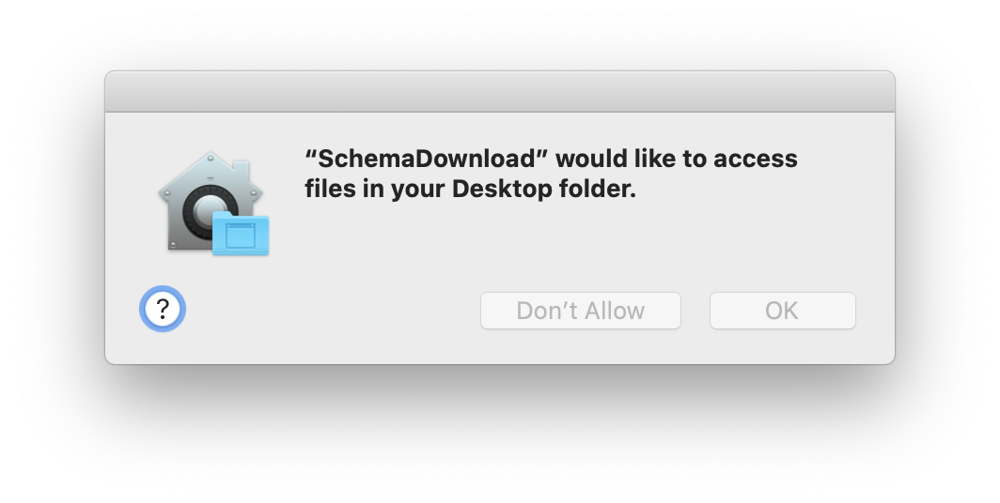
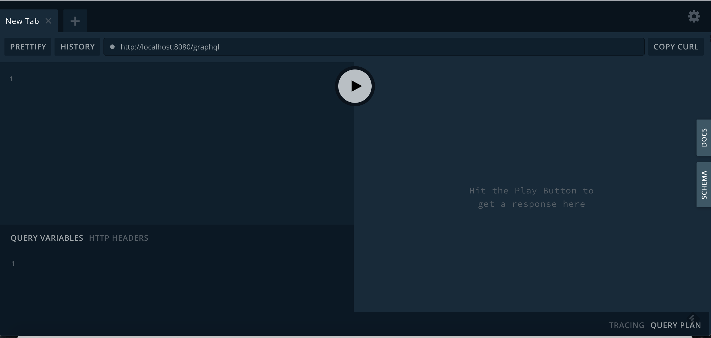
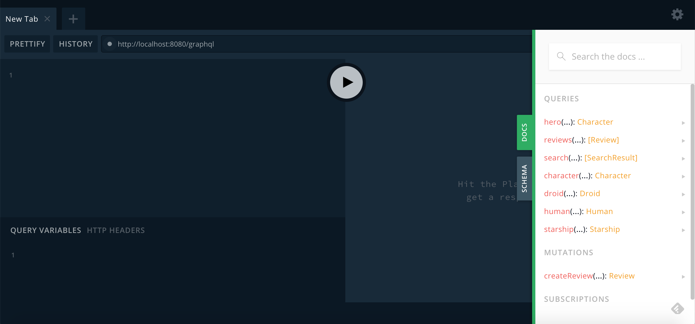
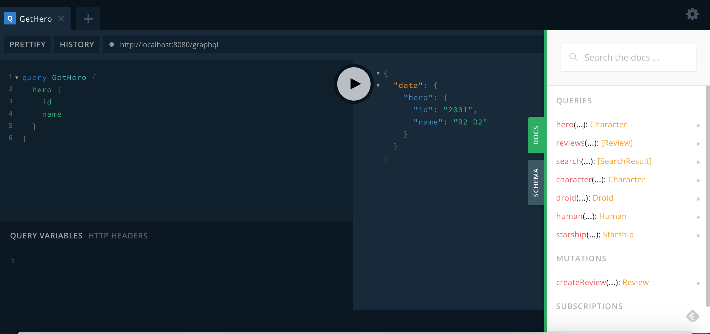
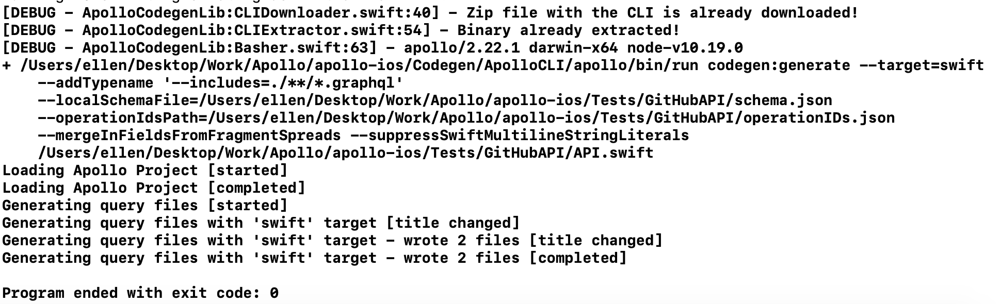

⚠️ **This functionality is in beta.** ⚠️

Apollo Client for iOS enables you to use Swift scripting to perform certain operations that otherwise require the command line. This document guides you through setting up a Swift Package Manager executable and then using it to: 

- Download a schema
- Generate Swift code for your model object based on your schema and operations

## Setup

To begin, let's set up a Swift Package Manager executable:

1. Using Terminal, `cd` into your project's `SRCROOT`. This is generally the directory that contains your `.xcodeproj` or `.xcworkspace` file. The directory structure of this folder should look something like this: 

    ```txt:title=Sample%20Project%20Structure
    MyProject // Source root
      | MyProject.xcodeproj
      | - MyProject // Contains app target source files
      | - MyLibraryTarget // Contains lib target source files
      | - MyProjectTests // Contains test files
    ```
2. Create a new directory for the Codegen executable by running `mkdir Codegen` in Terminal. Your directory structure should now look like this: 

    ```txt:title=Sample%20Project%20Structure
    MyProject // Source root
      | MyProject.xcodeproj
      | - MyProject // Contains app target source files
      | - MyLibraryTarget // Contains lib target source files
      | - MyProjectTests // Contains test files
      | - Codegen // Contains your Swift Scripting files
    ```
3. Using Terminal, change directories into the codegen folder, and initialize an SPM executable by using the following commands:

    ```txt:title=Terminal
    cd Codegen
    swift package init --type executable 
    ```
    
    When this command finishes, you'll see that the Codegen folder now has new contents: 
    
    ```txt:title=Sample%20Project%20Structure
    MyProject // Source root
      | MyProject.xcodeproj
      | - MyProject // Contains app target source files
      | - MyLibraryTarget // Contains lib target source files
      | - MyProjectTests // Contains test files
      | - Codegen // Contains your Swift Scripting files
           | Package.swift
           | README.md
           | - Sources
               | - Codegen
           | - Tests
               | - CodegenTests
    ```
4. Double-click `Package.swift` in this new folder (or run `open Package.swift` in Terminal). This opens the package you've just created in Xcode. 

5. Update the `dependencies` section to grab the Apollo iOS library:

    ```swift:title=Package.swift
    .package(name: "Apollo",
             url: "https://github.com/apollographql/apollo-ios.git", 
             .upToNextMinor(from: "0.27.0"))
    ```
  **NOTE**: The version should be identical to the version you're using in your main project.

    **ALSO NOTE**: Having to specify the name is a workaround for [SR-12110](https://bugs.swift.org/browse/SR-12210). Hopefully once that's fixed, SPM should pick up the name automatically. 

5. For the main executable target in the `targets` section, add `ApolloCodegenLib` as a dependency: 

    ```swift:title=Package.swift
    .target(name: "Codegen",
            dependencies: [                    
                .product(name: "ApolloCodegenLib", package: "Apollo"),
            ])
    ```
    
6. In `main.swift`, import the Codegen lib and Apple's Foundation library at the top of the file:

    ```swift:title=main.swift
    import Foundation
    import ApolloCodegenLib
    ```

7. Run `swift run` in Terminal - you should still be in the same directory where the `Package.swift` file was checked out, and this is the proper place to run it. This will download dependencies, then build and run your package. This should create an output of `"Hello, world!"`, confirming that the package and its dependencies are set up correctly.

Now it's time to use the executable to do some stuff for you!

## Accessing your project's file tree

Because Swift Package manager doesn't have an environment, there's no good way to access the `$SRCROOT` variable if you're running it directly from the command line or using a scheme in Xcode. 

Because almost everything the code generation can do requires access to the file tree where your code lives, there needs to be an alternate method to pass this through. 

Fortunately, there's a class for that: `FileFinder` automatically uses the calling `#file` as a way to access the Swift file you're currently editing. 

For example, let's take a `main.swift` in a folder in `/Codegen/Sources`, assuming following file system structure:

```txt:title=Sample%20Project%20Structure
MyProject // Source Root
  | MyProject.xcodeproj
  | - MyProject // Contains app target source files
  | - MyLibraryTarget // Contains lib target source files
  | - MyProjectTests // Contains test files
  | - Codegen // Contains Swift Scripting files
      | Package.swift
      | README.md
      | - Sources
          |- Codegen
              | main.swift
```

Here's how you obtain the parent folder of the script, then use that to get back to your source root: 

```swift:title=main.swift
let parentFolderOfScriptFile = FileFinder.findParentFolder()
let sourceRootURL = parentFolderOfScriptFile
  .deletingLastPathComponent() // Result: Sources folder
  .deletingLastPathComponent() // Result: Codegen folder
  .deletingLastPathComponent() // Result: MyProject source root folder
```

You can use this to get the URL of the folder you plan to download the CLI to: 

```swift:title=main.swift
let cliFolderURL = sourceRootURL
  .appendingPathComponent("Codegen")
  .appendingPathComponent("ApolloCLI")
```

This would put the folder to download the CLI here in your filesystem: 

```txt:title=Sample%20Project%20Structure
MyProject // SourceRoot
  | MyProject.xcodeproj
  | - MyProject // Contains app target source files
  | - MyLibraryTarget // Contains lib target source files
  | - MyProjectTests // Contains test files
  | - Codegen // Contains Swift Scripting files
      | Package.swift
      | README.md
      | - ApolloCLI // Contains downloaded typescript CLI
      | - Sources      
          | - Codegen
              | main.swift
```


>**Note**: We recommend adding this folder to your root `.gitignore`, because otherwise you'll be adding the zip file and a ton of JS code to your repo. 
>
> If you're on versions prior to `0.24.0`, throw an empty `.keep` file and force-add it to git to preserve the folder structure. Versions after `0.24.0` automatically create the folder being downloaded to if it doesn't exist.

Now, with access to both the `sourceRootURL` and the `cliFolderURL`, it's time to use your script to do neat stuff for you!

## Downloading a schema

One of the convenience wrappers available to you in the target is `ApolloSchemaDownloader`. This allows you to use an `ApolloSchemaOptions` object to set up how you would like to download the schema. 

1. Set up access to the endpoint you'll be downloading this from. This might be directly from your server, or from [Apollo Graph Manager](https://engine.apollographql.com). For this example, let's download directly from the server:

    ```swift:title=main.swift
    let endpoint = URL(string: "http://localhost:8080/graphql")!
    ```

2. You will want to download your schema into the folder containing source files for your project: 

    ```txt:title=Sample%20Project%20Structure
    MyProject // SourceRoot
      | MyProject.xcodeproj
      | - MyProject // Contains app target source files
          | schema.json
      | - MyLibraryTarget // Contains lib target source files
      | - MyProjectTests // Contains test files
      | - Codegen // Contains Swift Scripting files
          | Package.swift
          | README.md
          | - ApolloCLI // Contains downloaded typescript CLI
          | - Sources  
              | - Codegen    
                  | main.swift
    ```

    To do that, set up the URL for the folder where you want to download the schema:

    ```swift:title=main.swift
    let output = sourceRootURL
        .appendingPathComponent("MyProject")
    ```
    
    You might want to make sure the folder exists before proceeding:
    
    ```swift:title=main.swift
    try FileManager
      .default
      .apollo.createFolderIfNeeded(at: output)
    ```

3. Set up your `ApolloSchemaOptions` object. In this case, we'll use the [default arguments for all the constructor parameters that take them](./api/ApolloCodegenLib/structs/ApolloSchemaOptions#methods), and only pass in the endpoint to download from and the folder to put the downloaded file into: 

    ```swift:title=main.swift
    let options = ApolloSchemaOptions(endpointURL: endpoint,
                                      outputFolderURL: output)
    ```
    
    With these defaults, this will download a JSON file called `schema.json`. 
    
4. Add the code that will actually download the schema: 

    ```swift:title=main.swift
    do {
      try ApolloSchemaDownloader.run(with: cliFolderURL,
                                     options: options)
    } catch {
      exit(1)
    }
    ```
    Note that `catch`ing and manually calling `exit` with a non-zero code leaves you with a much more legible error message than simply letting the method throw. 

5. Build and run using the Xcode project. Note that if you're on Catalina you might get a warning asking if your executable can access files in a particular folder like this:

   
   
   Click **OK**. Your CLI output will look something like this: 
   
   
   
   The last two lines  (`Saving schema started` and `Saving schema completed`) indicate that the schema has successfully downloaded. 

Note the warning: This isn't relevant for schema downloading, but it *is* relevant for generating code: In order to generate code, you need both the schema and some kind of operation.

## Using codegen to create a `.graphql` file with an operation

Code generation requires both of the following to run:

* Your **schema**, which defines what it's *possible* for you to request from or send to your server
* One or more **operations**, which define what you are *actually* requesting from the server

If you're missing either of these, codegen can't run. If you define operations but no schema, the operations can't be validated. If you define a schema but no operations, there's nothing to validate or generate code for. 

Or, more succinctly:

```
schema + operations = code
```

Each operation you define can be one of the following:

- A **query**, which is a one-time request for specific data
- A **mutation**, which changes data on the server and then receives updated data back
- A **subscription**, which allows you to listen for changes to a particular object or type of object

Code generation takes your operations and compares them to the schema to confirm that they're valid. If an operation _isn't_ valid, the whole process errors out. If all operations are valid, codegen generates Swift code that gives you end-to-end type safety for each operation. 

Because you've already [downloaded a schema](#downloading-a-schema), you can now proceed to creating an operation. The easiest and most common type of operation to create is a Query. 

Identify where your server's [GraphiQL](https://github.com/graphql/graphiql) instance lives. GraphiQL is a helpful web interface for interacting with and testing out a GraphQL server. This can generally be accessed by going to the same URL as your GraphQL endpoint in a web browser, but you might need to talk to your backend team if they host it in a different place.

You'll see something that looks like this: 



In the "Docs" tab on the right-hand side, you should be able to access a list of the various queries you can make to your server: 



You can then type out a GraphQL query on the left-hand side and have it give you auto-completion for your queries and the properties you can ask for on the returned data. Clicking the play button will execute the query, so you can validate that the query works:



Now you can create a new empty `.graphql` file in your Xcode project, give it the same name as your query,  and paste in the query. 

You'll want to add it to the project files, ideally at or above the level of the `schema.json` (Otherwise, you'll need to manually pass the URL of your GraphQL files to your code generation step):

```txt:title=Sample%20Project%20Structure
MyProject // SourceRoot
  | MyProject.xcodeproj
  | - MyProject // Contains app target source files
       | schema.json
       | LaunchList.graphql
  | - MyLibraryTarget // Contains lib target source files
  | - MyProjectTests // Contains test files
  | - Codegen // Contains Swift Scripting files
      | Package.swift
      | README.md
      | - ApolloCLI // Contains downloaded typescript CLI
      | - Sources      
          | - Codegen
              | main.swift
```

Here, for example, is what this looks like in a file for one of the queries in our [tutorial application](./tutorial/tutorial-introduction):


## Generating code for a target

>**Before you start**: Remember, you need to have a locally downloaded copy of your schema and at least one `.graphql` file containing an operation in your file tree. If you don't have **both** of these, code generation will fail. [Read the section above](#using-codegen-to-create-a-graphql-file-with-an-operation) if you don't have an operation set up!

1. Specify the URL for the root of the target you're generating code for:

    ```swift:title=main.swift
    let targetURL = sourceRootURL
                    .appendingPathComponent("MyProject")
    ```

    Again, you might want to make sure the folder exists before proceeding:

    ```swift:title=main.swift 
    try FileManager
          .default
          .apollo.createFolderIfNeeded(at: targetURL)
    ```

2. Set up your `ApolloCodegenOptions` object. In this case, we'll use the constructor that [sets defaults for you automatically](./api/ApolloCodegenLib/structs/ApolloCodegenOptions#methods): 

    ```swift:title=main.swift
    let options = ApolloCodegenOptions(targetRootURL: targetURL)
    ```

    This creates a single file called `API.swift` in the target's root folder. 
    
3. Add the code to run code generation: 
    
    ```swift:title=main.swift
    do {
        try ApolloCodegen.run(from: targetURL,
                              with: cliFolderURL,
                              options: options)
    } catch {
        exit(1)
    }
    ```
   
   Note that again, `catch`ing and manually calling `exit` with a non-zero code leaves you with a much more legible error message than simply letting the method throw.  

4. Build and run using the Xcode project. Note that if you're on Catalina you might get a warning asking if your executable can access files in a particular folder like this:

   
   
   Click **OK**. Your CLI output will look something like this: 
   
   
   
   The final lines about loading the Apollo project and generating query files indicate that your code has been generated successfully. 
   
Now, you're able to generate code from a debuggable Swift Package Manager executable. All that's left to do is set it up to run from your Xcode project!

## Running your executable from your main project

1. Select the target in your project or workspace you want to run code generation, and go to the `Build Phases` tab. 

2. Create a new Run Script Build Phase by selecting the **+** button in the upper left-hand corner:
   

3. Update the build phase run script to `cd` into the folder where your executable's code lives, then run `swift run` (using `xcrun` so that you can ensure it runs with the correct SDK, no matter what type of project you're building): 

    ```
    cd "${SRCROOT}"/Codegen
    xcrun -sdk macosx swift run
    ```

    >**Note**: If your package ever seems to have problems with caching, run `swift package clean` before `swift run` for a totally clean build. It is not recommended to do this by default, because it substantially increases build time.
    
4. Build your target.

Now, every time you build your project, this script gets called. Because Swift knows not to recompile everything unless something's changed, it should not have a significant impact on your build time. 

## Swift-specific troubleshooting

If you encounter errors around `SecTaskLoadEntitlements` that result in an immediate exit of the script instead of showing the permission prompt, verify that all the folders you're looking for exist at the correct path. This error is often caused by a typo.
