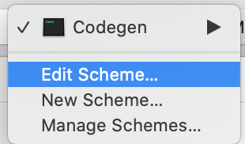
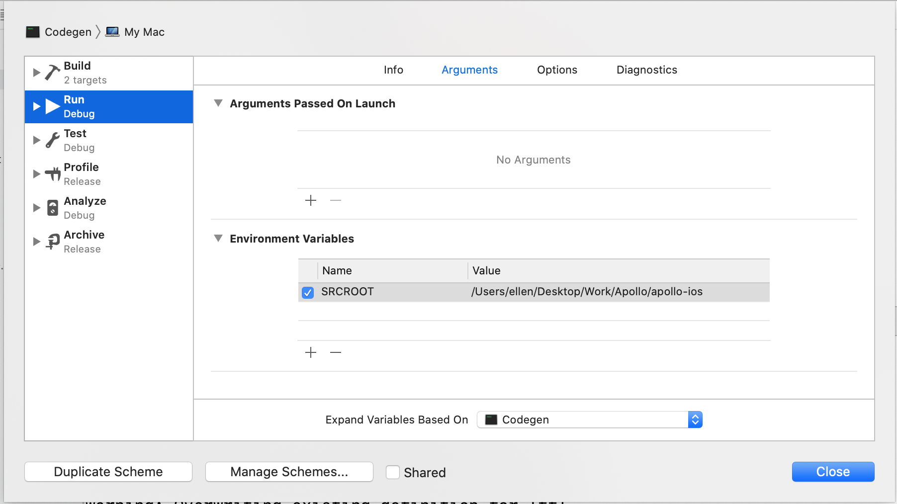

⚠️ **PLEASE NOTE: THIS FUNCTIONALITY IS IN BETA** ⚠️

Some functions you used to have to call using Bash have been adapted to allow the use of Swift scripting with Swift Package Manager executables. 

This document will guide you through setting up your executable and then using it to: 

- Download a schema
- Generate Swift code for your model object based on your schema + operations

## Setting up a Swift Package Manager Executable

To begin, you need to set up a Swift Package Manager executable. 

1. Using Terminal, `cd` into your project's `SRCROOT`. This is generally the folder containing your `.xcodeproj` or `.xcworkspace` file.
2. Create a new folder for the Codegen executable, change directories into the folder, then initialize an SPM executable using the following commands:

    ```
    mkdir Codegen
    cd Codegen
    swift package init --type executable 
    ```

3. Double click on the `Package.swift` in this new folder (or run `open Package.swift` in Terminal). This will open the package you've just created in Xcode. 

4. Update the `dependencies` section to grab the Apollo iOS library:

    ```swift
    .package(url: "https://github.com/apollographql/apollo-ios.git", 
             from: "0.21.0")
    ```
**NOTE**: The version should be identical to the version you're using in your main project. 

5. For the main exectuable target in the `targets` section, add `ApolloCodegenLib` as a dependency: 

    ```swift
    .target(name: "Codegen",
            dependencies: ["ApolloCodegenLib"])
    ```
    
6. In `main.swift`, import the Codegen lib at the top of the file:

    ```swift:title=main.swift
    import ApolloCodegenLib
    ```

7. Run `swift run`. This will download dependencies, then build and run your package. This should create an output of `"Hello, world!"`, confirming that the package and its dependencies are set up correctly.

Now it's time to use the executable to do some stuff for you!

## Accessing Your Project's File Tree

Because Swift Package manager doesn't have an environment, there's no good way to access the `$SRCROOT` variable if you're running it directly from the command line or using a scheme in Xcode. 

To set this up to allow you to access this in a debuggable fashion, you need to set up an environment variable in your Scheme. 

1. In Xcode, select the scheme drop-down and chose `Edit Scheme...`
    
    
2. Add an environment variable with the name `SRCROOT` and a value of the full path to the `SRCROOT` for your Xcode project. 
    

    **NOTE**: This needs to be specific to each machine, so you should make sure to uncheck the `Shared` checkbox so that the scheme is not shared with other people. 
    
3. In `main.swift`, add some code to access the `SRCROOT` variable: 
```swift:title=main.swift


## Downloading A Schema

One of the convenience wrappers available to you in the target is `ApolloSchemaDownloader`. This allows you to use an `ApolloSchemaOptions` object to set up how you would like to 

## Generating Code For A Target

> **PREREQUISITES**: In order to proceed with this step, you need to have a locally downloaded copy of your schema and at least one `.graphql` file containing an operation. If you don't have **both** of these, code generation will fail.

## Running Your Executable From Your Main Project

1. Select the target in your project or workspace  you want to have run the code generation, and go to the `Build Phases` tab. 

2. Create a new Run Script Build Phase by selecting the **+** button in the upper left-hand corner:
  

3. Update the 

    ```
    cd "${SRCROOT}"/Codegen
    swift run
    ```
    
4. Build your target. Since `swift run` is being called from within your target, all of the pieces of the environment, including `$SRCROOT`, will automatically be passed to the 

>**NOTE**: If your package ever seems to have problems with caching, run `swift package clean` before `swift run` for a totally clean build. It is not recommended to do this by default since it vastly increases build time.