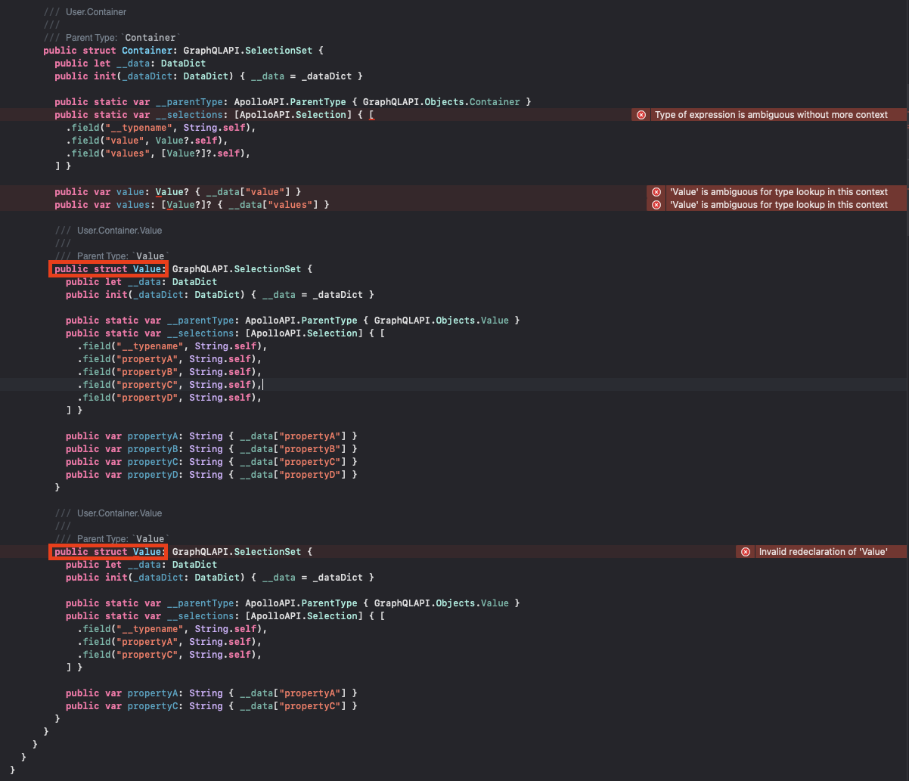
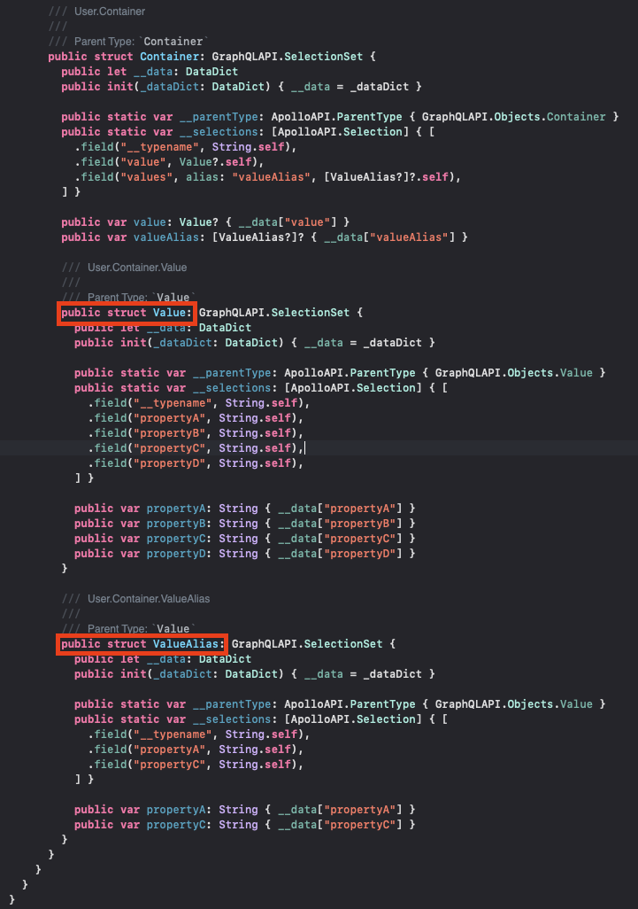

# Errors

## TypeNameConflict

Example error output:

```text title="TypeNameConflict error output"
TypeNameConflict - Field 'values' conflicts with field 'value' in operation/fragment `ConflictingQuery`. Recommend using a field alias for one of these fields to resolve this conflict.
```

If you receive this error, you have an Operation or Fragment that is resulting in multiple types of the same name due to how singularization/pluralization works in code generation. Take the following schema and query defintion for example:

```graphql title="Example Schema"
type Query {
  user: User
}

type User {
  containers: [Container]
}

type Container {
  value: Value
  values: [Value]
}

type Value {
  propertyA: String!
  propertyB: String!
  propertyC: String!
  propertyD: String!
}
```

```graphql title="ConflictingQuery"
query ConflictingQuery {
    user {
        containers {
            value {
                propertyA
                propertyB
                propertyC
                propertyD
            }

            values {
                propertyA
                propertyC
            }
        }
    }
}
```

If you run code generation with these you will get the `TypeNameConflict` error because the generated code for your query would contain code that looks like this:



As the error says, the recommended way to solve this is to use a field alias, so updating the query to be this:

```graphql title="ConflictingQuery"
query ConflictingQuery {
    user {
        containers {
            value {
                propertyA
                propertyB
                propertyC
                propertyD
            }

            valueAlias: values {
                propertyA
                propertyC
            }
        }
    }
}
```

If you run the code generation with the update query you will no longer see the error and the resulting code will look like this:

