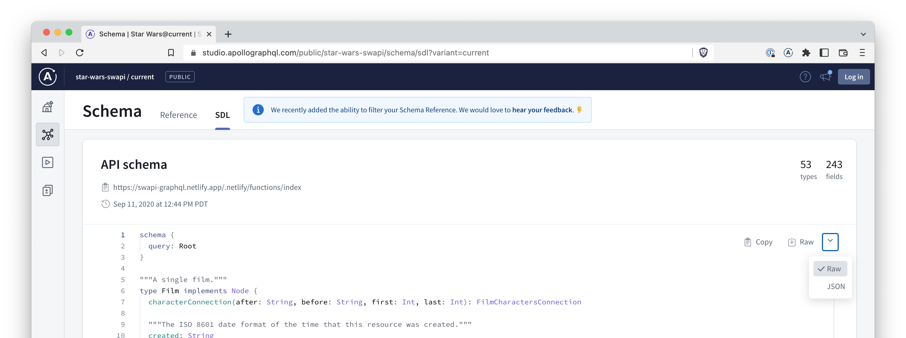

This short tutorial guides you through the basic concepts of generating Swift code with Apollo iOS. We'll introduce you the core capabilities of code generation, and walk through the process of generating Swift code using a GraphQL schema and GraphQL operations. 

> For more in-depth details, see [Code generation](../code-generation/introduction).

## Step 1: Project Setup

Start by creating a new directory, and navigating into it:

```shell
mkdir ios-code-gen-example
cd ios-code-gen-example
```

## Step 2: Download a GraphQL schema

We'll use the [StarWars GraphQL API](https://studio.apollographql.com/public/star-wars-swapi/home?variant=current) for this example. You can check this schema out using [Apollo Studio](https://studio.apollographql.com/public/star-wars-swapi/schema/sdl?variant=current).



On the right-hand side in Apollo Studio find the drop-down to download the schema, shown in the above screenshot. Apollo Studio supports both `JSON` or `Raw` formats. For this tutorial select `Raw` which downloads the GraphQL schema in the Schema Definition Language (SDL) format.

Clicking `Raw` will download a file named `star-wars-swapi@current.graphql`.

## Step 3: Move the downloaded schema into your project

Download or move the already downloaded `star-wars-swapi@current.graphql` file into the directory you created in [Step 1](#step-1-setup).

Rename the file extension from `.graphql` to `.graphqls`. Note the `s` on the end signifying a GraphQL schema file.

## Step 4: Create a GraphQL operation

You'll also need to create a GraphQL operation file because the code generation engine requires both a schema and at least one operation to generate code.

We'll be using the [allFilms Query operation](https://studio.apollographql.com/public/star-wars-swapi/explorer?variant=current) as an example. Clicking this link will open Explorer in Apollo Studio where you can select the fields you would like to be fetched. Alternatively, the query text below already has fields selected.

Copy the query text and create a new file named `AllFilmsQuery.graphql` in the directory you created in [Step 1](#step-1-setup). Paste this query into the new file.

```graphql
query Query {
  allFilms {
    films {
      title
      director
      releaseDate
      speciesConnection {
        species {
          name
          classification
          homeworld {
            name
          }
        }
      }
    }
  }
}
```

## Step 5: Download the CLI

Browse to the list of [Apollo iOS releases](https://github.com/apollographql/apollo-ios/releases) in GitHub and find the latest release. In the Assets list for each release will be a pre-built CLI binary called `apollo-ios-cli.tar.gz`

Download and unzip this file then move the `apollo-ios-cli` binary file into the directory you created in [Step 1](#step-1-setup).

> For more information on the different ways to install the CLI, see the [codegen CLI](../code-generation/codegen-cli#installation) documentation.

## Step 6: Create a codegen configuration

Run the following command:

```bash
./apollo-ios-cli init --schema-name StarWarsAPI --module-type swiftPackageManager
```

The CLI will create a configuration file named `apollo-codegen-configuration.json`, pre-filled with default values. The file should look similar to this:

```json
{
  "schemaName": "StarWarsAPI",
  "input": {
    "operationSearchPaths": ["**/*.graphql"],
    "schemaSearchPaths": ["**/*.graphqls"]
  },
  "output": {
    "testMocks": {
      "none": {}
    },
    "schemaTypes": {
      "path": "./StarWarsAPI",
      "moduleType": {
        "swiftPackageManager": {}
      }
    },
    "operations": {
      "inSchemaModule": {}
    }
  }
}
```

### Step 7: Generate code

Now you are ready to generate some code! Run the following command:

```bash
./apollo-ios-cli generate
```

you should see a new file created named `Query.graphql.swift`, that looks similar to this:

<ExpansionPanel title="Generated Code">

```swift

// @generated
// This file was automatically generated and should not be edited.

@_exported import ApolloAPI
import StarWarsAPI

public class Query: GraphQLQuery {
  public static let operationName: String = "Query"
  public static let document: DocumentType = .notPersisted(
    definition: .init(
      """
      query Query {
        allFilms {
          __typename
          films {
            __typename
            title
            director
            releaseDate
            speciesConnection {
              __typename
              species {
                __typename
                name
                classification
                homeworld {
                  __typename
                  name
                }
              }
            }
          }
        }
      }
      """
    ))

  public init() {}

  public struct Data: StarWarsAPI.SelectionSet {
    public let __data: DataDict
    public init(data: DataDict) { __data = data }

    public static var __parentType: ParentType { StarWarsAPI.Objects.Root }
    public static var __selections: [Selection] { [
      .field("allFilms", AllFilms?.self),
    ] }

    public var allFilms: AllFilms? { __data["allFilms"] }

    /// AllFilms
    ///
    /// Parent Type: `FilmsConnection`
    public struct AllFilms: StarWarsAPI.SelectionSet {
      public let __data: DataDict
      public init(data: DataDict) { __data = data }

      public static var __parentType: ParentType { StarWarsAPI.Objects.FilmsConnection }
      public static var __selections: [Selection] { [
        .field("films", [Film?]?.self),
      ] }

      /// A list of all of the objects returned in the connection. This is a convenience
      /// field provided for quickly exploring the API; rather than querying for
      /// "{ edges { node } }" when no edge data is needed, this field can be be used
      /// instead. Note that when clients like Relay need to fetch the "cursor" field on
      /// the edge to enable efficient pagination, this shortcut cannot be used, and the
      /// full "{ edges { node } }" version should be used instead.
      public var films: [Film?]? { __data["films"] }

      /// AllFilms.Film
      ///
      /// Parent Type: `Film`
      public struct Film: StarWarsAPI.SelectionSet {
        public let __data: DataDict
        public init(data: DataDict) { __data = data }

        public static var __parentType: ParentType { StarWarsAPI.Objects.Film }
        public static var __selections: [Selection] { [
          .field("title", String?.self),
          .field("director", String?.self),
          .field("releaseDate", String?.self),
          .field("speciesConnection", SpeciesConnection?.self),
        ] }

        /// The title of this film.
        public var title: String? { __data["title"] }
        /// The name of the director of this film.
        public var director: String? { __data["director"] }
        /// The ISO 8601 date format of film release at original creator country.
        public var releaseDate: String? { __data["releaseDate"] }
        public var speciesConnection: SpeciesConnection? { __data["speciesConnection"] }

        /// AllFilms.Film.SpeciesConnection
        ///
        /// Parent Type: `FilmSpeciesConnection`
        public struct SpeciesConnection: StarWarsAPI.SelectionSet {
          public let __data: DataDict
          public init(data: DataDict) { __data = data }

          public static var __parentType: ParentType { StarWarsAPI.Objects.FilmSpeciesConnection }
          public static var __selections: [Selection] { [
            .field("species", [Specy?]?.self),
          ] }

          /// A list of all of the objects returned in the connection. This is a convenience
          /// field provided for quickly exploring the API; rather than querying for
          /// "{ edges { node } }" when no edge data is needed, this field can be be used
          /// instead. Note that when clients like Relay need to fetch the "cursor" field on
          /// the edge to enable efficient pagination, this shortcut cannot be used, and the
          /// full "{ edges { node } }" version should be used instead.
          public var species: [Specy?]? { __data["species"] }

          /// AllFilms.Film.SpeciesConnection.Specy
          ///
          /// Parent Type: `Species`
          public struct Specy: StarWarsAPI.SelectionSet {
            public let __data: DataDict
            public init(data: DataDict) { __data = data }

            public static var __parentType: ParentType { StarWarsAPI.Objects.Species }
            public static var __selections: [Selection] { [
              .field("name", String?.self),
              .field("classification", String?.self),
              .field("homeworld", Homeworld?.self),
            ] }

            /// The name of this species.
            public var name: String? { __data["name"] }
            /// The classification of this species, such as "mammal" or "reptile".
            public var classification: String? { __data["classification"] }
            /// A planet that this species originates from.
            public var homeworld: Homeworld? { __data["homeworld"] }

            /// AllFilms.Film.SpeciesConnection.Specy.Homeworld
            ///
            /// Parent Type: `Planet`
            public struct Homeworld: StarWarsAPI.SelectionSet {
              public let __data: DataDict
              public init(data: DataDict) { __data = data }

              public static var __parentType: ParentType { StarWarsAPI.Objects.Planet }
              public static var __selections: [Selection] { [
                .field("name", String?.self),
              ] }

              /// The name of this planet.
              public var name: String? { __data["name"] }
            }
          }
        }
      }
    }
  }
}
```

</ExpansionPanel>

And that's it! You can also review all the additional generated files to get a deeper understanding of how code generation works using the Apollo iOS client.
