import {
  ExpansionPanel,
  ExpansionPanelList,
  ExpansionPanelListItem
} from 'gatsby-theme-apollo-docs';

<ExpansionPanel title="Setting up the Detail UI">

<ExpansionPanelList>
<ExpansionPanelListItem number="1">

<h4>Set up the outer Stack View</h4>

Show the **Library** of UI elements by clicking on the library button in the top right of Xcode:

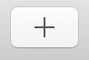

Search for a `UIStackView`. When it comes up, drag it into the Detail View Controller in the storyboard. Select the stack view, go to the **Add New Constraints** button, and use the panel that pops up when you click it to pin the stack view 20pt from the superview's two sides and 40pt from the top:

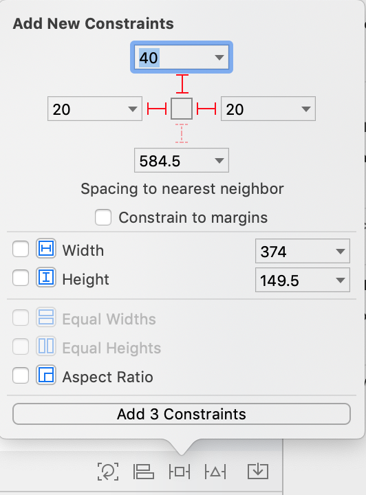

In the right sidebar, update the settings of the Stack View in the Attributes Inspector to these:

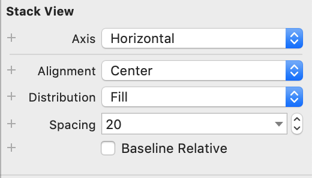

</ExpansionPanelListItem>
<ExpansionPanelListItem number="2">

<h4>Set up the Mission Patch Image View</h4>

Next, show the library again, and search for a **UIImageView**. Drag it into the outer stack view you just added. 

In Interface Builder's left sidebar, command-click on both the Image View and the view controller's main view to select both:

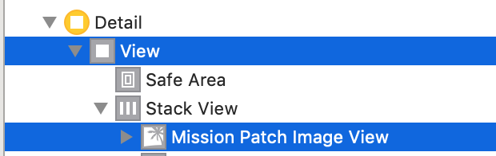

Next, tap the Add New Constraints button again, and select **Equal Widths**:

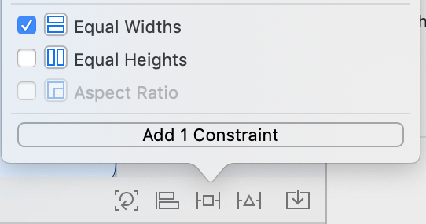

Select the constraint you just added using Interface Builder's left sidebar:

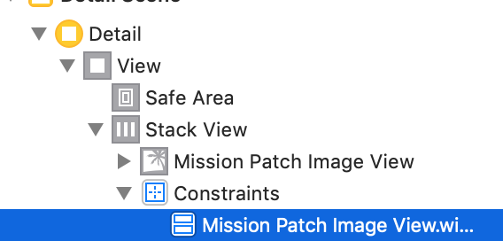

And update it to match the following:

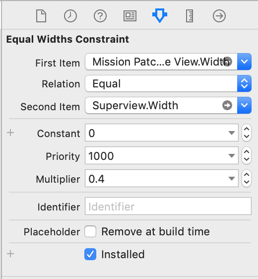

This constraint means that the width of the image will always be 40% of the screen, no matter the size of the screen. 

To add a constraint that keeps the height always equal to the width, select the Image View in Interface Builder's left sidebar, and click on the Add New Constraints button one last time. Select the **Aspect Ratio** constraint:

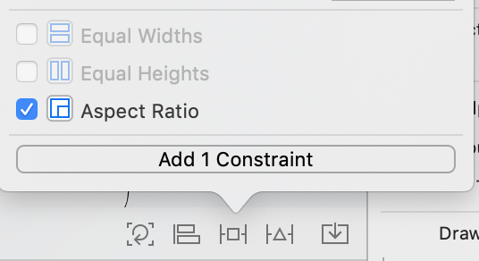

Select the constraint you just added using Interface Builder's left sidebar (note: The ratio may not be 1:1 yet, just look for the constraint that says "Aspect"):

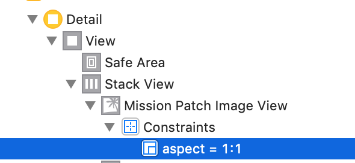

And update it to match the following: 

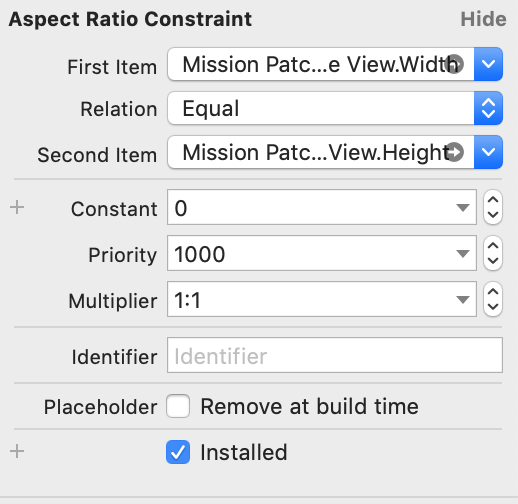

> **Note**: You might still see some sizing errors at this point, but those will go away in the next step.

Finally, hook this image up to the `missionPatchImageView` outlet.

</ExpansionPanelListItem>
<ExpansionPanelListItem number="3">

<h4>Set up the inner Stack View</h4>

Next, add a second stack view to your horizontal stack view. Update the settings in the attributes inspector to these:

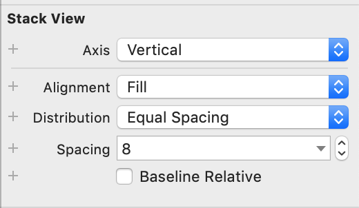

</ExpansionPanelListItem>
<ExpansionPanelListItem number="4">

<h4>Add labels to the inner stack view</h4>

Add a `UILabel` to the inner stack view. Select the label, go to the Attributes Inspector panel, and update the text, font size, and lines:

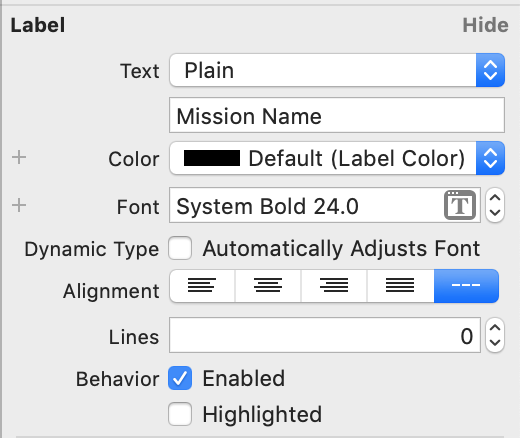

Hook this label up to the `missionNameLabel` outlet.

Next, add a second `UILabel` to the inner stack view. Again, select  label, go to the Attributes Inspector panel, and update the text, font size, and lines:

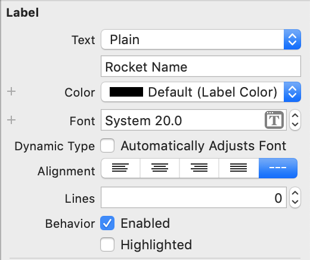

Hook this label up to the `rocketNameLabel` outlet.

Next, add a third label to the inner stack view, and update its details to match the following:

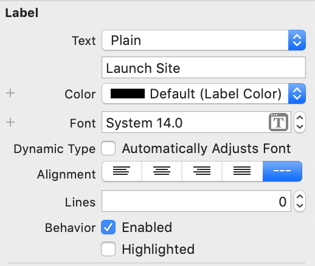

Hook this last label up to the `launchSiteLabel` outlet.

</ExpansionPanelListItem>
<ExpansionPanelListItem number="5">

<h4>Add the navigation bar button</h4>

Drag in a `UIBarButtonItem` to the top right of the navigation bar. Rename it `Book Now!`:

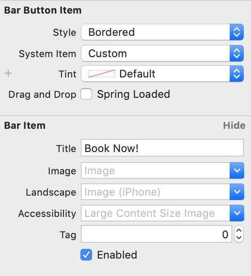

Hook the item up to the `bookCancelButton` outlet. 

</ExpansionPanelListItem>
<ExpansionPanelListItem number="check">
  You're done!
</ExpansionPanelListItem>
</ExpansionPanelList>
</ExpansionPanel>
