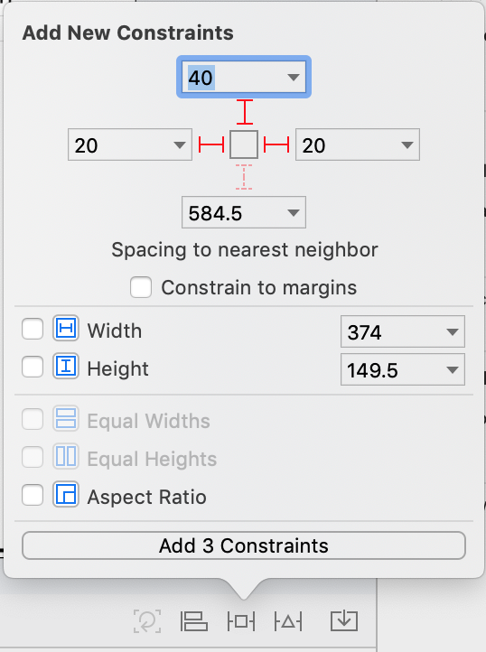
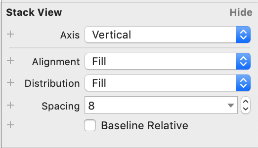
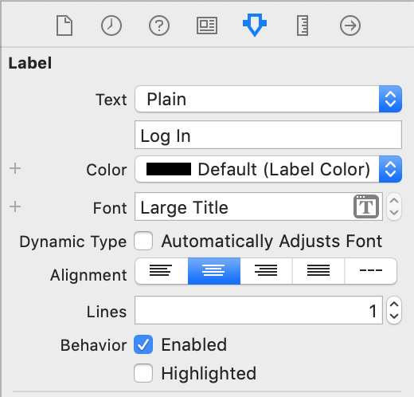
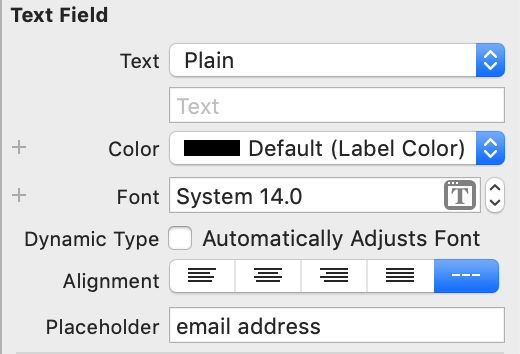
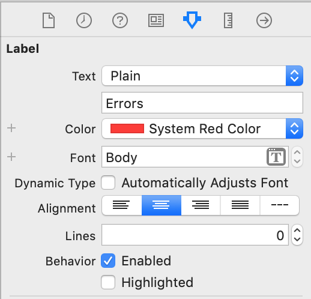
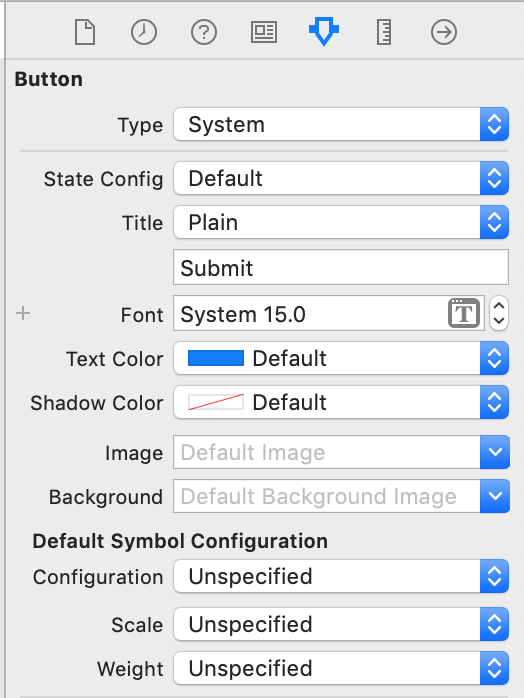
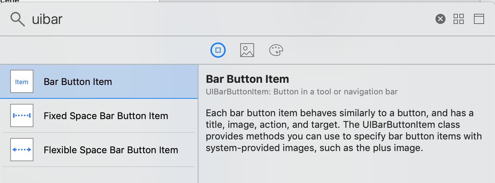
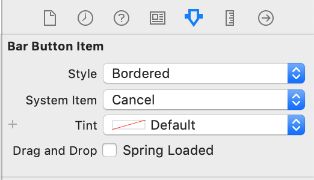

import {
  ExpansionPanel,
  ExpansionPanelList,
  ExpansionPanelListItem
} from 'gatsby-theme-apollo-docs';

<ExpansionPanel title="Setting up the Login UI">

<ExpansionPanelList>
<ExpansionPanelListItem number="1">

<h4>Set up the outer Stack View</h4>

Show the **Library** of UI elements by clicking on the library button in the top right of Xcode:

Search for a `UIStackView`, and when it comes up, drag it into the Detail View Controller in the storyboard. Select the stack view, go to the **Add New Constraints** button, and use the panel that pops up when you click it to pin the stack view 20pt from the superview's two sides and 40pt from the top:

In the right sidebar, update the settings of the Stack View in the Attributes Inspector to these:

</ExpansionPanelListItem>
<ExpansionPanelListItem number="2">

<h4>Add elements to the Stack View</h4>

Add a `UILabel` to the stack view. Select the label, go to the Attributes Inspector panel, and update the text and font:

Add a `UITextField` to the stack view. Select it, go to the Attributes Inspector panel, and update the placeholder text:



Hook this text field up to the `emailTextField` outlet.

Add another `UILabel` to the stack view. Select it, go to the Attributes Inspector panel, and update the color, font, number of lines, and text:

Hook this label up to the `errorLabel` outlet. 

Add a `UIButton` to the stack view. Select it, go to the Attributes Inspector panel, and update the title text:

Hook this button up to the `submitButton` outlet and the `touchUpInside` method for the `submitTapped` action. 

</ExpansionPanelListItem>
<ExpansionPanelListItem number="2">

<h4>Add a cancel button</h4>

Search in the library for a `UIBarButtonItem`:

Drag it in to the top left hand side of the navigation bar. Then, select it and go to the Attributes Inspector panel, and make it a system cancel item:

Hook this button up to the `cancelTapped` action. 

</ExpansionPanelListItem>
<ExpansionPanelListItem number="check">
  You're done!
</ExpansionPanelListItem>
</ExpansionPanelList>
</ExpansionPanel>