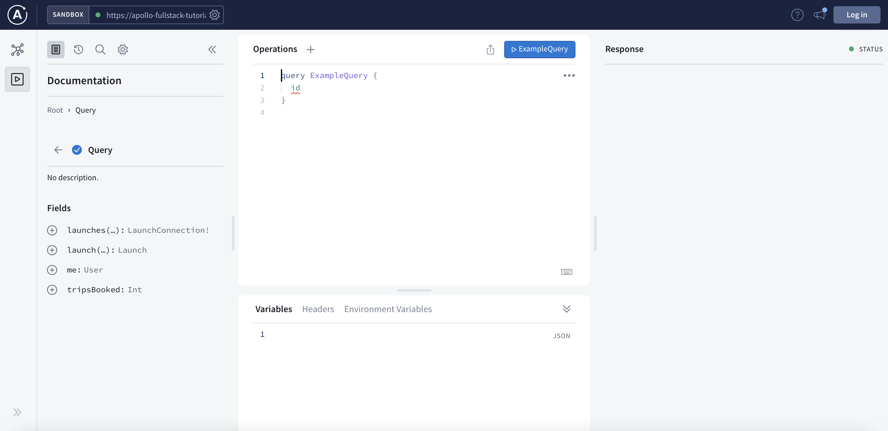
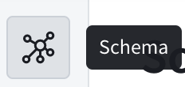
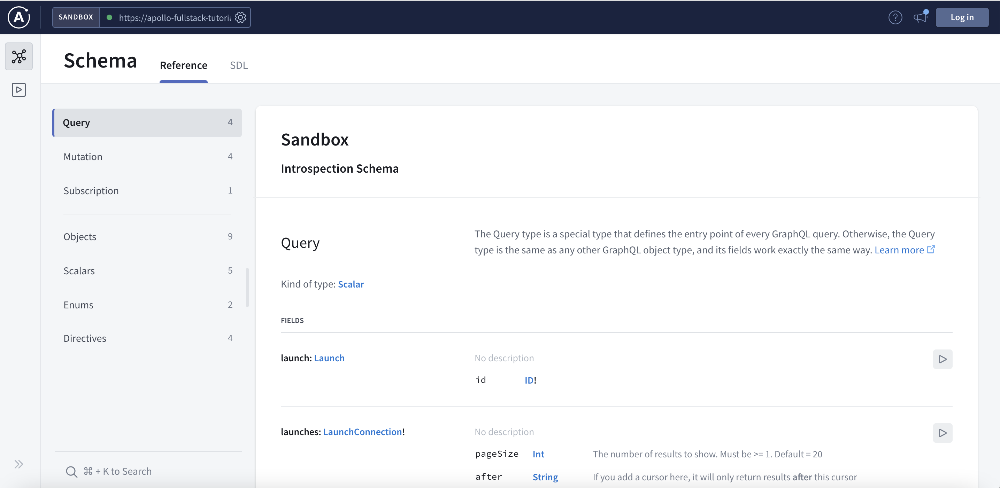

import SPMXcodeInstallCLI from "../../shared/cli-install/spm-xcode.mdx"

This tutorial uses a modified version of the GraphQL server you build as part of [the Apollo full-stack tutorial](https://www.apollographql.com/docs/tutorial/introduction/). You can visit [that server's Apollo Studio Sandbox Explorer](https://studio.apollographql.com/sandbox/explorer?endpoint=https%3A%2F%2Fapollo-fullstack-tutorial.herokuapp.com%2Fgraphql) to explore its schema without needing to be logged in:



You'll know that this Sandbox instance is pointed at our server because its URL, `https://apollo-fullstack-tutorial.herokuapp.com`, is in the box at the top left of the page. If Sandbox is properly connected, you'll see a green dot:


The schema defines which GraphQL operations your server can execute. At the top left, click the schema icon to get an overview of your schema:



In the **Reference** tab, you can now see a list of all of the things available to you as a consumer of this API, along with available fields on all objects:



## Setup Codegen CLI

<SPMXcodeInstallCLI />

> **Note:** Xcode 14.3 has a bug where the `Install CLI` plugin command does not show up in the menu when right-clicking on your project which is being tracked [here](https://github.com/apollographql/apollo-ios/issues/2919). If you experience this issue an alternative is to use another version of Xcode, or follow the instructions to get a pre-built binary of the CLI on the [Codegen CLI](https://www.apollographql.com/docs/ios/code-generation/codegen-cli#installation) page.

## Create your Codegen Configuration

Next we need to setup our [codegen configuration](https://www.apollographql.com/docs/ios/code-generation/codegen-configuration) file. To do this run the following command in Terminal from project directory:

```bash
./apollo-ios-cli init --schema-namespace RocketReserverAPI --module-type swiftPackageManager
```

This generates a basic `apollo-codegen-config.json` file for our project.

## Download your server's schema

Next we need to download the schema for our project to use. To do so, first we need to update our `apollo-codegen-config.json` to include a [`schemeDownloadConfiguration`](https://www.apollographql.com/docs/ios/code-generation/codegen-configuration#schema-download-configuration). Add the following JSON to the end of the config file after the `output` object:

```json
"schemaDownloadConfiguration": {
    "downloadMethod": {
        "introspection": {
            "endpointURL": "https://apollo-fullstack-tutorial.herokuapp.com/graphql",
            "httpMethod": {
                "POST": {}
            },
            "includeDeprecatedInputValues": false,
            "outputFormat": "SDL"
        }
    },
    "downloadTimeout": 60,
    "headers": [],
    "outputPath": "./graphql/schema.graphqls"
}
```

> For more information about downloading schemas, see the [Downloading a Schema](https://www.apollographql.com/docs/ios/code-generation/downloading-schema) documentation.

Now that we have updated our config, we can download the schema by running the following command in Terminal:

```bash
./apollo-ios-cli fetch-schema
```

After running this command you should see a `graphql` folder in your project directory containing a `schema.graphqls` file.

In the next step you will [write your first query.](tutorial-write-your-first-query)