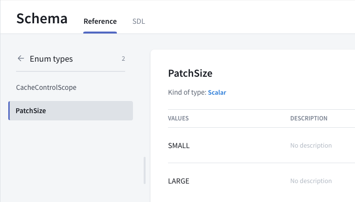
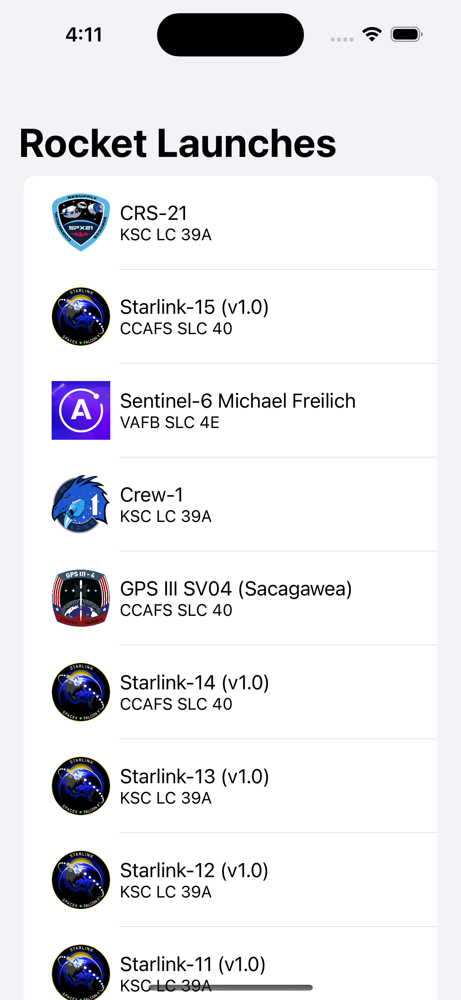

Go back to `LaunchList.graphql`. Your query is already fetching most of the information you want to display, but it would be nice to display both the name of the mission and an image of the patch. 

Looking at the schema in Sandbox Explorer, you can see that `Launch` has a property of `mission`, which allows you to get details of the mission. A mission has both a `name` and a `missionPatch` property, and the `missionPatch` can optionally take a parameter about what size something needs to be.

Because loading a list view with large images can impact performance, ask for the name and a `SMALL` mission patch. Update your query to look like the following:

```graphql title="LaunchList.graphql"
query LaunchList {
  launches {
    hasMore
    cursor
    launches {
      id
      site
      mission {
        name
        missionPatch(size: SMALL)
      }
    }
  }
}
```

When you re-run code generation if you look in `LaunchListQuery.graphql.swift`, you'll see a new nested type, `Mission`, with the two properties you requested.

Any GraphQL field can take arguments like `missionPatch` above, and arguments can be of scalar or complex types. In this case, `SMALL` is an enum in the GraphQL schema. It can take a finite list of values. If you look at the Schema section in Sandbox, you can see a list of the enums. You can then click in to see that `PatchSize` can only take two values: `SMALL` and `LARGE`



## Connect the data to the UI

Go to `LaunchRow.swift` and add the following import to the top of the file:

```swift title="LaunchRow.swift"
import RocketReserverAPI
import SDWebImageSwiftUI // highlight-line
import SwiftUI
```

Next replace the existing `placeholderImg` reference with the following code:

```swift title="LaunchRow.swift"
if let missionPatch = launch.mission?.missionPatch {
    WebImage(url: URL(string: missionPatch))
        .resizable()
        .placeholder(placeholderImg)
        .indicator(.activity)
        .scaledToFit()
        .frame(width: 50, height: 50)
} else {
    placeholderImg
        .resizable()
        .scaledToFit()
        .frame(width: 50, height: 50)
}
```

Finally let's update the text label for the mission name:

```swift title="LaunchRow.swift"
VStack(alignment: .leading) {
    Text(launch.mission?.name ?? "Mission Name") // highlight-line
    Text(launch.site ?? "Launch Site")
        .font(.system(size: 14))
}
```

## Test your query

Build and run the application, and you will see all the information for current launches.



If you scroll down, you'll see the list includes only about 20 launches. This is because the list of launches is **paginated**, and you've only fetched the first page.

Next, you will [use a cursor-based loading system to load the entire list of launches](tutorial-paginate-results).