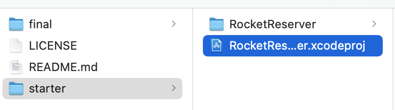

In this step, you'll add the Apollo iOS SDK to a new project. 

## Open the Xcode project

In the files you've downloaded or checked out from [the tutorial repo](https://github.com/apollographql/iOSTutorial), there are `starter` and `final` folders. Open the `RocketReserver.xcodeproj` file located in the `starter` folder: 

When the project opens, Swift Package Manager (SPM) will resolve two dependencies that you'll be using later in the project that are already set up. 

Next, it's time to add Apollo as a dependency.

## Add the Apollo iOS SDK to your project

1. Go to **File > Add Packages...**. The Add Package dialog appears, by default with Apple packages. In the upper left-hand corner, paste `https://github.com/apollographql/apollo-ios` into the search bar in the upper right:

    

2. Hit **Return** to kick off the search. Xcode will then show you the `apollo-ios` package and allow you to select a version in the right-hand panel. Select **Up to Next Minor** from the Version dropdown (because the Apollo iOS SDK is still a `0.x` release, breaking changes _can_ occur between minor versions):

    
    
    > NOTE: There's a bug in the initial release of Xcode 13 showing the most recent minor version as 0.3.0 instead of 0.49.0, which it was at the time of writing. Please consult the [releases page on the SDK repo](https://github.com/apollographql/apollo-ios/releases) to see what our latest version is until this bug is fixed. 

3. Click **Add Package**. Once SPM is done checking out the package, a list of framework targets included in the library appears. For this tutorial, select the main **Apollo** target and the **ApolloWebSocket** target:

    

    _Note: Do **not** select the `Apollo-Dynamic` target, this is only for use for projects linking to our library dynamically. Most projects, including this one, will not need to do this._
    
4. Click **Finish**. SPM fetches your dependencies. When it completes, you can see them in the project navigator:

    

> **Note:** Because SPM has not yet implemented [Target-Based Dependency Resolution](https://github.com/apple/swift-evolution/blob/master/proposals/0226-package-manager-target-based-dep-resolution.md), you'll see the `SQLite` dependency even though you didn't select `ApolloSQLite`, the target which depends on it.

## Learn what you need to generate code

Now that you've got the SDK set up, there are two more pieces you need to actually generate code. 

The first is the **GraphQL Schema**, which you can generally get from your server or from Apollo Studio Sandbox. This is a list of all of the possible queries and data types that are available to you from your server. The schema can be thought of as a contract of what it's *possible* to ask for. 

The second is at least one operation, so that we know what you're *actually* asking for. Apollo generates code by taking your operations, validating that they are actually possible by comparing them to the schema, and then using data from the schema to generate all of the data structures necessary to create operations type-safely, and parse the responses from those operations type-safely. 

The most basic way to think about this is the following equation: 

**Schema + Operations = Code**

If you don't have any operations, our code generator won't know what information you want to ask for, so it can't generate the code to send a request or parse a result. If you don't have a schema, our code generator won't know if what you want to ask for is possible, so it can't guarantee type safety. If you have both, the appropriate checks can be made and type-safe code can be generated. 

Now that you know what you need and why you need it, the next step is to [obtain a local copy of your GraphQL schema](./tutorial-obtain-schema).
