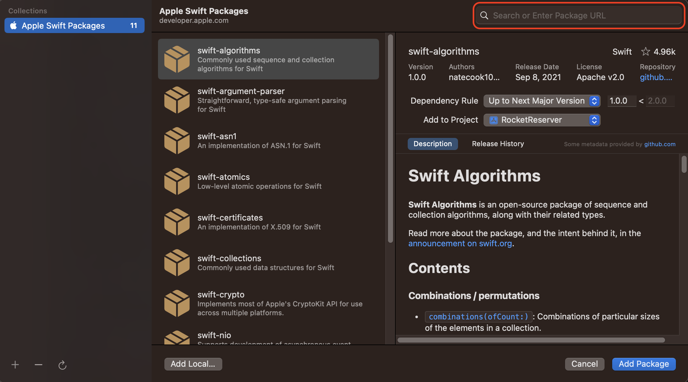

In this step, you'll add the Apollo iOS SDK to a new project. 

## Open the Xcode project

In the files you've downloaded or checked out from [the tutorial repo](https://github.com/apollographql/iOSTutorial), there are `starter` and `final` folders. Open the `RocketReserver.xcodeproj` file located in the `starter` folder: 

When the project opens, Swift Package Manager (SPM) will resolve two dependencies that you'll be using later in the project that are already set up. 

Next, it's time to add Apollo as a dependency.

## Add the Apollo iOS SDK to your project

1. Go to **File > Add Packages...**. The Add Package dialog appears, by default with Apple packages. In the upper left hand corner, paste `https://github.com/apollographql/apollo-ios` into the search bar in the upper right:

    

2. Hit **Return** to kick off the search. Xcode will then show you the `apollo-ios` package and allow you to select a version in the right hand panel. Select **Up to Next Minor** from the Version dropdown (because the Apollo iOS SDK is still a `0.x` release, breaking changes _can_ occur between minor versions):

    
    
    > NOTE: There's a bug in the initial release of Xcode 13 showing the most recent minor version as 0.3.0 instead of 0.49.0, which it was at the time of writing. Please consult the [releases page on the SDK repo](https://github.com/apollographql/apollo-ios/releases) to see what our latest version is until this bug is fixed. 

5. Click **Add Package**. Once SPM is done checking out the package, a list of framework targets included in the library appears. For this tutorial, select the main **Apollo** target and the **ApolloWebSocket** target:

    

    _Note: Do **not** select the `Apollo-Dynamic` target, this is only for use for projects linking to our library dynamically. Most projects, including this one, will not need to do this._
    
6. Click **Finish**. SPM fetches your dependencies. When it completes, you can see them in the project navigator:

    

> **Note:** Because SPM has not yet implemented [Target-Based Dependency Resolution](https://github.com/apple/swift-evolution/blob/master/proposals/0226-package-manager-target-based-dep-resolution.md), you'll see the `SQLite` dependency even though you didn't select `ApolloSQLite`, the target which depends on it.

Next, before you can use the SDK, you need to [obtain a local copy of your GraphQL schema](./tutorial-obtain-schema).
