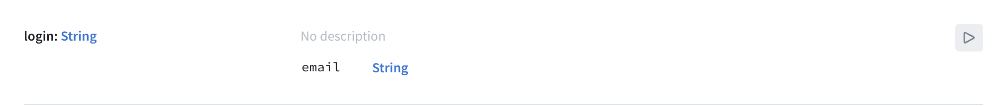

import LoginUISetupPanel from "./components/login_ui_setup_panel.mdx"

In this section, you'll log in to the server and learn how to send a token back to the server with your requests. 

> **Note**: The way you log in with this particular server may be very different from the way you log in with your own server - login is often handled by _middleware_, or a layer totally separate from GraphQL. However you get the token you send, you'll be sending it back to the server the same way. 

The first thing you'll do is create a **mutation** to log yourself in.

## Creating a login mutation

A **mutation** is an operation which is designed to change state on your server. In this case, the mutation is very simple: You want to log in. 

Open [GraphiQL](https://n1kqy.sse.codesandbox.io/), and delete anything already in the left hand panel. Open the Schema tab and select the `login` mutation: 



This mutation takes a single argument, the email address of the person being logged in, and unlike many GraphQL APIs that return objects which need to have fields selected, only returns a single string. 

In the right panel, add a login mutation:

```graphql
mutation Login($email: String) {
  login(email: $email)
}
```

One thing to watch out for: `$email` is a `String` rather than a `String!`, meaning it's legal to pass it a `null` value. However, if you do, you won't get very far. 

In the Query Variables section, at the bottom, add the following:

```json
{ "email": null }
```

And press the big Play button to run your mutation. You'll see that you get back `null` for the login: 


Now, replace `null` in the Query Variables section with your actual email address:

```json
{ "email": "your@email.com" }
```

Press the Play button, and you'll get an actual response:


Next, copy the query. Create a new empty file, name it `Login.graphql`, and paste the query into it. Build your project to make sure the codegen adds the mutation to your `API.swift` file.

Now, it's time to add a view controller which lets you log in.

## Creating the `LoginViewController`

Go to **File > New > File... > Swift File** to create a new Swift file, and name it **LoginViewController.swift**.

Create the class by replacing the `import Foundation` text with the following: 

```swift
import UIKit

class LoginViewController: UIViewController {
}
```

Next, within the class, add `IBOutlet`s for the three fields you're planning to add: 

```swift
@IBOutlet private var emailTextField: UITextField!
@IBOutlet private var errorLabel: UILabel!
@IBOutlet private var submitButton: UIButton!
```

Add an empty `IBAction` method that you'll fill in later for handling taps on the submit button:

```swift
@IBAction private func submitTapped() {
}
```

And then add an `IBAction` to handle taps on a cancel button you're going to add by dismissing the view controller:

```    
@IBAction private func cancelTapped() {
  self.dismiss(animated: true)
}
```


This next (collapsed) section covers setting up constraints in detail to match the way things work in the sample application. You're welcome to use the three outlets and two actions listed above in an alternate setup if you'd prefer, but screenshots for the remainder of these tutorials will be based on this section. 

To follow the precise UI setup instructions, expand this panel:

<LoginUISetupPanel />

In the end, your login view controller should look like this in the storyboard (or roughly like it in whatever alternate setup you've decided to use): 


## Actually logging in 


```swift
private func enableSubmitButton(_ isEnabled: Bool) {
  self.submitButton.isEnabled = isEnabled
    if isEnabled {
      self.submitButton.setTitle("Submit", for: .normal)
    } else {
      self.submitButton.setTitle("Submitting...", for: .normal)
    }
}
```

Next, add a simplified validation to ensure that the String you'll be passing through to the server is an email address:

```swift
private func validate(email: String) -> Bool {
  return email.contains("@")
}
```

>**Note**: Validating emails can be obnoxiously complicated due to multiple RFCs that allow for certain emails which are technically valid but do not pass the most common email validators. However, containing an `@` symbol is basically the only thing all the RFCs agree must happen for something to be an email address. Checking for this at least allows you to have some vague assurance that what someone has entered could be an email before sending it off to your server.


```swift
override func viewDidLoad() {
  super.viewDidLoad()
  self.errorLabel.text = nil
  self.enableSubmitButton(true)
}
```


Add a library called [keychain-swift](https://github.com/evgenyneu/keychain-swift)

```
https://github.com/evgenyneu/keychain-swift.git
```


```swift
static let loginKeychainKey = "login"
```


In `submitTapped`:

```swift
self.errorLabel.text = nil
self.enableSubmitButton(false)

guard let email = self.emailTextField.text else {
  self.errorLabel.text = "Please enter an email address."
  self.enableSubmitButton(true)
  return
}

guard self.validate(email: email) else {
  self.errorLabel.text = "Please enter a valid email."
  self.enableSubmitButton(true)
  return
}
```


under that

```swift
 Network.shared.apollo.perform(mutation: LoginMutation(email: email)) { [weak self] result in
  defer {
    self?.enableSubmitButton(true)
  }

  switch result {
  case .success(let graphQLResult):
    if let token = graphQLResult.data?.login {
      let keychain = KeychainSwift()
      keychain.set(token, forKey: LoginViewController.loginKeychainKey)
      self?.dismiss(animated: true)
    }

    if let errors = graphQLResult.errors {
      print("Errors from server: \(errors)")
    }
  case .failure(let error):
    print("Error: \(error)")
  }
}
```

static let 

In **DetailViewController.swift**


```swift
private func isLoggedIn() -> Bool {
  let keychain = KeychainSwift()
  return keychain.get("login") != nil
}
```


```swift
@IBAction private func bookOrCancelTapped() {
  guard self.isLoggedIn() else {
  self.performSegue(withIdentifier: "showLogin", sender: self)
  return
}
    
guard let launch = self.launch else {
  // We don't have enough information yet to know
  // if we're booking or cancelling, bail.
  return
}
    
if launch.isBooked == true {
    print("Cancel trip!")
  } else {
    print("Book trip!")
  }
}
```

## Summary

Next, you'll [use your login token in a mutation to actually book yourself a flight](./tutorial-mutations)!