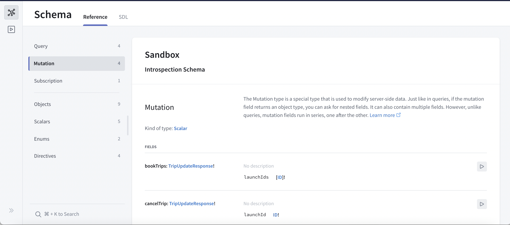
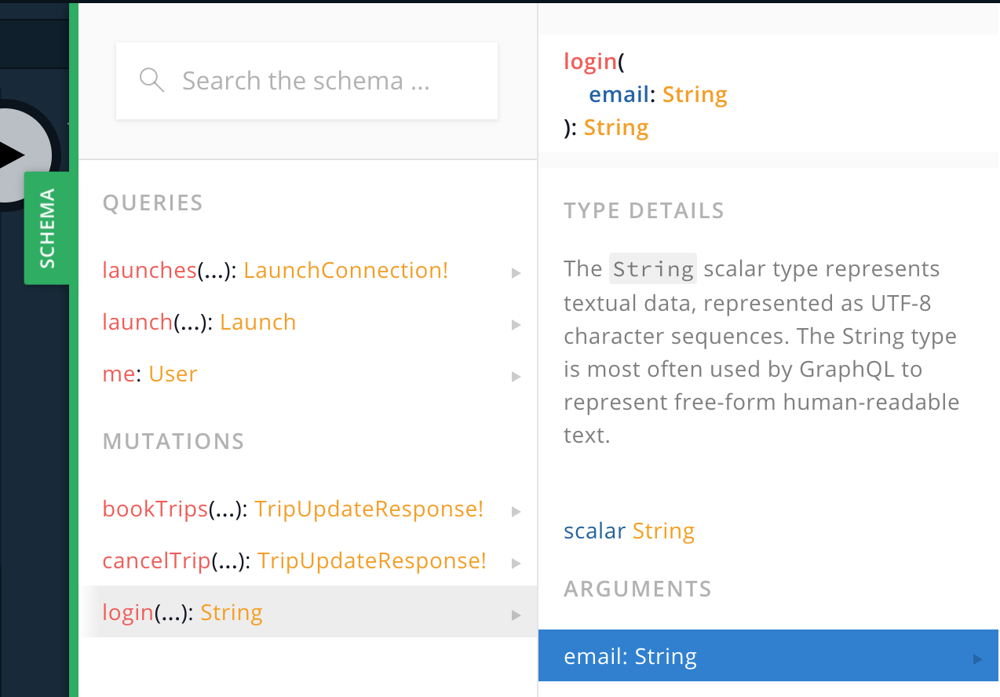
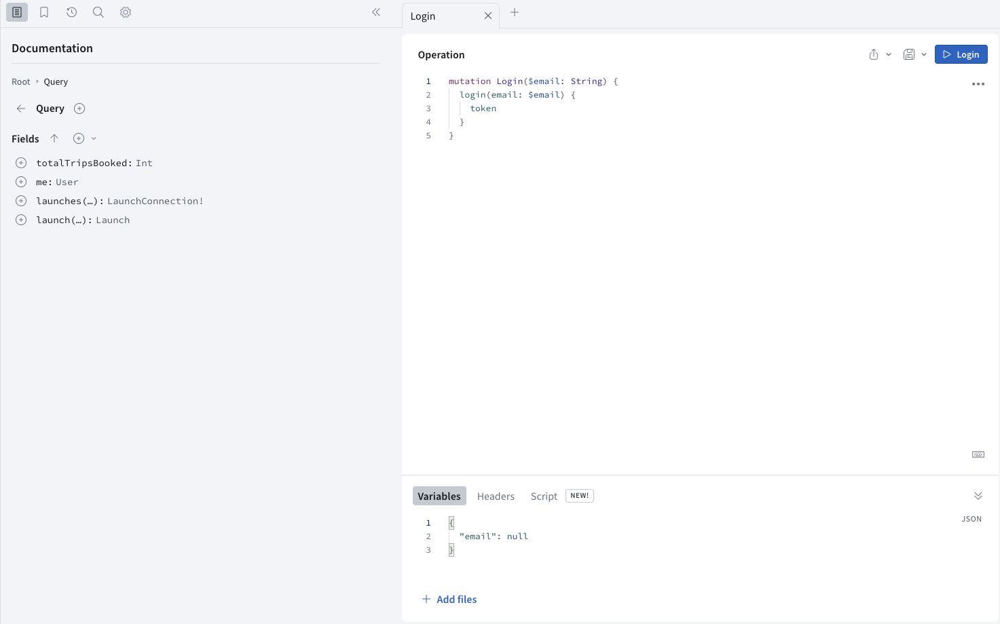
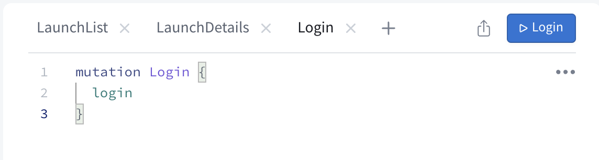
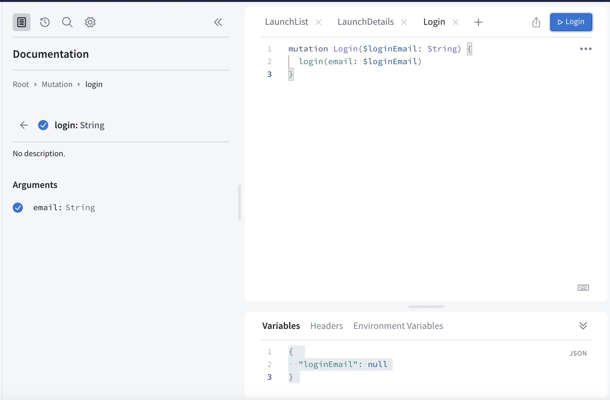
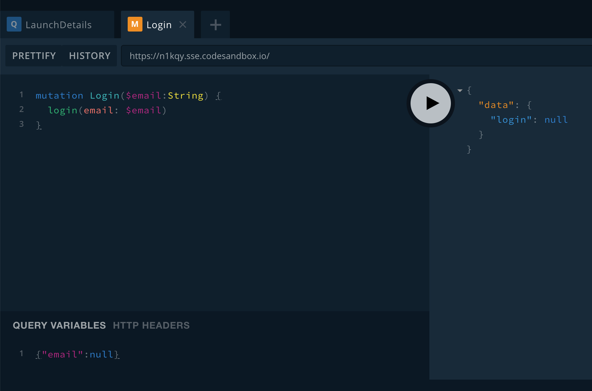
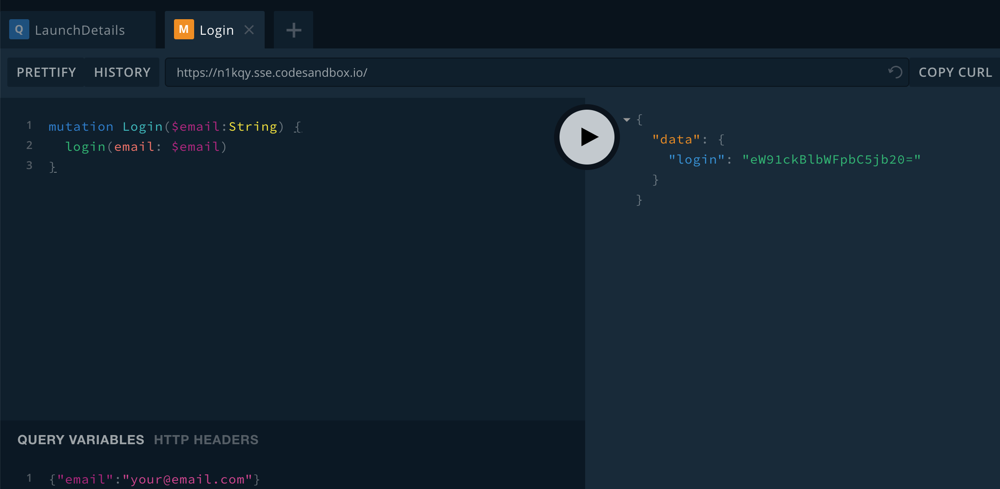
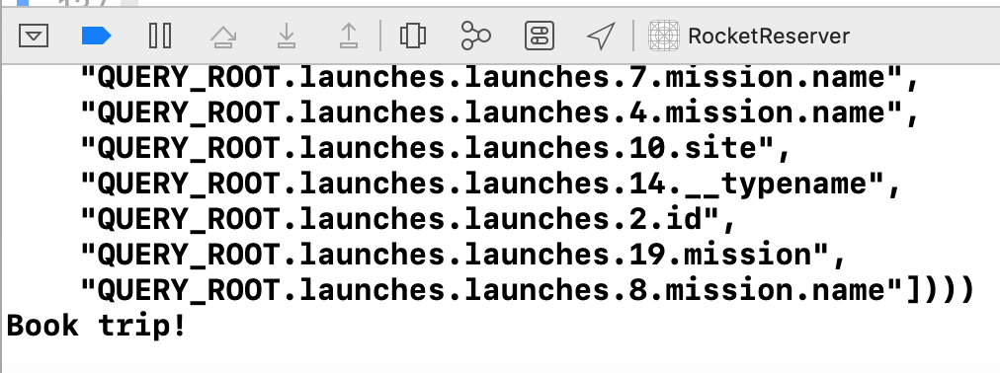

In this section, you'll add the ability to log in to the example server and obtain a token that your client can use to make identified requests.

> **Note**: The way you log in to this particular server might differ from the way you log in with your own server. Login is often handled by _middleware_, or a layer totally separate from GraphQL.
> 
> Regardless of how you obtain the token from your server, you'll usually send it back to the server the same way as demonstrated in the next part of this tutorial.

## Create a login mutation

A **mutation** is an operation that changes state on your server. In this case, the mutation changes back-end state by creating a session tied to a particular user of your client.

Open [your Sandbox Explorer](https://studio.apollographql.com/sandbox/explorer?endpoint=https%3A%2F%2Fapollo-fullstack-tutorial.herokuapp.com) and click on the plus symbol to add a new tab. Next, click on the Schema icon to get back to looking at your schema, and select "Mutation" to look at your list of mutations: 



Scroll down to take a look at the `login` mutation: 



Click the play button to the right to open that mutation in the Explorer tab. When it opens, click the plus sign to add the operation: 



Sandbox Explorer tries to be helpful by adding the word `Mutation` after the word `Login`, but the iOS SDK also does that for you - so you'd wind up with a `LoginMutationMutation`. Rename the operation `Login` instead: 



Notice that there are no brackets after the call to the `login` mutation - this is because the type returned by this mutation is `String`, which is known as a **scalar type**. This means it won't have properties the way an object would, so you don't need to specify what properties you want returned to you. 

You'll also notice that `email` wasn't automatically added as an argument even though it doesn't seem to have a default value: That's because `email` is of type `String` - which remember, in GraphQL, means that it's **not** required (although obviously you won't get too far without it).  

Click the plus sign next to the `email` argument to have that argument added: 



You'll also notice that Sandbox Explorer has added a variable to your "Variables" section to match the login email. 

Click the Submit Operation button your mutation. You'll see that  since you sent `null` for the email address, you get back `null` for the login: 



Now, replace `null` in the Query Variables section with an actual email address:

```json:title=(Sandbox%20Explorer)
{ "loginEmail": "me@example.com" }
```

Press the Submit Operation button, and this time you'll get an actual response:



Next, copy the operation, either manually or using the meatball menu's "Copy operation" option. 

Open Xcode, create a new empty file named `Login.graphql`, and paste the operation into it. Build your project to make sure the codegen adds the mutation to your `API.swift` file.

## Define login logic

Now it's time to actually log the user in, using `LoginViewController.swift`. You'll notice in the `IBAction` for `submitTapped`, we're doing some very basic validation that the user has actually entered an email address before submitting it. 

Still in `submitTapped`, replace the `TODO` with a call to perform the login mutation:

```swift:title=LoginViewController.swift
 Network.shared.apollo.perform(mutation: LoginMutation(loginEmail: email)) { [weak self] result in
  defer {
    // Re-enable the submit button when this scope exits
    self?.enableSubmitButton(true)
  }

  switch result {
  case .failure(let error):
    self?.showAlert(title: "Network Error",
                    message: error.localizedDescription)
  case .success(let graphQLResult):
  
    if let token = graphQLResult.data?.login {
      // TODO: Store the token securely
    }

    if let errors = graphQLResult.errors {
      let message = errors
                     .map { $0.localizedDescription }
                     .joined(separator: "\n")
      self?.showAlert(title: "GraphQL Error(s)",
                      message: message)
    }
  }
}
```


Next, you need to store the login credential that's returned by the server. Login credentials should always be stored in the Keychain, but interacting with it directly is challenging, so you'll be using the `KeychainSwift` library which has already been added as a Swift Package to this project.

At the top of `LoginViewController.swift`, import the `KeychainSwift` library:

```swift:title=LoginViewController.swift
import KeychainSwift
```

Next, note that there's a `static let` at the top of the view controller that will give you a value you can use to query the keychain for a login token. Because this is a `static let`, you can use it outside instances of `LoginViewController` (which you will do in a second). 

Replace the `TODO` after unwrapping the token with the following: 

```swift:title=LoginViewController.swift
let keychain = KeychainSwift()
keychain.set(token, forKey: LoginViewController.loginKeychainKey)
self?.dismiss(animated: true)
```

With this code, once you log in successfully, the token will be stored in the keychain, and then the `LoginViewController` will automatically dismiss (if it still exists). This will send you back to the `DetailViewController`. 

## Display the login screen

Now, it's time to show the login view controller whenever someone attempts to book a trip without being logged in.

At the top of `DetailViewController.swift`, import the `KeychainSwift` library:

```swift:title=DetailViewController.swift
import KeychainSwift
```

Then, find the `isLoggedIn` method and replace its contents with the following: 

```swift:title=DetailViewController.swift
private func isLoggedIn() -> Bool {
  let keychain = KeychainSwift()
  return keychain.get(LoginViewController.loginKeychainKey) != nil
}
```

This code checks if there is any value stored in the keychain under the login keychain key. If there isn't, it determines the user isn't logged in. If there is, the user is logged in. 

Find the `bookOrCancelTapped` method and start by determining what to do if the user is logged in or not: 

```swift:title=DetailViewController.swift
@IBAction private func bookOrCancelTapped() {
  guard self.isLoggedIn() else {
    self.performSegue(withIdentifier: "showLogin", sender: self)
    return
  }
  
  // TODO: Book or cancel the trip
}
```

Then, replace the `TODO` in the above code with logic to figure out whether a trip on the current launched needs to be booked or cancelled: 

```swift:title=DetailViewController.swift
guard let launch = self.launch else {
  // We don't have enough information yet to know
  // if we're booking or cancelling, bail.
  return
}
    
if launch.isBooked {
  print("Cancel trip!")
} else {
  print("Book trip!")
}
```

Build and run the application, and select a launch from the list to view its detail screen. Now when you tap the "Book now!" button, the `LoginViewController` will appear. Use it to log yourself in.

When the `DetailViewController` reappears, if you tap the "Book now!" button again, you'll see the print statement you added logging happily to the console:



In the next step, you'll [use your login token in a mutation to book yourself a trip](./tutorial-mutations)!
