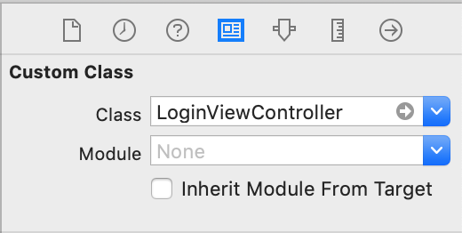
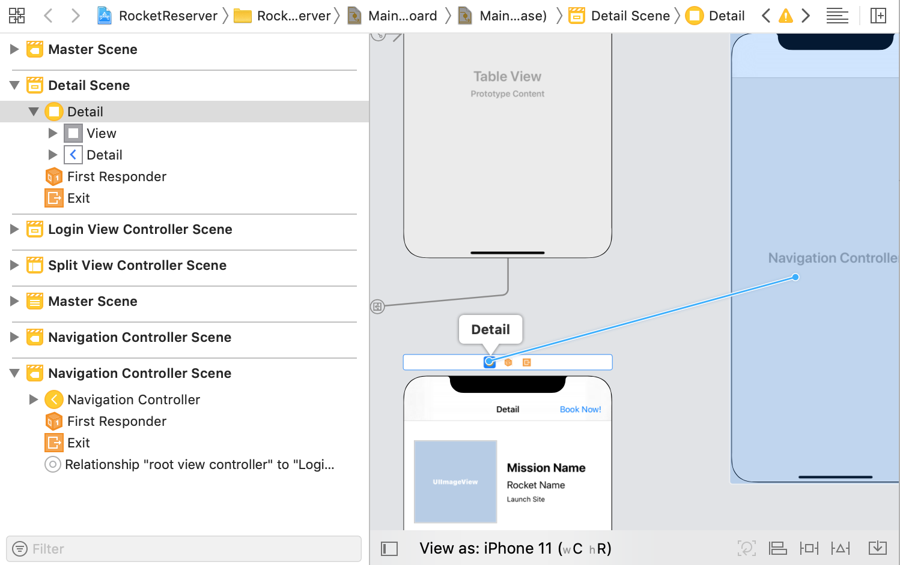
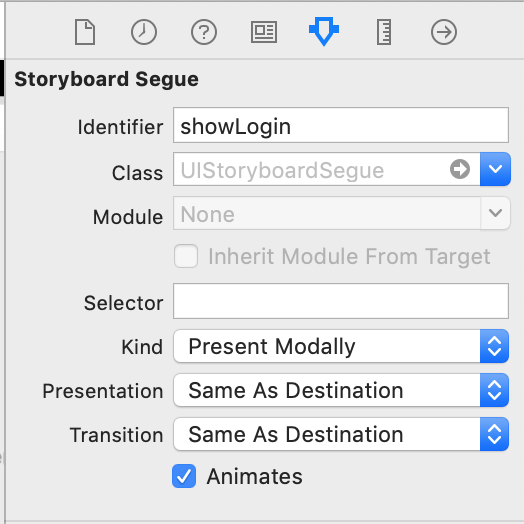
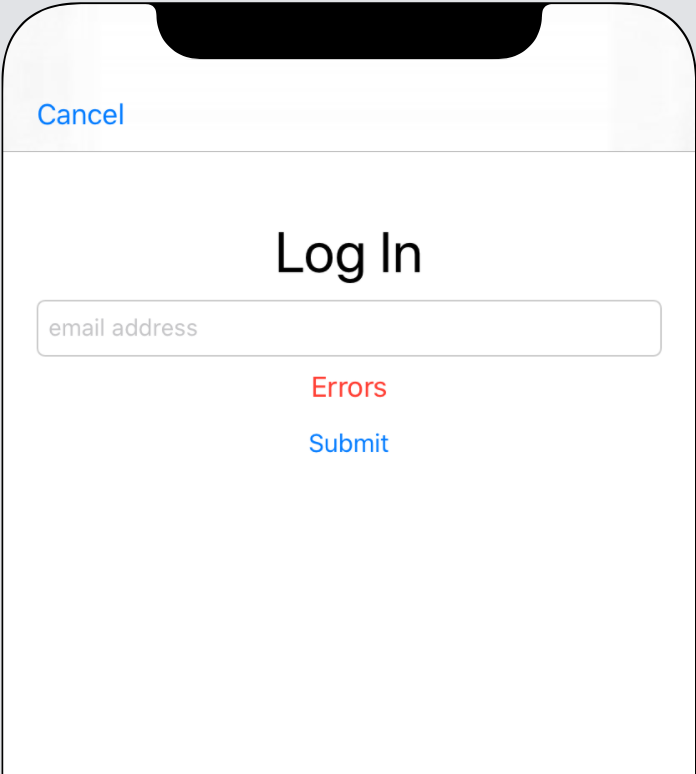

import LoginUISetupPanel from "./components/login_ui_setup_panel.mdx"

In this section, you'll add the ability to log in to the example server and obtain a token that your client can use to make identified requests.

> **Note**: The way you log in to this particular server might differ from the way you log in with your own server. Login is often handled by _middleware_, or a layer totally separate from GraphQL.
> 
> Regardless of how you obtain the token from your server, you'll send it back to the server the same way in the next part of this tutorial.

## Create a login mutation

A **mutation** is an operation that changes state on your server. In this case, the mutation changes back-end state by creating a session tied to a particular user of your client.

Open [GraphiQL](https://apollo-fullstack-tutorial.herokuapp.com/) and delete anything that's already in the left-hand panel. Open the Docs tab and select the `login` mutation:


This mutation takes a single argument, the `email` address of the person being logged in. Unlike many GraphQL operations that return objects which need to have fields selected, the `login` mutation returns only a single string.

In the left-hand panel, add the following mutation definition:

```graphql:title=(GraphiQL)
mutation Login($email: String) {
  login(email: $email)
}
```

One thing to watch out for: the type of the `$email` argument is a `String` instead of a `String!`. This means it's legal to pass a `null` value (but if you do, you won't get very far).

In the Query Variables section at the bottom, add the following:

```json:title=(GraphiQL)
{ "email": null }
```

And press the big Play button to run your mutation. You'll see that you get back `null` for the login: 


Now, replace `null` in the Query Variables section with an actual email address:

```json:title=(GraphiQL)
{ "email": "me@example.com" }
```

Press the Play button, and you'll get an actual response:


Next, copy the query. Create a new empty file named `Login.graphql`, and paste the query into it. Build your project to make sure the codegen adds the mutation to your `API.swift` file.

Now, it's time to add a view controller that lets you log in.

## Create the `LoginViewController`

Go to **File > New > File... > Swift File** to create a new Swift file, and name it `LoginViewController.swift`.

Create the class by replacing the `import Foundation` text with the following: 

```swift:title=LoginViewController.swift
import UIKit

class LoginViewController: UIViewController {
}
```

Next, within the class, add `IBOutlet`s for the three fields you're planning to add: 

```swift:title=LoginViewController.swift
@IBOutlet private var emailTextField: UITextField!
@IBOutlet private var errorLabel: UILabel!
@IBOutlet private var submitButton: UIButton!
```

Add an empty `IBAction` method that you'll fill in later for handling taps on the submit button:

```swift:title=LoginViewController.swift
@IBAction private func submitTapped() {
}
```

And then add an `IBAction` to handle taps on a cancel button you're going to add by dismissing the view controller:

```swift:title=LoginViewController.swift
@IBAction private func cancelTapped() {
  self.dismiss(animated: true)
}
```

Next, open `Main.storyboard`. Search for a `UIViewController` in the library, and drag it into the storyboard next to the detail view controller. 

Select the view controller in the storyboard, and edit its Custom Class to be `LoginViewController`:



Next, go to **Editor > Embed In > Navigation Controller** to make sure there's a nav controller for your login VC. 

Then, in the left sidebar of the storyboard, select the `DetailViewController`, and control-drag from it to the `LoginViewController`'s navigation controller to set up a segue: 



Select the segue, and then in the attributes inspector set the identifier of the segue to `showLogin` and the type to `Present Modally`:



This next (collapsed) section covers setting up constraints in detail to match the way things work in the sample application. You're welcome to use the three outlets and two actions listed above in an alternate setup if you'd prefer, but screenshots for the remainder of these tutorials are based on this section.

To follow the precise UI setup instructions, expand this panel:

<LoginUISetupPanel />

In the end, your login view controller should look like this in the storyboard (or roughly like it in whatever alternate setup you've decided to use): 




## Define login logic

Now it's time to hook everything up. Below your `IBAction` methods, add a new function to enable the submit button and change its title based on whether it's enabled:

```swift:title=LoginViewController.swift
private func enableSubmitButton(_ isEnabled: Bool) {
  self.submitButton.isEnabled = isEnabled
  if isEnabled {
    self.submitButton.setTitle("Submit", for: .normal)
  } else {
    self.submitButton.setTitle("Submitting...", for: .normal)
  }
}
```

Next, add basic email validation to help make sure that the String you'll be passing through to the server might be an email address (a production app would of course validate more thoroughly):

```swift:title=LoginViewController.swift
private func validate(email: String) -> Bool {
  return email.contains("@")
}
```

Now add a `viewDidLoad` override that clears the text in the error label and enables the submit button:

```swift:title=LoginViewController.swift
override func viewDidLoad() {
  super.viewDidLoad()
  self.errorLabel.text = nil
  self.enableSubmitButton(true)
}
```

Next, you need to store the login credential that's returned by the server. Login credentials should always be stored in the Keychain, but interacting with it directly is challenging.

Instead, add a library called [keychain-swift](https://github.com/evgenyneu/keychain-swift), by going to **File > Swift Packages > Add Package Dependency...** and pasting in the `keychain-swift` repo URL:

```
https://github.com/evgenyneu/keychain-swift.git
```

The library will resolve. Because it's a single target, you only need to add that target to your project. 

At the top of `LoginViewController.swift`, import the library you just added:

```swift:title=LoginViewController.swift
import KeychainSwift
```

Next, add a `static let` that will give you a value you can use to query the keychain for a login token: 


```swift:title=LoginViewController.swift
static let loginKeychainKey = "login"
```

Because this is a `static let`, you can use it outside instances of `LoginViewController`. 

Now add some validation to the `submitTapped` button to make sure the String you're going to send as an email is non-null and passes your local validation:

```swift:title=LoginViewController.swift
self.errorLabel.text = nil
self.enableSubmitButton(false)

guard let email = self.emailTextField.text else {
  self.errorLabel.text = "Please enter an email address."
  self.enableSubmitButton(true)
  return
}

guard self.validate(email: email) else {
  self.errorLabel.text = "Please enter a valid email."
  self.enableSubmitButton(true)
  return
}
```

Now that you have a non-null and valid `email` variable, you can use it to log in. Still in `submitTapped`, add a call to perform the login mutation:

```swift:title=LoginViewController.swift
 Network.shared.apollo.perform(mutation: LoginMutation(email: email)) { [weak self] result in
  defer {
    self?.enableSubmitButton(true)
  }

  switch result {
  case .success(let graphQLResult):
    if let token = graphQLResult.data?.login {
      let keychain = KeychainSwift()
      keychain.set(token, forKey: LoginViewController.loginKeychainKey)
      self?.dismiss(animated: true)
    }

    if let errors = graphQLResult.errors {
      print("Errors from server: \(errors)")
    }
  case .failure(let error):
    print("Error: \(error)")
  }
}
```

With this code, once you log in successfully, the `LoginViewController` will automatically dismiss. This will send you back to the `DetailViewController`. 

## Display the login screen

Now, it's time to show the login view controller whenever someone attempts to book a trip without being logged in.

At the top of `DetailViewController.swift`, import the `KeychainSwift` library:

```swift:title=DetailViewController.swift
import KeychainSwift
```

Then, add a new method to determine whether the user is currently logged in: 

```swift:title=DetailViewController.swift
private func isLoggedIn() -> Bool {
  let keychain = KeychainSwift()
  return keychain.get(LoginViewController.loginKeychainKey) != nil
}
```

Then, add a new method to determine what to do when the "Book now!" button is tapped:


```swift:title=DetailViewController.swift
@IBAction private func bookOrCancelTapped() {
  guard self.isLoggedIn() else {
    self.performSegue(withIdentifier: "showLogin", sender: self)
    return
  }
    
  guard let launch = self.launch else {
    // We don't have enough information yet to know
    // if we're booking or cancelling, bail.
    return
  }
    
  if launch.isBooked {
    print("Cancel trip!")
  } else {
    print("Book trip!")
  }
}
```

In your storyboard, hook this method up to the `bookOrCancel` button you set up earlier. 

Build and run the application. Now when you tap the "Book now!" button, the `LoginViewController` will appear. Use it to log yourself in.

When the `DetailViewController` reappears, if you tap the "Book now!" button again, you'll see the print statement you added logging happily to the console:


In the next step, you'll [use your login token in a mutation to book yourself a trip](./tutorial-mutations)!
