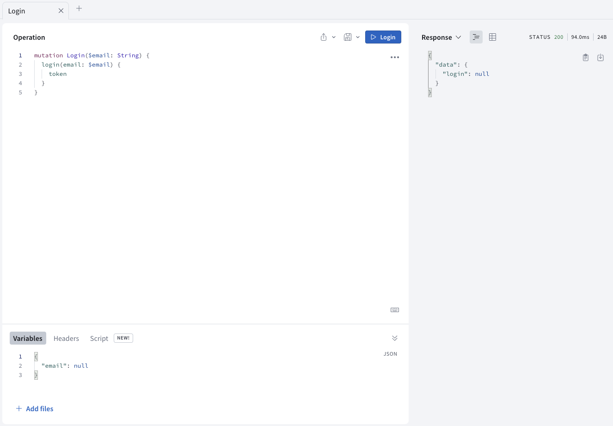

import LoginUISetupPanel from "./components/login_ui_setup_panel.mdx"

In this section, you'll log in to the server and get a token you can use to make identified requests. 

> **Note**: The way you log in with this particular server may be very different from the way you log in with your own server - login is often handled by _middleware_, or a layer totally separate from GraphQL.
> 
> However you get the token from your server, you'll be sending it back to the server the same way in the next part of this tutorial, and can still learn some valuable things from this section of the tutorial.

The first thing you'll do is create a **mutation** to log yourself in.

## Creating a login mutation

A **mutation** is an operation which is designed to change state on your server. In this case, the mutation is very simple: You want to log in. 

Open [GraphiQL](https://apollo-fullstack-tutorial.herokuapp.com/), and delete anything already in the left hand panel. Open the Schema tab and select the `login` mutation: 


This mutation takes a single argument, the email address of the person being logged in, and unlike many GraphQL APIs that return objects which need to have fields selected, only returns a single string. 

In the right panel, add a login mutation:

```graphql
mutation Login($email: String) {
  login(email: $email)
}
```

One thing to watch out for: `$email` is a `String` rather than a `String!`, meaning it's legal to pass it a `null` value. However, if you do, you won't get very far. 

In the Query Variables section, at the bottom, add the following:

```json
{ "email": null }
```

And press the big Play button to run your mutation. You'll see that you get back `null` for the login: 



Now, replace `null` in the Query Variables section with your actual email address:

```json
{ "email": "your@email.com" }
```

Press the Play button, and you'll get an actual response:


Next, copy the query. Create a new empty file, name it `Login.graphql`, and paste the query into it. Build your project to make sure the codegen adds the mutation to your `API.swift` file.

Now, it's time to add a view controller which lets you log in.

## Creating the `LoginViewController`

Go to **File > New > File... > Swift File** to create a new Swift file, and name it **LoginViewController.swift**.

Create the class by replacing the `import Foundation` text with the following: 

```swift
import UIKit

class LoginViewController: UIViewController {
}
```

Next, within the class, add `IBOutlet`s for the three fields you're planning to add: 

```swift
@IBOutlet private var emailTextField: UITextField!
@IBOutlet private var errorLabel: UILabel!
@IBOutlet private var submitButton: UIButton!
```

Add an empty `IBAction` method that you'll fill in later for handling taps on the submit button:

```swift
@IBAction private func submitTapped() {
}
```

And then add an `IBAction` to handle taps on a cancel button you're going to add by dismissing the view controller:

```    
@IBAction private func cancelTapped() {
  self.dismiss(animated: true)
}
```

Next open **Main.storyboard**. Search for a `UIViewController` in the library, and drag it into the storyboard next to the detail view controller. 

Select the view controller in the storyboard, and edit its Custom Class to be `LoginViewController`:


Next, go to **Editor > Embed In > Navigation Controller** to make sure there's a nav controller for your login VC. 

Then, in the left sidebar of the storyboard, select the `DetailViewController`, and control-drag from it to the `LoginViewController`'s navigation controller to set up a segue: 


Select the segue, and then in the attributes inspector set the identifier of the segue to `showLogin` and the type to `Present Modally`:


This next (collapsed) section covers setting up constraints in detail to match the way things work in the sample application. You're welcome to use the three outlets and two actions listed above in an alternate setup if you'd prefer, but screenshots for the remainder of these tutorials will be based on this section. 

To follow the precise UI setup instructions, expand this panel:

<LoginUISetupPanel />

In the end, your login view controller should look like this in the storyboard (or roughly like it in whatever alternate setup you've decided to use): 


## Actually logging in 

Now, it's time to hook everything up. Below your `IBAction` methods, add a new function to enable the submit button and change its title based on whether it's enabled or not:

```swift
private func enableSubmitButton(_ isEnabled: Bool) {
  self.submitButton.isEnabled = isEnabled
  if isEnabled {
    self.submitButton.setTitle("Submit", for: .normal)
  } else {
    self.submitButton.setTitle("Submitting...", for: .normal)
  }
}
```

Next, add a simplified email validation to ensure that the String you'll be passing through to the server is an email address:

```swift
private func validate(email: String) -> Bool {
  return email.contains("@")
}
```

>**Note**: Validating emails can be obnoxiously complicated due to multiple RFCs that allow for certain emails which are technically valid but do not pass the most common email validators. 
>
>However, containing an `@` symbol is basically the only thing all the RFCs agree must happen for something to be an email address. Checking for this at least allows you to have some vague assurance that what someone has entered could be an email before sending it off to your server.

Next, add a `viewDidLoad` override that clears the text in the error label and enables the submit button:

```swift
override func viewDidLoad() {
  super.viewDidLoad()
  self.errorLabel.text = nil
  self.enableSubmitButton(true)
}
```

Next, you'll want to store the login credential which is returned from the server. Login credentials should always be stored in the Keychain, but interacting with it directly is a bit of a pain. 

Instead, add a library called [keychain-swift](https://github.com/evgenyneu/keychain-swift), by going to **File > Swift Packages > Add Package Dependency...** and pasting in the `keychain-swift` repo URL:

```
https://github.com/evgenyneu/keychain-swift.git
```

The library will resolve, and since it's only a single target, you only need to add that target to your project. 

At the top of `LoginViewController.swift`, import the library you just added:

```swift
import KeychainSwift
```

Next, add a `static let` that will give you a value you can use to query the keychain for a login token: 


```swift
static let loginKeychainKey = "login"
```

This is a `static let` so you can use it outside instances of `LoginViewController`. 

Next, add some validation to the `submitTapped` button to make sure the String you're going to send as an email is non-null and passes your local validation:

```swift
self.errorLabel.text = nil
self.enableSubmitButton(false)

guard let email = self.emailTextField.text else {
  self.errorLabel.text = "Please enter an email address."
  self.enableSubmitButton(true)
  return
}

guard self.validate(email: email) else {
  self.errorLabel.text = "Please enter a valid email."
  self.enableSubmitButton(true)
  return
}
```

Now that you have a non-null and valid `email` variable, you can use it to log in. Still in `submitTapped`, add a call to perform the login mutation:

```swift
 Network.shared.apollo.perform(mutation: LoginMutation(email: email)) { [weak self] result in
  defer {
    self?.enableSubmitButton(true)
  }

  switch result {
  case .success(let graphQLResult):
    if let token = graphQLResult.data?.login {
      let keychain = KeychainSwift()
      keychain.set(token, forKey: LoginViewController.loginKeychainKey)
      self?.dismiss(animated: true)
    }

    if let errors = graphQLResult.errors {
      print("Errors from server: \(errors)")
    }
  case .failure(let error):
    print("Error: \(error)")
  }
}
```

With this code, once you log in successfully, the `LoginViewController` will automatically dismiss. This will send you back to the `DetailViewController`. 

## Showing the login screen

Now, it's time to show the login view controller if someone attempts to book without a logged in account. 

In **DetailViewController.swift**, add a new method to determine if the user is currently logged in: 

```swift
private func isLoggedIn() -> Bool {
  let keychain = KeychainSwift()
  return keychain.get(LoginViewController.loginKeychainKey) != nil
}
```

Then, add a new method to determine what to do when the "Book now!" button is tapped:


```swift
@IBAction private func bookOrCancelTapped() {
  guard self.isLoggedIn() else {
    self.performSegue(withIdentifier: "showLogin", sender: self)
    return
  }
    
  guard let launch = self.launch else {
    // We don't have enough information yet to know
    // if we're booking or cancelling, bail.
    return
  }
    
  if launch.isBooked == true {
    print("Cancel trip!")
  } else {
    print("Book trip!")
  }
}
```

In your storyboard, hook this method up to the `bookOrCancel` button you set up earlier. 

Build and run the application, and now when you tap the "Book now!" button, the `LoginViewController` will appear. Use it to log yourself in. 

When the `DetailViewController` reappears, if you tap the "Book now!" button again, you'll see the print statement you added logging happily to the console:


## Summary

In this portion of the tutorial: 

- You used your first mutation to log yourself in 
- You built a system to allow the user to log in
- You stored an authentication token so that you can make authenticated requests in the future

Next, you'll [use your login token in a mutation to actually book yourself a flight](./tutorial-mutations)!