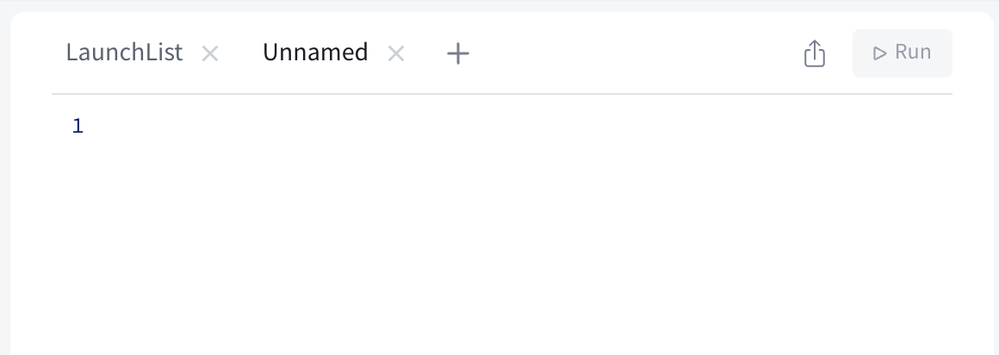

In this section, you'll write a second GraphQL query that requests details about a single launch and uses that data in a `DetailView`

To get more information to show on the detail page, you have a couple of options: 

- You could request all the details you want to display for every single launch in the `LaunchList` query, and then pass that retrieved object on to the `DetailViewController`. 
- You could provide the identifier of an individual launch to a _different_ query to request all the details you want to display. 

The first option *can* seem easier if there isn't a substantial difference in size between what you're requesting for the list versus the detail page. 

However, remember that one of the advantages of GraphQL is that you can query for _exactly_ the data you need to display on a page. If you're not going to be displaying additional information, you can save bandwidth, execution time, and battery life by not asking for data until you need it.

This is especially true when you have a *much* larger query for your detail view than for your list view. Passing the identifier and then fetching based on that is considered a best practice. Even though the amount of data in this case doesn't differ greatly, you'll build out a query to help fetch details based on the ID so you'll know how to do it in the future.

# Create the details query

Create a new empty file and name it `LaunchDetails.graphql`. In this file, you'll add the details you want to display in the detail view. First, you'll want to go back to [your Sandbox](https://studio.apollographql.com/sandbox/explorer?endpoint=https%3A%2F%2Fapollo-fullstack-tutorial.herokuapp.com) and make sure that your query works!

In the Explorer tab, start by clicking the "New Tab" button in the middle operations section: 


A new tab will be added with nothing in it: 



In the left-hand column, click the word "Query" under "Documentation" to be brought to a list of possible queries: 


Select the `launch` query by clicking the button next to it. Sandbox Explorer will automatically set up the query for you to use: 


First, change the name of the operation from "Query" to "LaunchDetails" - that will then reflect in the tab name and make it easier to tell which query you're working with:  


Let's go through what's been added here: 

- Again, we've added an operation, but this time it's got a parameter coming into it. This was added automatically by Sandbox Explorer because there is not a default value provided for the non-null `launchId` argument. 
- The parameter is prefixed with a `$` for its name, and the type is indicated immediately after. Note that the `ID` type here has an exclamation point, meaning it can't be null. 
- Within that operation, we make a call to the `launch` query. The `id` is the argument the query is expecting, and the `$launchId` is the name of the parameter we just passed in the line above. 
- Again, there's blank space for you to add the fields you want to get details for on the returned object, which in this case is a `Launch`. 
- Finally, at the bottom, the "Variables" section of the Operations panel has been expanded, and a dictionary has been added with a key of `"launchId"`. At runtime, this will be used to fill in the blank of the `$launchId` parameter. 


> Note: GraphQL's assumptions about nullability are different from Swift's. In Swift, if you don't annotate a property's type with either a question mark or an exclamation point, that property is non-nullable.
>
> In GraphQL, if you don't annotate a field's type with an exclamation point, that field is considered *nullable*. This is because GraphQL fields are **nullable by default**.
>
> Keep this difference in mind when you switch between editing Swift and GraphQL files.

Now in the Sandbox Explorer, start by using the checkboxes or typing to add the properties you're already requesting in the `LaunchList` query. One difference: Use `LARGE` for the mission patch size since the patch will be displayed in a much larger `ImageView`:

```graphql title="(Sandbox Explorer)"
query LaunchDetails($id:ID!) {
  launch(id: $id) {
    id
    site
    mission {
      name
      missionPatch(size:LARGE)
    }
  }
}
```

Next, look in the left sidebar to see what other fields are available. Selecting `rocket` will add a set of brackets to request details about the rocket, and drill you into the `rocket` property, showing you the available fields on the `Rocket` type: 


Click the buttons to check off `name` and `type`. Next, go back to `Launch` by clicking the back button next to the `Rocket` type in the left sidebar: 


Finally, check off the `isBooked` property on the `Launch`. Your final query should look like this: 

```graphql title="(Sandbox Explorer)"
query LaunchDetails($launchId: ID!) {
  launch(id: $launchId) {
    id
    site
    mission {
      name
      missionPatch(size: LARGE)
    }
    rocket {
      name
      type
    }
    isBooked
  }
}
```

At the bottom of the Operations section, update the Variables section to pass in an ID for a launch. In this case, it needs to be a string that contains a number:

```json title="(Sandbox Explorer)"
{ "id": "25" }
```

This tells Sandbox Explorer to fill in the value of the `$launchId` variable with the value `"25"` when it runs the query. Press the big play button, and you should get some results back for the launch with ID 25: 


Now that you've confirmed it worked, copy the query (either by selecting all the text or using the "Copy Operation" option from the meatball menu as before) and paste it into your `LaunchDetails.graphql` file. Run the code generation from Terminal to generate the code for the new query.

## Execute the query

Now let's add the code to run this query to retrieve our data.

Go to `DetailViewModel.swift` and add this `import`

```swift title="DetailViewModel.swift"
import RocketReserverAPI
```

Next let's update the `init()` method and add some variables to hold our Launch data:

```swift title="DetailViewModel.swift"
let launchID: RocketReserverAPI.ID // highlight-line

@Published var launch: LaunchDetailsQuery.Data.Launch?// highlight-line
@Published var isShowingLogin = false
@Published var appAlert: AppAlert?

init(launchID: RocketReserverAPI.ID) {// highlight-line
    self.launchID = launchID// highlight-line
}
```

Next we need to run the query, so replace the `TODO` in the `loadLaunchDetails` method with this code:

```swift title="DetailViewModel.swift"
func loadLaunchDetails() {
    guard launchID != launch?.id else {
        return
    }

    Network.shared.apollo.fetch(query: LaunchDetailsQuery(launchId: launchID)) { [weak self] result in
        guard let self = self else {
            return
        }

        switch result {
        case.success(let graphQLResult):
            if let launch = graphQLResult.data?.launch {
                self.launch = launch
            }

            if let errors = graphQLResult.errors {
                self.appAlert = .errors(errors: errors)
            }
        case .failure(let error):
            self.appAlert = .errors(errors: [error])
        }
    }
}
```

Now that we have our query executing we need to update the UI code to use the new data.

## Update UI code

To start, go to `DetailView.swift` and add the following `import` statements:

```swift title="DetailView.swift"
import RocketReserverAPI
import SDWebImageSwiftUI
```

Next, we need to update the `init()` method to initialize the `DetailViewModel` with a `launchID`:

```swift title="DetailView.swift"
init(launchID: RocketReserverAPI.ID) {
    _viewModel = StateObject(wrappedValue: DetailViewModel(launchID: launchID))
}
```

Lastly, let's update the `body` View variable to use the launch data from `DetailViewModel` and call the `loadLaunchDetails` method:

```swift title="DetailView.swift"
var body: some View {
    VStack {
        if let launch = viewModel.launch { // highlight-line
            HStack(spacing: 10) {
                if let missionPatch = launch.mission?.missionPatch { // highlight-line 
                    WebImage(url: URL(string: missionPatch)) // highlight-line
                        .resizable() // highlight-line
                        .placeholder(placeholderImg) // highlight-line
                        .indicator(.activity) // highlight-line
                        .scaledToFit() // highlight-line
                        .frame(width: 165, height: 165) // highlight-line
                } else { // highlight-line
                    placeholderImg
                        .resizable()
                        .scaledToFit()
                        .frame(width: 165, height: 165)
                } // highlight-line

                VStack(alignment: .leading, spacing: 4) {
                    if let missionName = launch.mission?.name { // highlight-line
                        Text(missionName)
                            .font(.system(size: 24, weight: .bold))
                    }

                    if let rocketName = launch.rocket?.name { // highlight-line
                        Text("🚀 \(rocketName)")
                            .font(.system(size: 18))
                    }

                    if let launchSite = launch.site { // highlight-line
                        Text(launchSite)
                            .font(.system(size: 14))
                    }
                }

                Spacer()
            }

            if launch.isBooked { // highlight-line
                cancelTripButton()
            } else {
                bookTripButton()
            }
        }
        Spacer()
    }
    .padding(10)
    .navigationTitle(viewModel.launch?.mission?.name ?? "") // highlight-line
    .navigationBarTitleDisplayMode(.inline)
    .task {
        viewModel.loadLaunchDetails() // highlight-line
    }
    .sheet(isPresented: $viewModel.isShowingLogin) {
        LoginView(isPresented: $viewModel.isShowingLogin)
    }
    .appAlert($viewModel.appAlert)
}
```

Optionally, if you want to be able to continue to preview the SwiftUI view, update the preview code in `DetailView` to this:

```swift title="DetailView.swift"
struct DetailView_Previews: PreviewProvider {
    static var previews: some View {
        DetailView(launchID: "110") // highlight-line
    }
}
```

Now we just need to connect the `DetailView` to our `LaunchListView`. So let's go to `LaunchListView.swift` and update our `List` to the following:

```swift title="LaunchListView.swift"
ForEach(0..<viewModel.launches.count, id: \.self) { index in
    NavigationLink(destination: DetailView(launchID: viewModel.launches[index].id)) { // highlight-line
        LaunchRow(launch: viewModel.launches[index]) // highlight-line
    } // highlight-line
}
```

This will allow us to click on any `LaunchRow` in our list and load the `DetailView` for that launch.

## Test the DetailView

Now that everything is linked up, build and run the application and when you click on any launch you should see a corresponding `DetailView` like this:


You may have noticed that the detail view includes a `Book Now!` button, but there's no way to book a seat yet. To fix that, let's [learn how to make changes to objects in your graph with mutations, including authentication](tutorial-first-mutation).