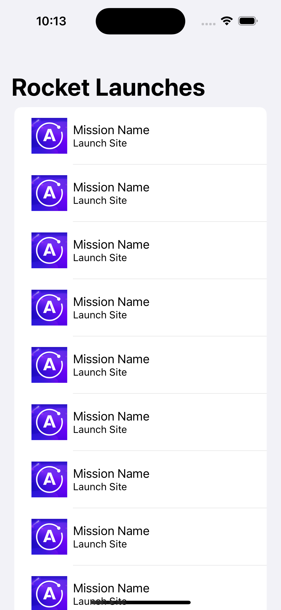

In this step, you'll get the starter project and add the Apollo iOS SDK to a new project.

## Clone the starter project

```text
git clone https://github.com/apollographql/apollo-ios.git
```

The starter project is located in the `starter` folder.

At any time, if you want to view a completed version of the project, open the project in the `final` folder.

## Open the 'starter' project in Xcode

Open the `RocketReserver.xcodeproj` located in the `starter` folder:


When the project opens, Swift Package Manager (SPM) will resolve some dependencies that you'll be using later in the project that are already set up:

* KeychainSwift
* SDWebImage
* SDWebImageSwiftUI

If you build and run the project you should see a list with placeholder data:



Next let's add Apollo as a dependency.

## Add the Apollo iOS SDK to your project

1. Go to **File > Add Packages...**. The Add Package dialog appears, by default with Apple packages. In the upper right hand corner, paste `https://github.com/apollographql/apollo-ios` into the search bar:


2. Xcode will then show you the `apollo-ios` package and allow you to select a version in the right hand panel. Select **Up to Next Minor** from the Version dropdown (At the time of writing, the current minor version is 1.2.x, note that minor breaking changes _can_ occur between minor releases):


3. Click **Add Package**. Once SPM is done checking out the package, a list of framework targets included in the library appears. For this tutorial, select the main **Apollo** target and the **ApolloWebSocket** target:


_Note: Do **not** select the `Apollo-Dynamic` target, this is only for use for projects linking to our library dynamically. Most projects, including this one, will not need to do this._
    
4. Click **Add Package**. SPM fetches your dependencies. When it completes, you can see them in the project navigator:


> **Note:** Because SPM has not yet implemented [Target-Based Dependency Resolution](https://github.com/apple/swift-evolution/blob/master/proposals/0226-package-manager-target-based-dep-resolution.md), you'll see the `SQLite` dependency even though you didn't select `ApolloSQLite`, the target which depends on it.

Your project should now be ready to use the Apollo iOS SDK. Next, you will [add the GraphQL schema to the project.](tutorial-add-graphql-schema)