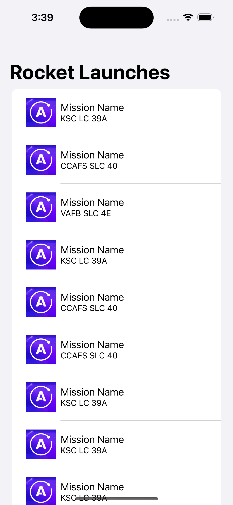

In this chapter you are going to display a list of Launches in a [List](https://developer.apple.com/documentation/swiftui/list).

## Configure LaunchListViewModel

In `LaunchListViewModel` add a new variable to hold the launches returned by the query:

```swift title="LaunchListViewModel.swift"
@Published var launches = [LaunchListQuery.Data.Launches.Launch]() // highlight-line
@Published var appAlert: AppAlert?
@Published var notificationMessage: String?
```

Next, replace the `TODO` in the `loadMoreLaunches()` method with the code to run the `LaunchListQuery`:

```swift title="LaunchListViewModel.swift"
Network.shared.apollo.fetch(query: LaunchListQuery()) { [weak self] result in
    guard let self = self else {
        return
    }

    switch result {
    case .success(let graphQLResult):
        if let launchConnection = graphQLResult.data?.launches {
            self.launches.append(contentsOf: launchConnection.launches.compactMap({ $0 }))
        }

        if let errors = graphQLResult.errors {
            self.appAlert = .errors(errors: errors)
        }
    case .failure(let error):
        self.appAlert = .errors(errors: [error])
    }
}
```

`GraphQLResult` has both a `data` property and an `errors` property. This is because GraphQL allows partial data to be returned if it's non-null. 

In the example we're working with now, we could theoretically obtain a list of launches, and then an error stating that a launch with a particular ID could not be retrieved. 

This is why when you get a `GraphQLResult`, you generally want to check both the `data` property (to display any results you got from the server) _and_ the `errors` property (to try to handle any errors you received from the server).

As you can see in the code, the sample project has already provided an easy way to display error alerts by simply assigning the desired value to the `appAlert` property.

## Use Launches in the UI

First let's update our `LaunchRow` view to be able to display the data for a specific `Launch`. At the top of the file add `import RocketReserverAPI` and then add the following variable:

```swift title="LaunchRow.swift"
let launch: LaunchListQuery.Data.Launches.Launch // highlight-line
private let placeholderImg = Image("placeholder")
```

Then let's update one of our [Text](https://developer.apple.com/documentation/swiftui/text) views to show the launch site:

```swift title="LaunchRow.swift"
VStack(alignment: .leading) {
    Text("Mission Name")
    Text(launch.site ?? "Launch Site") // highlight-line
        .font(.system(size: 14))
}
```

Now that our `LaunchRow` is updated, let's move over to `LaunchListView` and start displaying our Launches in the list.

Update the `ForEach` loop to loop through every launch item from our `viewModel` and create a `LaunchRow` for it:

```swift title="LaunchListView.swift"
ForEach(0..<viewModel.launches.count, id: \.self) { index in
    LaunchRow(launch: viewModel.launches[index])
}
```

The last step is to call the `loadMoreLaunches` method we updated earlier to actually query the server for data. To do this update the `TODO` in the `.task { }` in `LaunchListView` to the following:

```swift title="LaunchListView.swift"
.task {
    viewModel.loadMoreLaunches() // highlight-line
}
```

## Test your query

Build and run the application, you now have a UI connected to your GraphQL queries 🚀.



Next, you'll [add more info](tutorial-add-more-info-to-list) to the list to make it look nicer!