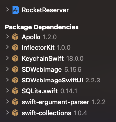

In this step, you'll add the Apollo iOS SDK to a new project. 

## Create a new Xcode project

1. Open Xcode and go to **File > New > Project**. The template chooser appears.

2. Under the set of iOS templates, choose **Master-Detail App**:

    

4. Click **Next**. An options dialog for your app appears.

5. Name the project **RocketReserver**. Make sure the language is **Swift** and the User Interface is **Storyboard**:

    

6. Click **Next**. Select a location to save your new project and click **Finish**.

Xcode creates and opens your new project, which has the following structure:

## Add the Apollo iOS SDK to your project

Next, you'll add a dependency on the `apollo-ios` repo and Apollo libraries using Swift Package Manager (SPM).

1. Go to **File > Swift Packages > Add Package Dependency**. A dialog to specify a package repository appears.

2. Specify `https://github.com/apollographql/apollo-ios.git` (don't forget the `.git`!) as the package repository:

3. Click **Next**. Xcode checks out the repository and analyzes the library. A package options dialog appears.

4. Select **Up to Next Minor** from the Version dropdown (because the Apollo iOS SDK is still a `0.x` release, breaking changes _can_ occur between minor versions):

    

5. Click **Next**. A list of packages included in the library appears. For this tutorial, select the main **Apollo** target and the **ApolloWebSocket** target:

    

6. Click **Finish**. SPM fetches your dependencies. When it completes, you can see them in the project navigator:

    

> **Note:** Because SPM has not yet implemented [Target-Based Dependency Resolution](https://github.com/apple/swift-evolution/blob/master/proposals/0226-package-manager-target-based-dep-resolution.md), you'll see the `SQLite` dependency even though you didn't select it.

Next, before you can use the SDK, you need to [obtain a local copy of your GraphQL schema](./tutorial-obtain-schema).
