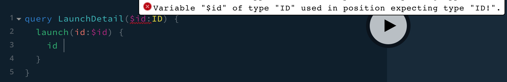
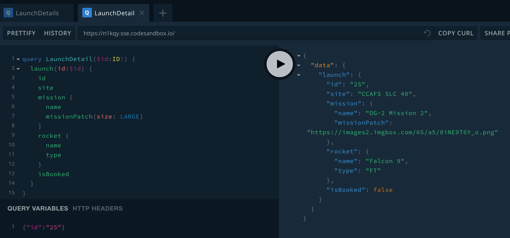
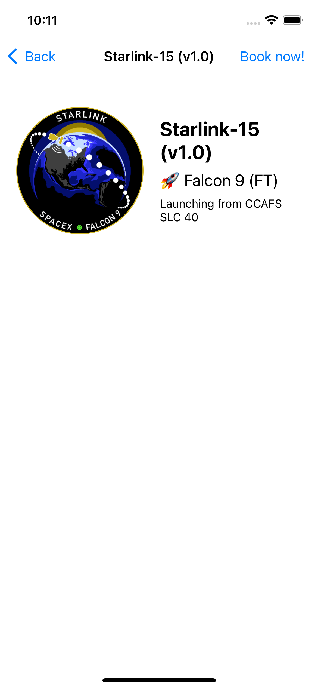
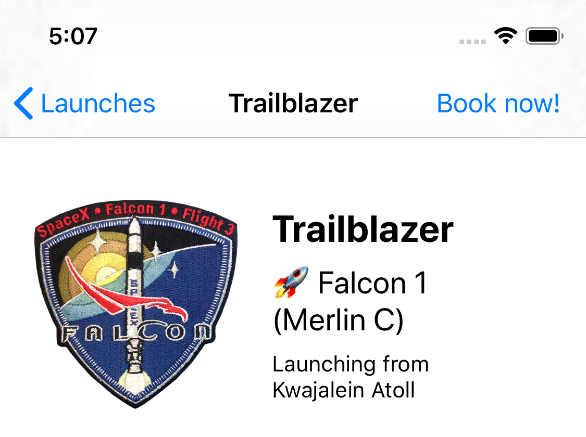

To get more information to show on the detail page, you have a couple of options: 

- You could request all the details you want to display for every single launch in the `LaunchList` query, and then pass that retrieved object on to the `DetailViewController`. 
- You could provide the identifier of an individual launch to a _different_ query to request all the details you want to display. 

The first option *can* seem easier if there isn't a substantial difference in size between what you're requesting for the list versus the detail page. 

However, remember that one of the advantages of GraphQL is that you can query for _exactly_ the data you need to display on a page. If you're not going to be displaying additional information, you can save bandwidth, execution time, and battery life by not asking for data until you need it.

This is especially true when you have a *much* larger query for your detail view than for your list view. Passing the identifier and then fetching based on that is considered a best practice. Even though the amount of data in this case doesn't differ greatly, you'll build out a query to help fetch details based on the ID so you'll know how to do it in the future. 

Create a new empty file and name it `LaunchDetails.graphql`. In this file, you'll add the details you want to display in the detail view. First, you'll want to go back to GraphiQL and make sure that your query works!

Start by typing in the query name and passing in an ID. Then, try calling the singular `launch` method, which takes the ID as a property, and requesting the `id` back as the query result: 

```graphql:title=(GraphiQL)
query LaunchDetails($id:ID) {
  launch(id:$id) {
    id  
  }
}
```

You'll see a warning in GraphiQL: 



This bit can be confusing for Swift developers, because GraphQL's assumptions about nullability are different from Swift's: 

* In Swift, if you don't annotate a property's type with either a question mark or an exclamation point, that property is non-nullable.

* In GraphQL, if you don't annotate a field's type with an exclamation point, that field is considered *nullable*. This is because GraphQL fields are **nullable by default**.

Keep this difference in mind when you switch between editing Swift and GraphQL files.

Now, switch back to GraphiQL. Start by adding the properties you're already requesting in the `LaunchList` query, but use `LARGE` for the mission patch size since the patch will be displayed much larger:


```graphql:title=(GraphiQL)
query LaunchDetails($id:ID!) {
  launch(id: $id) {
    id
    site
    mission {
      name
      missionPatch(size:LARGE)
    }
  }
}
```

Next, look at the schema to see what other fields are available. For this example, we'll get the available fields on the `Launch`'s `rocket` field, and also whether the launch has been booked or not. Add the following below the closing brace for `mission`: 
 
```graphQL:title=(GraphiQL)
rocket {
  name
  type
}
isBooked
```

At the bottom of GraphiQL's left panel, you'll see two tabs named "Query Variables" and "HTTP Headers". In "Query Variables", add the following:

```json:title=(GraphiQL)
{ "id": "25" }
```

This tells GraphiQL to fill in the value of the `$id` variable with the value `"25"` when it runs the query. Press the big play button, and you should get some results back for the launch with ID 25: 


</img>

Now that you've confirmed it worked, copy the query and paste it into your `LaunchDetails.graphql` file. Build the application so that codegen picks up this new file and generates a new query type for it. 

Now that you know what you're planning to ask for, it's time to set up the UI for the detail screen. Go to `DetailViewController.swift`. First, add a place to hang on to the result of the query. Add the following property to the top of the class: 

```swift:title=DetailViewController.swift
private var launch: LaunchDetailsQuery.Data.Launch?
```

Next, delete the `self.detailDescriptionLabel` outlet and replace it with the following list of outlets:

```swift:title=DetailViewController.swift
@IBOutlet private var missionPatchImageView: UIImageView!
@IBOutlet private var missionNameLabel: UILabel!
@IBOutlet private var rocketNameLabel: UILabel!
@IBOutlet private var launchSiteLabel: UILabel!
@IBOutlet private var bookCancelButton: UIBarButtonItem!
```

Now in `Main.storyboard`, go to the **Detail Scene**. Delete the existing label. 

This next (collapsed) section covers setting up constraints in detail to match the way things work in the sample application. You're welcome to use the five outlets listed above in an alternate setup if you'd prefer, but screenshots for the remainder of these tutorials are based on this section. 

To follow the precise UI setup instructions, expand this panel:

<DetailUISetupPanel />

In the end, your detail view controller should look like this in the storyboard (or roughly like it in whatever alternate setup you've decided to use): 


</img>

Now it's time to hook everything up! Head back to `DetailViewController.swift` and update the `viewDidLoad` function to clear out anything from the storyboard before attempting to configure the view:

```swift:title=DetailViewController.swift
override func viewDidLoad() {
  super.viewDidLoad()

  self.missionNameLabel.text = "Loading..."
  self.launchSiteLabel.text = nil
  self.rocketNameLabel.text = nil
  self.configureView()
}
```

Delete the existing contents of `configureView()`. In their place, start by adding a check that we have something to display, and a place to display it:

```swift:title=DetailViewController.swift
guard
  self.missionNameLabel != nil,
  let launch = self.launch else {
    return
}
```   
    
Next, it's time to display all the informaton you've gotten from your GraphQL server. Remember that GraphQL properties are nullable by default, so you'll often need to provide handling for when a given property is `nil`. 

Add the following code below the `guard` statement you just added:
   
```swift:title=DetailViewController.swift
self.missionNameLabel.text = launch.mission?.name
self.title = launch.mission?.name

let placeholder = UIImage(named: "placeholder")!
    
if let missionPatch = launch.mission?.missionPatch {
  self.missionPatchImageView.sd_setImage(with: URL(string: missionPatch)!, placeholderImage: placeholder)
} else {
  self.missionPatchImageView.image = placeholder
}

if let site = launch.site {
  self.launchSiteLabel.text = "Launching from \(site)"
} else {
  self.launchSiteLabel.text = nil
}
    
if 
  let rocketName = launch.rocket?.name ,
  let rocketType = launch.rocket?.type {
    self.rocketNameLabel.text = "🚀 \(rocketName) (\(rocketType))"
} else {
  self.rocketNameLabel.text = nil
}
    
if launch.isBooked {
  self.bookCancelButton.title = "Cancel trip"
  self.bookCancelButton.tintColor = .red
} else {
  self.bookCancelButton.title = "Book now!"
  self.bookCancelButton.tintColor = self.view.tintColor
}
```

Then, add a method to load the details using the `LaunchDetailsQuery` you created earlier:

```swift:title=DetailViewController.swift
private func loadLaunchDetails() {
  guard
    let launchID = self.launchID,
    launchID != self.launch?.id else {
      // This is the launch we're alrady displaying, or the ID is nil.
      return
  }
    
  Network.shared.apollo.fetch(query: LaunchDetailsQuery(id: launchID)) { [weak self] result in
    guard let self = self else {
      return
    }
    
    switch result {
    case .failure(let error):
      print("NETWORK ERROR: \(error)")
    case .success(let graphQLResult):
      if let launch = graphQLResult.data?.launch {
        self.launch = launch
      }
    
      if let errors = graphQLResult.errors {
        print("GRAPHQL ERRORS: \(errors)")
      }
    }
  }
}
```

Finally, update the `didSet` for `launchID` to load the launch details if we don't already have them: 

```swift:title=DetailViewController.swift
var launchID: GraphQLID? {
  didSet {
    self.loadLaunchDetails()
  }
}
```

and add a `didSet` on the `launch` property to load the UI once the launch is actually loaded. 

```swift:title=DetailViewController.swift
private var launch: LaunchDetailsQuery.Data.Launch? {
  didSet {
    self.configureView()
  }
}
```

Build and run the application. When you tap into the detail screen, you should now see the full details: 



</img>

You'll notice that many of the more recent launches have a rocket type of `FT`. If you load more launches a couple times, you'll get to some rockets that have different rocket types: 



</img>

You may have noticed that the detail view includes a `Book Now!` button, but there's no way to book a seat yet. To fix that, let's [learn how to make changes to objects in your graph with mutations](./tutorial-mutations).
