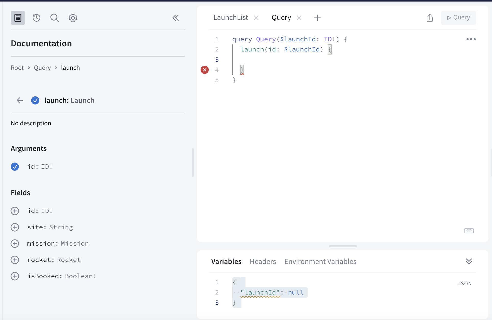
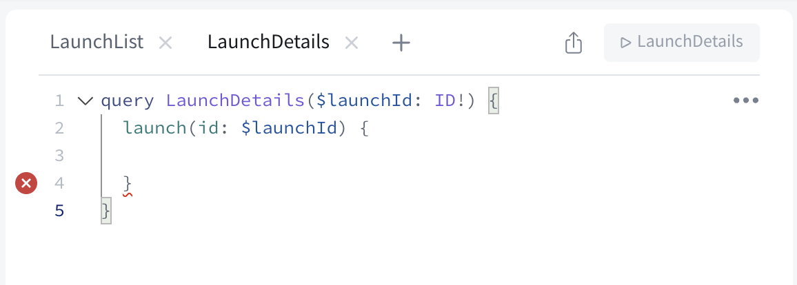
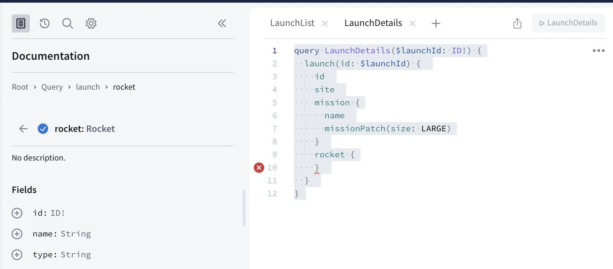

To get more information to show on the detail page, you have a couple of options: 

- You could request all the details you want to display for every single launch in the `LaunchList` query, and then pass that retrieved object on to the `DetailViewController`. 
- You could provide the identifier of an individual launch to a _different_ query to request all the details you want to display. 

The first option *can* seem easier if there isn't a substantial difference in size between what you're requesting for the list versus the detail page. 

However, remember that one of the advantages of GraphQL is that you can query for _exactly_ the data you need to display on a page. If you're not going to be displaying additional information, you can save bandwidth, execution time, and battery life by not asking for data until you need it.

This is especially true when you have a *much* larger query for your detail view than for your list view. Passing the identifier and then fetching based on that is considered a best practice. Even though the amount of data in this case doesn't differ greatly, you'll build out a query to help fetch details based on the ID so you'll know how to do it in the future. 

Create a new empty file and name it `LaunchDetails.graphql`. In this file, you'll add the details you want to display in the detail view. First, you'll want to go back to [your Sandbox](https://studio.apollographql.com/sandbox/explorer?endpoint=https%3A%2F%2Fapollo-fullstack-tutorial.herokuapp.com%2Fgraphql) and make sure that your query works!

In the Explorer tab, start by clicking the "New Tab" button in the middle operations section: 


A new tab will be added with nothing in it: 


In the left-hand column, click the word "Query" under "Documentation" to be brought to a list of possible queries: 


Select the `launch` query by clicking the button next to it. Sandbox Explorer will automatically set up the query for you to use: 



First, change the name of the operation from "Query" to "LaunchDetails" - that will then reflect in the tab name and make it easier to tell which query you're working with:  



Let's go through what's been added here: 

- Again, we've added an operation, but this time it's got a parameter coming into it. This was added automatically by Sandbox Explorer because there is not a default value provided for the non-null `launchId` argument. 
- The parameter is prefixed with a `$` for its name, and the type is indicated immediately after. Note that the `ID` type here has an exclamation point, meaning it can't be null. 
- Within that operation, we make a call to the `launch` query. The `id` is the argument the query is expecting, and the `$launchId` is the name of the parameter we just passed in the line above. 
- Again, there's blank space for you to add the fields you want to get details for on the returned object, which in this case is a `Launch`. 
- Finally, at the bottom, the "Variables" section of the Operations panel has been expanded, and a dictionary has been added with a key of `"launchId"`. At runtime, this will be used to fill in the blank of the `$launchId` parameter. 


> Note: GraphQL's assumptions about nullability are different from Swift's. In Swift, if you don't annotate a property's type with either a question mark or an exclamation point, that property is non-nullable.
>
> In GraphQL, if you don't annotate a field's type with an exclamation point, that field is considered *nullable*. This is because GraphQL fields are **nullable by default**.
>
> Keep this difference in mind when you switch between editing Swift and GraphQL files.

Now, switch back to Sandbox Explorer. Start by using the checkboxes or typing to add the properties you're already requesting in the `LaunchList` query. One difference: Use `LARGE` for the mission patch size since the patch will be displayed in a much larger `ImageView`:

```graphql title="(Sandbox Explorer)"
query LaunchDetails($id:ID!) {
  launch(id: $id) {
    id
    site
    mission {
      name
      missionPatch(size:LARGE)
    }
  }
}
```

Next, look in the left sidebar to see what other fields are available. Selecting `rocket` will add a set of brackets to request details about the rocket, and drill you into the `rocket` property, showing you the available fields on the `Rocket` type: 



Click the buttons to check off `name` and `type`. Next, go back to `Launch` by clicking the back button next to the `Rocket` type in the left sidebar: 


Finally, check off the `isBooked` property on the `Launch`. Your final query should look like this: 

```graphql title="(Sandbox Explorer)"
query LaunchDetails($launchId: ID!) {
  launch(id: $launchId) {
    id
    site
    mission {
      name
      missionPatch(size: LARGE)
    }
    rocket {
      name
      type
    }
    isBooked
  }
}
```

At the bottom of the Operations section, update the Variables section to pass in an ID for a launch. In this case, it needs to be a string that contains a number:

```json:title=(Sandbox%20Explorer)
{ "launchId": "25" }
```

This tells Sandbox Explorer to fill in the value of the `$launchId` variable with the value `"25"` when it runs the query. Press the big play button, and you should get some results back for the launch with ID 25: 


Now that you've confirmed it worked, copy the query (either by selecting all the text or using the "Copy Operation" option from the meatball menu as before) and paste it into your `LaunchDetails.graphql` file. Build the application so that codegen picks up this new file and generates a new query type for it. 

Now that you know what you're planning to ask for, it's time to set up the UI for the detail screen. Go to `DetailViewController.swift`. First, add a place to hang on to the result of the query. Add the following property to the top of the class: 

```swift title="DetailViewController.swift"
private var launch: LaunchDetailsQuery.Data.Launch?
```

Next, update the `viewDidLoad` function to clear out anything from the storyboard before attempting to configure the view:

```swift title="DetailViewController.swift"
override func viewDidLoad() {
  super.viewDidLoad()

  self.missionNameLabel.text = "Loading..."
  self.launchSiteLabel.text = nil
  self.rocketNameLabel.text = nil
  self.configureView()
}
```

Delete the existing contents of `configureView()`. In their place, start by adding a check that we have something to display, and a place to display it:

```swift title="DetailViewController.swift"
guard
  self.missionNameLabel != nil,
  let launch = self.launch else {
    return
}
```   
    
Next, it's time to display all the information you've gotten from your GraphQL server. Remember that GraphQL properties are nullable by default, so you'll often need to provide handling for when a given property is `nil`.

Add the following code below the `guard` statement you just added:
   
```swift title="DetailViewController.swift"
self.missionNameLabel.text = launch.mission?.name
self.title = launch.mission?.name

let placeholder = UIImage(named: "placeholder")!
    
if let missionPatch = launch.mission?.missionPatch {
  self.missionPatchImageView.sd_setImage(with: URL(string: missionPatch)!, placeholderImage: placeholder)
} else {
  self.missionPatchImageView.image = placeholder
}

if let site = launch.site {
  self.launchSiteLabel.text = "Launching from \(site)"
} else {
  self.launchSiteLabel.text = nil
}
    
if 
  let rocketName = launch.rocket?.name ,
  let rocketType = launch.rocket?.type {
    self.rocketNameLabel.text = "🚀 \(rocketName) (\(rocketType))"
} else {
  self.rocketNameLabel.text = nil
}
    
if launch.isBooked {
  self.bookCancelButton.title = "Cancel trip"
  self.bookCancelButton.tintColor = .red
} else {
  self.bookCancelButton.title = "Book now!"
  // Get the color from the main window rather than the view to prevent alerts from draining color
  self.bookCancelButton.tintColor = UIApplication.shared.windows.first?.tintColor
}
```

Then, find the `loadLaunchDetails()`  method. Replace the `TODO` with the following, which loads the details using the `LaunchDetailsQuery` you created earlier:

```swift title="DetailViewController.swift"
private func loadLaunchDetails() {
  guard
    let launchID = self.launchID,
    launchID != self.launch?.id else {
      // This is the launch we're already displaying, or the ID is nil.
      return
  }
    
  Network.shared.apollo.fetch(query: LaunchDetailsQuery(launchId: launchID)) { [weak self] result in
    guard let self = self else {
      return
    }
    
    switch result {
    case .failure(let error):
      self.showAlert(title: "Network Error",
                     message: error.localizedDescription)
    case .success(let graphQLResult):
      if let launch = graphQLResult.data?.launch {
        self.launch = launch
      }
    
      if let errors = graphQLResult.errors {
        let message = errors
                        .map { $0.localizedDescription }
                        .joined(separator: "\n")
        self.showAlert(title: "GraphQL Error(s)",
                       message: message)
      }
    }
  }
}
```

Finally, update the `didSet` for `launchID` to load the launch details if we don't already have them: 

```swift title="DetailViewController.swift"
var launchID: GraphQLID? {
  didSet {
    self.loadLaunchDetails()
  }
}
```

and add a `didSet` on the `launch` property to load the UI once the launch is actually loaded. 

```swift title="DetailViewController.swift"
private var launch: LaunchDetailsQuery.Data.Launch? {
  didSet {
    self.configureView()
  }
}
```

Build and run the application. When you tap into the detail screen, you should now see the full details: 


You'll notice that many of the more recent launches have a rocket type of `FT`. If you load more launches until you get to the end of the list, you'll get to some rockets that have different rocket types: 


You may have noticed that the detail view includes a `Book Now!` button, but there's no way to book a seat yet. To fix that, let's [learn how to make changes to objects in your graph with mutations, including authentication](./tutorial-authentication).
