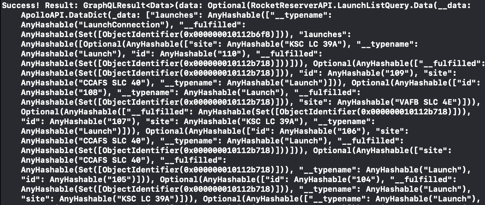

To use the generated operations in `RocketReserverAPI`, you first create an instance of `ApolloClient`. This instance takes your generated code and uses it to make network calls to your server. It's recommended that this instance is a singleton or static instance that's accessible from anywhere in your codebase.

## Create an ApolloClient

1. Create a new Swift file called `Network.swift` and add `import Apollo` to the top of the file.

2. Now add the following code into the file:

```swift title="Network.swift"
class Network {
  static let shared = Network()

  private(set) lazy var apollo = ApolloClient(url: URL(string: "https://apollo-fullstack-tutorial.herokuapp.com/graphql")!)
}
```

## Implement the query

To make sure your `ApolloClient` instance is communicating correctly with the server, go to `LaunchListViewModel`, add the following imports and update the `init()` method to contain the following code:

```swift title="LaunchListViewModel.swift"
import Apollo
import RocketReserverAPI

...

init() {
    Network.shared.apollo.fetch(query: LaunchListQuery()) { result in
        switch result {
        case .success(let graphQLResult):
            print("Success! Result: \(graphQLResult)")
        case .failure(let error):
            print("Failure! Error: \(error)")
        }
    }
}
```

## Test your query

Build and run your application. The web host might take a few seconds to spin up your GraphQL server if nobody's been using it recently, but once it's up, you should see a response that resembles the following:



This means the request was correctly executed and you now have a list of launch sites 🚀🚀🚀.

Go ahead and remove the code added to the `init()` method.

Next, let's [connect this data to your UI](tutorial-connect-queries-to-ui)