The most common GraphQL operation is the **query**, which requests data from your graph in a structure that conforms to your server's schema. If you return to [the Sandbox](https://studio.apollographql.com/sandbox/explorer?endpoint=https%3A%2F%2Fapollo-fullstack-tutorial.herokuapp.com/graphql)  for your server, you can see available queries in the Schema Reference tab you opened earlier.

Scroll down to the `launches` query to get details about it:

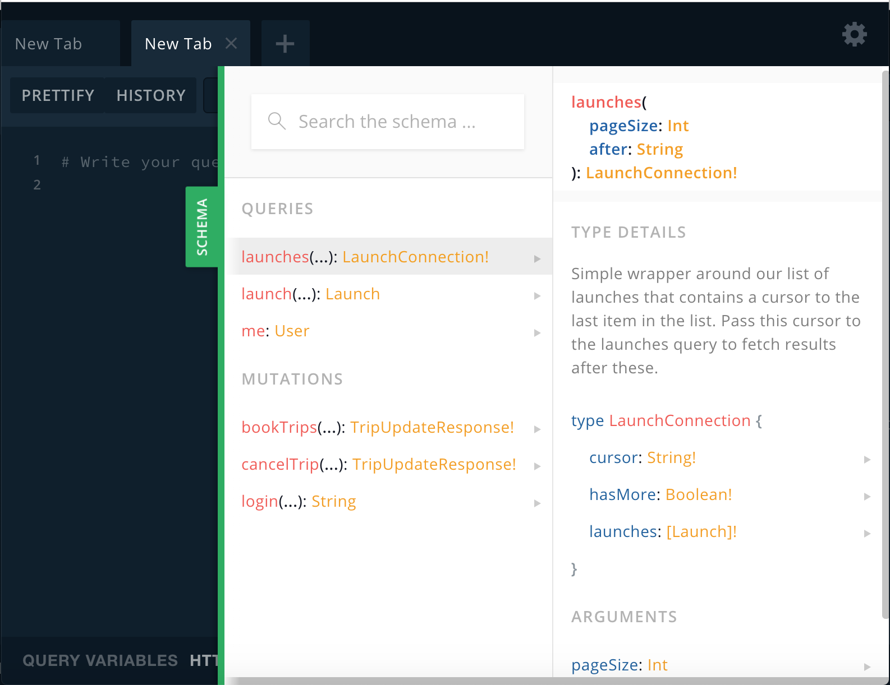

Here, you see both the query term itself, the return type, and information about parameters that can be passed to the query.  You can use this information to write a query you'll eventually add to your app.

To start working with this query in the Sandbox Explorer, select the "play" button to the right side of the information:

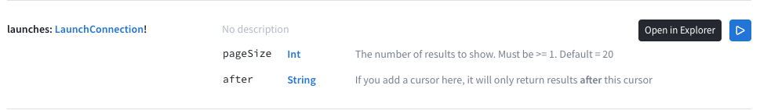

This brings you back into Sandbox's Explorer tab with the sidebar on the left showing documentation for the query you've selected:


Notice the small button next to the `launches` icon. Click this button to add the query to the middle "operations" panel:


When the query is added, it will look like this:

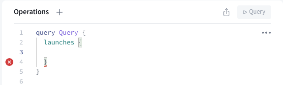

Let's break down what you're seeing here:

- The type of the operation, `query`, followed by the name of the operation, currently `Query` (we'll make that more specific in a second), is the outermost set of brackets.
- The actual query being called is the next set of brackets in. Since the `arguments` for this query both have default values, they are not automatically added to the query for you.
- An error in the empty space between the brackets, which is where you'll put the list of information you want back from each launch.

The Apollo iOS SDK requires every query to have a name (even though this isn't required by the GraphQL spec). Since you're going to be creating more than one query, it's also a good idea to give this operation a specific name other than `Query`. Change the name of the operation to `LaunchList`:

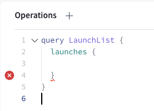

Next, on the left hand side, you can select what fields you want back in the returned object. Start by clicking the button next to the `cursor` field. It will mark that field as selected, then insert it into your operations:

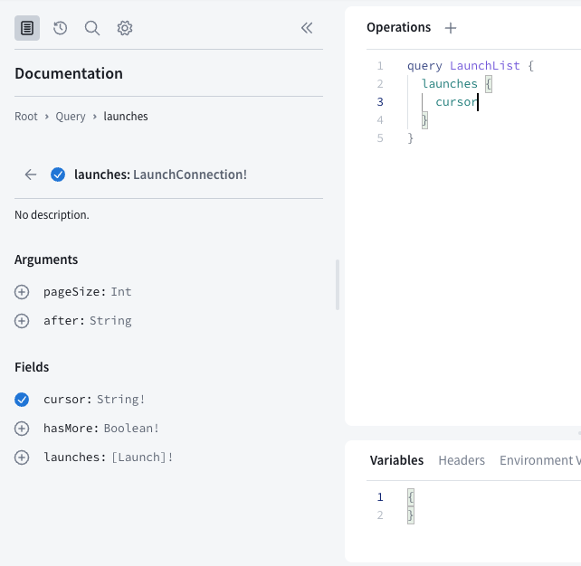

This is probably the easiest way to add fields to your object, since it knows how everything is spelled and what type everything is.

However, you can also use auto-complete to help you with this. Add a newline below `cursor` in the Operations panel and start typing `ha`. An autocomplete box pops up and shows you options based on what's in the schema:

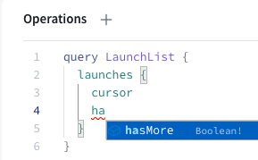

The Sandbox Explorer is a great tool for building and verifying queries so you don't have to repeatedly rebuild your project in Xcode to try out changes.

As the schema indicates, the `launches` query returns a `LaunchConnection` object. This object includes a list of launches, along with fields related to pagination (`cursor` and `hasMore`). The query you've written so far indicates exactly which fields of this `LaunchConnection` object you want to be returned.

Run this query by pressing the "Submit Operation" button, which should now have the name of your query, `LaunchList`:

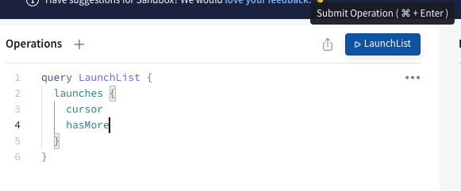

You'll quickly see the query returns results as a JSON object on the right-hand side of the page:

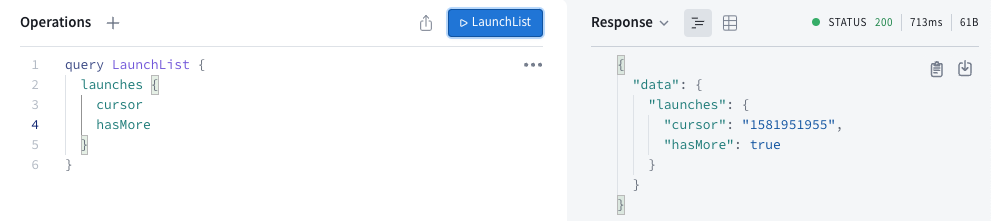

This query executes successfully, but it doesn't include any information about the `launches`! That's because we didn't include the necessary field in the query.

Click the button next to the `launches` field at the bottom of the left column. It will add a set of braces for `launches` to the operations section, and then move the documentation to show information for the `Launch` type:

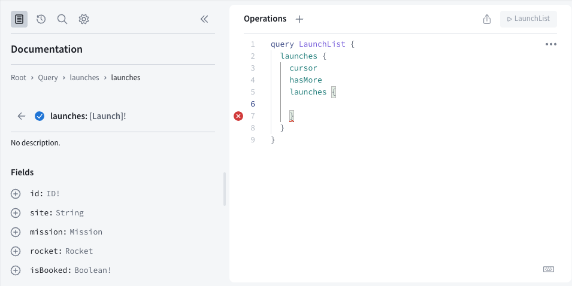

The fields you add in this set of brackets will be fetched for every launch in the list. Click the buttons next to `id` and `site` properties to add those two fields. When you're done, your operation should look like this:

```graphql:title=(Sandbox%20Explorer)
query LaunchList {
  launches {
    cursor
    hasMore
    launches {
      id
      site
    }
  }
}
```

Run the operation again, and you'll now see that in addition to the information you got back before, you're also getting a list of launches with their ID and site information:

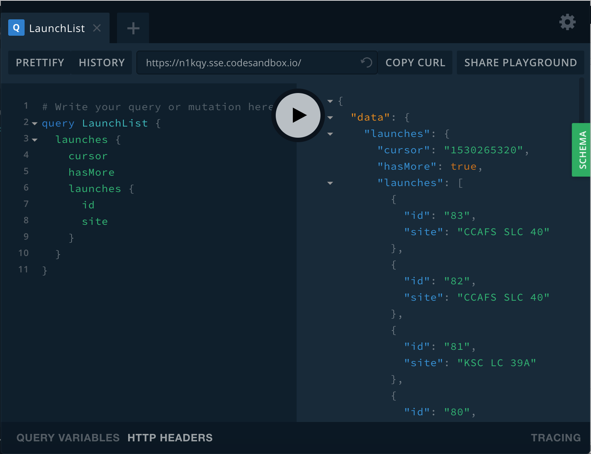

## Adding your query to Xcode

Now that your query is fetching the right data, head back to Xcode.

1. Go to **File > New > File...** and select the **Empty** file template:

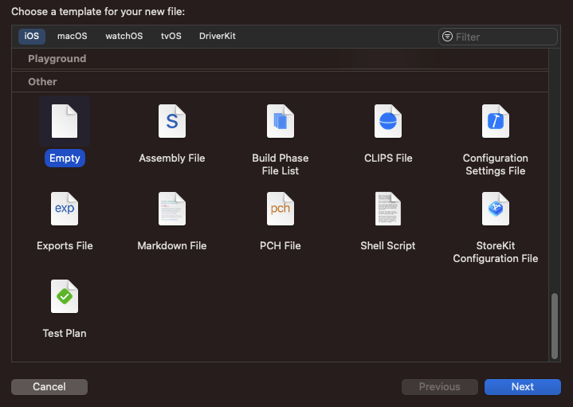

2. Click **Next** and name the file `LaunchList.graphql`. Make sure it's saved at the same level as your `schema.graphqls` file. As previously, don't add it to any target.

3. Copy your final operation from Sandbox Explorer by selecting the three dot (aka "meatball") menu to the right of your operation name and selecting "Copy Operation":

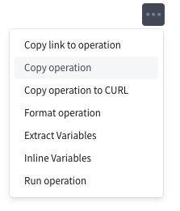

4. Paste the copied operation into `LaunchList.graphql`

You're now ready to generate code from the combination of your saved query and schema.

## Running code generation

1. Return to your project's **Apollo** Run Script build phase. Comment out the line that you added to the bottom (that includes `schema:download`). The schema isn't changing between builds, which means you don't need to refetch it.

2. _Uncomment_ the line you previously commented out (that includes `codegen:generate`).

3. Build your project. When the build completes, an `API.swift` file appears in the same folder  as `schema.json`.

4. Drag the `API.swift` file into Xcode. This time, **do** check the **Add to target** box for the `RocketReserver` app. You include this file in your application's bundle to enable you to execute the query you defined.

### The `API.swift` file

Open the `API.swift` file. It defines a root class, `LaunchListQuery`, with many nested structs below it. If you compare the structs to the JSON data returned in Sandbox Explorer, you see that the structure matches. These structs include properties only for the fields that your query requests.

Try commenting out the `id` property in `LaunchList.graphql` using a `#`, saving, then building again. When the build completes, the innermost `Launch` now only includes the built-in `__typename` and the requested `site` property.

Uncomment `id` in `LaunchList.graphql` and rebuild to restore the property.

Now that you've generated code and had a chance to see what's in there, it's time to get everything working end to end!

## Running a test query

To use the generated operations in `API.swift`, you first create an instance of `ApolloClient`. This instance takes your generated code and uses it to make network calls to your server. It's recommended that this instance is a singleton or static instance that's accessible from anywhere in your codebase.

1. Create a new Swift file called `Network.swift` and copy the code from [Basic client creation](../initialization/#basic-client-creation) into it. Make sure to add `import Apollo` to the top of the file.

2. Update the URL string to be `https://apollo-fullstack-tutorial.herokuapp.com/graphql` instead of the `localhost` URL in the example.

3. To make sure your `ApolloClient` instance is communicating correctly with the server, add the following code to `AppDelegate.swift` in the `application:didFinishLaunchingWithOptions` method, above `return true`:

    ```swift title="AppDelegate.swift"
    Network.shared.apollo.fetch(query: LaunchListQuery()) { result in
      switch result {
      case .success(let graphQLResult):
        print("Success! Result: \(graphQLResult)")
      case .failure(let error):
        print("Failure! Error: \(error)")
      }
    }
    ```

Build and run your application. The web host might take a few seconds to spin up your GraphQL server if nobody's been using it recently, but once it's up, you should see a response that resembles the following:

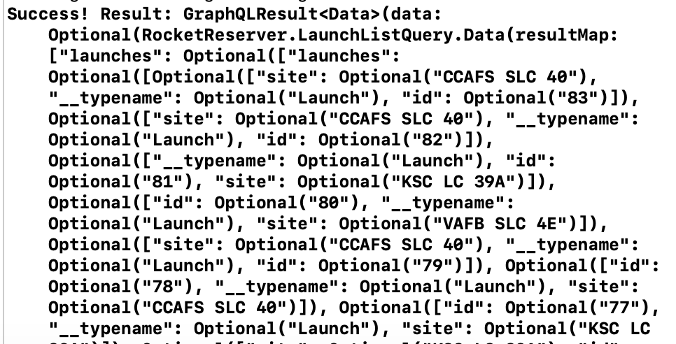

You're now successfully fetching data from the network using generated code! Now it's time to move on to [displaying query results in your UI](./tutorial-query-ui).
