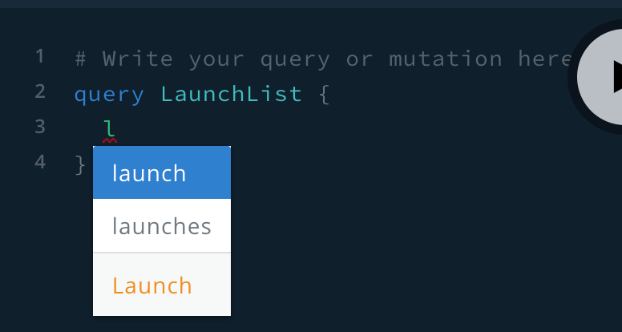

The most common GraphQL operation is the **query**, which requests data from your graph in a structure that conforms to your server's schema. If you return to [the GraphiQL query explorer](https://apollo-fullstack-tutorial.herokuapp.com) for your server, you can see available queries in the Schema tab you opened earlier. 

Click on the `launches` query at the top for details about it:


In the right panel, you see both the query itself and information about what the query returns. You can use this information to write a query you'll eventually add to your app. 

In the left-hand text area, add the following lines to start creating a query that will fetch a list of all available launches: 

```graphql:title=(GraphiQL)
query LaunchList {
}
```

The Apollo iOS SDK requires every query to have a name (even though this isn't required by the GraphQL spec). The query above has the name `LaunchList`.

Next, between the query's curly braces, start typing `la`. An autocomplete box pops up and shows you options based on what's in the schema:



GraphiQL is a great tool for building and verifying queries so you don't have to repeatedly rebuild your project in Xcode to try out changes.

As the schema indicates, the `launches` query returns a `LaunchConnection` object. This object includes a list of launches, along with fields related to pagination (`cursor` and `hasMore`). The query you write indicates exactly which fields of this `LaunchConnection` object you want to be returned, like so:

```graphql:title=(GraphiQL)
query LaunchList {
  launches {
    cursor
    hasMore
  }  
}
```

If you run this query by pressing the play button in GraphiQL, the query returns results as a JSON object on the right-hand side of the page: 


This query executes successfully, but it doesn't include any information about the `launches`! That's because we didn't include the necessary field in our query.

Update your query to fetch the `id` and `site` properties for each launch, like so:

```graphql:title=(GraphiQL)
query LaunchList {
  launches {
    cursor
    hasMore
    launches {
      id
      site
    }
  }  
}
```

Run the query again, and you'll now see that in addition to the information you got back before, you're also getting a list of launches with their ID and site information: 


## Adding your query to Xcode

Now that your query is fetching the right data, head back to Xcode.

1. Go to **File > New > File...** and select the **Empty** file template:


2. Click **Next** and name the file `LaunchList.graphql`. Make sure it's saved at the same level as your `schema.json` file. As previously, don't add it to any target.

3. Copy your final query from GraphiQL and paste it into `LaunchList.graphql`. 

You're now ready to generate code from the combination of your saved query and schema.

## Running code generation

1. Return to your project's **Apollo CLI** Run Script build phase. Comment out the line that you added to the bottom (that includes `schema:download`). The schema isn't changing between builds, which means you don't need to refetch it.

2. _Uncomment_ the line you previously commented out (that includes `codegen:generate`).

3. Build your project. When the build completes, an `API.swift` file appears in the same folder  as `schema.json`.

4. Drag the `API.swift` file into Xcode. This time, **do** check the **Add to target** box for the `RocketReserver` app. You include this file in your application's bundle to enable you to execute the query you defined.

### The `API.swift` file

Open the `API.swift` file. It defines a root class, `LaunchListQuery`, with many nested structs below it. If you compare the structs to the JSON data returned in GraphiQL, you see that the structure matches. These structs include properties only for the fields that your query requests. 

Try commenting out the `id` property in `LaunchList.graphql`, saving, then building again. When the build completes, the innermost `Launch` now only includes the built-in `__typename` and the requested `site` property. 

Uncomment `id` and rebuild to restore the property.

Now that you've generated code and had a chance to see what's in there, it's time to get everything working end to end!

## Running a test query

To use the generated operations in `API.swift`, you first create an instance of `ApolloClient`. This instance takes your generated code and uses it to make network calls to your server. It's recommended that this instance is a singleton or static instance that's accessible from anywhere in your codebase.

1. Create a new Swift file called `Network.swift` and copy the code from [Basic client creation](/initialization/#basic-client-creation) into it. Make sure to add `import Apollo` to the top of the file.

2. Update the URL string to be `https://apollo-fullstack-tutorial.herokuapp.com` instead of the `localhost` URL in the example.

3. To make sure your `ApolloClient` instance is communicating correctly with the server, add the following code to `AppDelegate.swift` in the `application:didFinishLaunchingWithOptions` method, above `return true`:

    ```swift:title=AppDelegate.swift
    Network.shared.apollo.fetch(query: LaunchListQuery()) { result in
      switch result {
      case .success(let graphQLResult):
        print("Success! Result: \(graphQLResult)")
      case .failure(let error):
        print("Failure! Error: \(error)")
      }
    }
    ```

Build and run your application. CodeSandbox might take a few seconds to spin up your GraphQL server if nobody's been using it recently, but once it's up, you should see a response that resembles the following: 


You're now successfully fetching data from the network using generated code! Now it's time to move on to [displaying query results in your UI](./tutorial-query-ui).
