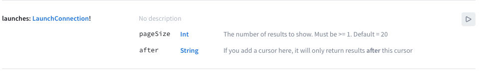

## Constructing a query in GraphiQL

The most common GraphQL operation is the **query**, which requests information from your graph in a structure that conforms to the schema. If you return to [the GraphiQL query explorer](https://n1kqy.sse.codesandbox.io/) for your server, you can see available queries in the Schema tab you opened earlier. 

Click on the `launches` query at the top for details about it:



In the right panel, you see both the query itself and information about what the query returns. You can use this information to write a query you'll eventually add to your app. 

In the left-hand text area, add the following lines to start creating a query that will fetch a list of all available launches: 

```graphql
query LaunchList {
}
```

The Apollo iOS SDK requires every query to have a name (even though this isn't required by the GraphQL spec). The query above has the name `LaunchList`.

Next, between the query's curly braces, start typing `la`. An autocomplete box pops up and shows you options based on what's in the schema:


GraphiQL is a great tool for building and verifying queries so you don't have to repeatedly rebuild your project in Xcode to try out changes. 

As the schema indicates, the `launches` query returns a `LaunchConnection` object that includes both a list of launches and fields related to pagination (`cursor` and `hasMore`). The query you write indicates exactly which fields of the `LaunchConnection` object you want to be returned, like so:

```graphql
query LaunchList {
  launches {
    cursor
    hasMore
  }  
}
```

If you run this query by pressing the play button in GraphiQL, the query returns results as a JSON object on the right-hand side of the page: 


This query executes successfully, but it doesn't include any information about the `launches`! That's because we didn't include the necessary field in our query.

Update your query to fetch the `id` and `site` properties for each launch, like so:


```graphql
query LaunchList {
  launches {
    cursor
    hasMore
    launches {
      id
      site
    }
  }  
}
```

Run the query again, and you'll now see that in addition to the information you got back before, you're also getting a list of launches with their ID and site information: 


## Adding your query to Xcode

Now that your query is ready, head back to Xcode.

1. Go to **File > New > File...** and select the **Empty** file template:


2. Click **Next** and name the file `LaunchList.graphql`. Make sure it's saved at the same level as your `schema.json` file. As before, don't add it to any target.

3. Copy your final query from GraphiQL and paste it into `schema.json`. 

You're now ready to generate code from the combination of your saved query and schema.

## Running code generation

1. Return to your project's **Apollo CLI** Run Script build phase. Comment out the line that you added to the bottom (that includes `apollo:schema`) and _uncomment_ the line you previously commented out (that includes `codegen:generate`).

What you will need to do frequently is regenerate code based on queries as you've written them, so that when you add, change, or remove a query, the accompanying code is automatically updated. 

To do this, uncomment the line you commented out earlier containing `codegen:generate`. Now, build your project. It'll churn for a moment, and when it's done, you'll see a nice new **API.swift** file output in your project's directory at the same level as the `schema.json`. 

Drag this file into Xcode. This time, you **do** need to check the "Add to target" box for the `RocketReserver` app - this is the puzzle piece which will actually get included in your application's bundle and which will allow you to take advantage of all the work you just did. 

>**Note**: If you've got a super-giant API file and want it split into smaller files, there's [a way to do that with advanced code generation](https://www.apollographql.com/docs/ios/installation/#generate-multiple-files-in-a-folder-instead-of-one-giant-file). For the purposes of this tutorial though, it's not going to get *that* big. 

Take a look inside the `API.swift` file. You'll see that it has a root class, `LaunchListQuery`, and it's got a bunch of nested structs below it. Compare the structs to the JSON data returned in GraphiQL: It's the same structure! And these structs are set up to only have properties for fields you've requested. 

For instance, try commenting out the `id` property in `LaunchList.graphql`, saving, then building again. You'll see when the build completes that the innermost `Launch` now only has the built in `__typename` and the requested `site` properties. 

Comment `id` back in, rebuild, and the property for `id` comes back when the build finishes. This helps prevent you from accidentally trying to access a property which isn't included in the result for your particular query. 

Now that you've generated code and had a chance to see what's in there, it's time to get everything working end to end!

## Running a test query

To use the generated operations that get put into `API.swift`, you need to use an instance of `ApolloClient`. This is the thing which will take that generated code and use it to make raw network calls. 

Note that you need something to hang on to your instance of `ApolloClient`, or calls will self-terminate before completing. The easiest way to do this is to use a singleton, or a single static instance of a class you can access from anywhere in your codebase.

Start by creating a new Swift file called **Network.swift**, and copying the code in the [basic client creation section of our guide on creating a client](https://www.apollographql.com/docs/ios/initialization/#basic-client-creation). Make sure to add `import Apollo` at the top of the file. Update the URL string to be `https://n1kqy.sse.codesandbox.io/` instead of the `localhost` url shown in the example.

To make sure the Apollo client is communicating correctly with the server, add a call using your `LaunchListQuery` to `AppDelegate.swift` in the `application:didFinishLaunchingWithOptions` method so that it runs when the application is started. 

Just above the `return true`, in that method, add the following code: 

```swift
Network.shared.apollo.fetch(query: LaunchListQuery()) { result in
  switch result {
  case .success(let graphQLResult):
    print("Success! Result: \(graphQLResult)")
  case .failure(let error):
    print("Failure! Error: \(error)")
  }
}
```

Build and run your application. CodeSandbox may need to take ~10-30 seconds to spin up the application if nobody's been using it recently, but once it's spun up you should see a response pretty quickly which looks something like this: 


You're now successfully fetching data from the network using generated code! Now it's time to move on to [displaying query results in your UI](tutorial_2).
