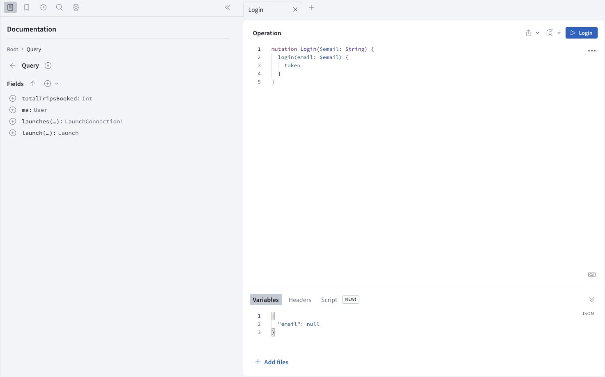
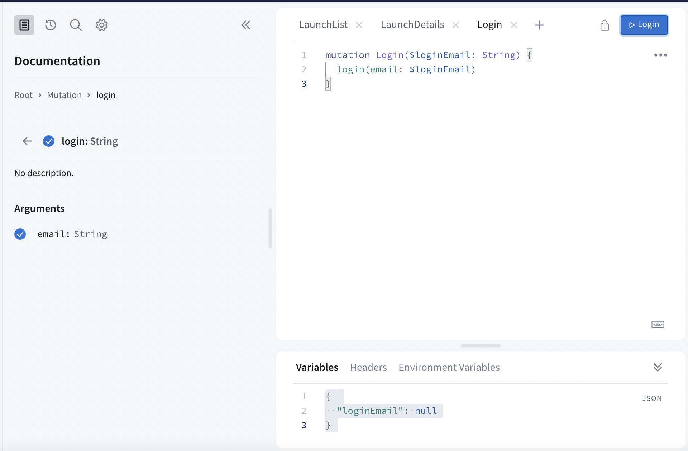

In this section, you will write your first mutation to log in to the backend.

A mutation is used to change data on your server. Here the login mutation will create a session based on your email address.

> **Note**: The way you log in to this particular server might differ from the way you log in with your own server. Login is often handled by _middleware_, or a layer totally separate from GraphQL, like [OAuth](https://en.wikipedia.org/wiki/OAuth).
> Also note that a typical authentication flow should require a password but for this tutorial, anyone is allowed to book flights with a valid email address!

## Prototype your mutation in Sandbox Explorer

Open [your Sandbox Explorer](https://studio.apollographql.com/sandbox/explorer?endpoint=https%3A%2F%2Fapollo-fullstack-tutorial.herokuapp.com%2Fgraphql) and click on the plus symbol to add a new tab. Next, click on the Schema icon to get back to looking at your schema, and select "Mutation" to look at your list of mutations:


Scroll down to take a look at the `login` mutation:


Click the play button to the right to open that mutation in the Explorer tab. When it opens, click the plus sign next to `login` to add the operation:



Notice the red error indication - this is because the type returned by the mutation is `User`, which is not a **leaf** type: you need to choose which of the user's fields the mutation will return. For our purposes, we only need the `token` field, so add it by clicking the plus sign next to it.

You'll also notice that `email` wasn't automatically added as an argument even though it doesn't seem to have a default value: that's because `email` is of type `String` - which remember, in GraphQL, means that it's **not** required (although obviously you won't get too far without it).

Click the plus sign next to the `email` argument to have that argument added:



You'll also notice that Sandbox Explorer has added a variable to your "Variables" section to match the login email.

Click the Submit Operation button your mutation. You'll see that since you sent `null` for the email address, you get back `null` for the login:


Now, replace `null` in the Query Variables section with an actual email address:

```json title="(Sandbox Explorer)"
{ "email": "me@example.com" }
```

Press the Submit Operation button, and this time you'll get an actual response:


Next, copy the operation, either manually or using the three-dot menu's "Copy operation" option.

## Add the mutation to the project

Now that your mutation is working, add it to your project. Create a file named `Login.graphql` next to your other GraphQL files and past the contents of the mutation:

```graphql title="Login.graphql"
mutation Login($email: String!) {
  login(email: $email) {
    token
  }
}
```
Note: we've also marked the `email` variable as non-nullable by adding `!` to the end of the type, since we always want to pass a value for it.

Run code generation in Terminal to generate the code for the mutation.

## Implement the login logic

To start, go to `LoginViewModel.swift` and add the following `import`:

```swift title="LoginViewModel.swift"
import Apollo
import RocketReserverAPI
```

Next, replace the `TODO` in the `login(with email: String?)` method with the following code:

```swift title="LoginViewModel.swift"
Network.shared.apollo.perform(mutation: LoginMutation(email: email)) { [weak self] result in
    defer {
        self?.isSubmitEnabled = true
    }

    switch result {
    case .success(let graphQLResult):
        if let token = graphQLResult.data?.login?.token {
            // TODO - store token securely
            self?.isPresented = false
        }

        if let errors = graphQLResult.errors {
            self?.appAlert = .errors(errors: errors)
        }
    case .failure(let error):
        self?.appAlert = .errors(errors: [error])
    }
}
```

Next, you need to store the login credential that's returned by the server. Login credentials should always be stored in the Keychain, but interacting with it directly is challenging, so you'll be using the `KeychainSwift` library which has already been added as a Swift Package to this project.

At the top of `LoginViewModel.swift` add the following `import`:

```swift title="LoginViewModel.swift"
import KeychainSwift
```

Now replace the `TODO - store token securely` after unwrapping the token with the following:

```swift title="LoginViewModel.swift"
let keychain = KeychainSwift()
keychain.set(token, forKey: LoginView.loginKeychainKey)
```

## Display the login view

Next we need to check if the user is logged in when booking/cancelling a trip to see if we should display the `LoginView`.

To do this go to the `DetailViewModel.swift`, you will notice the `bookOrCancel()` method already has some code in it to call the `isLoggedIn()` method, and if that returns false to set the flag to show the login view.

```swift title="DetailViewModel.swift"
func bookOrCancel() {
    guard self.isLoggedIn() else {
        isShowingLogin = true
        return
    }

    // TODO
}
```

Currently the `isLoggedIn()` method is always returning false, so let's update that now, first add the following `import` to `DetailViewModel.swift`:

```swift title="DetailViewModel.swift"
import KeychainSwift
```

Next, replace the contents of the `isLoggedIn()` method with the following:

```swift title="DetailViewModel.swift"
private func isLoggedIn() -> Bool {
    let keychain = KeychainSwift() // highlight-line
    return keychain.get(LoginView.loginKeychainKey) != nil // highlight-line
}
```

## Test the login mutation

Build and run the application, select a launch from the list to get to the `DetailView`. You should see that clicking the "Book now!" button shows the login view and if you login with this email: `me@example.com`, subsequent presses of "Book now!" no longer show the login view.

In the next section, you will add you will learn how to [authenicate your operations](tutorial-authenticate-operations) with your login token.