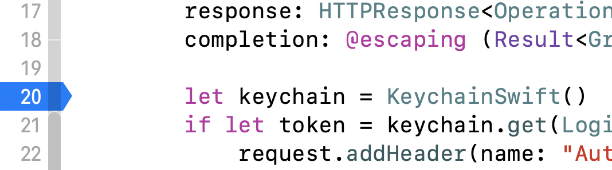
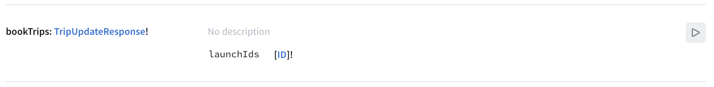
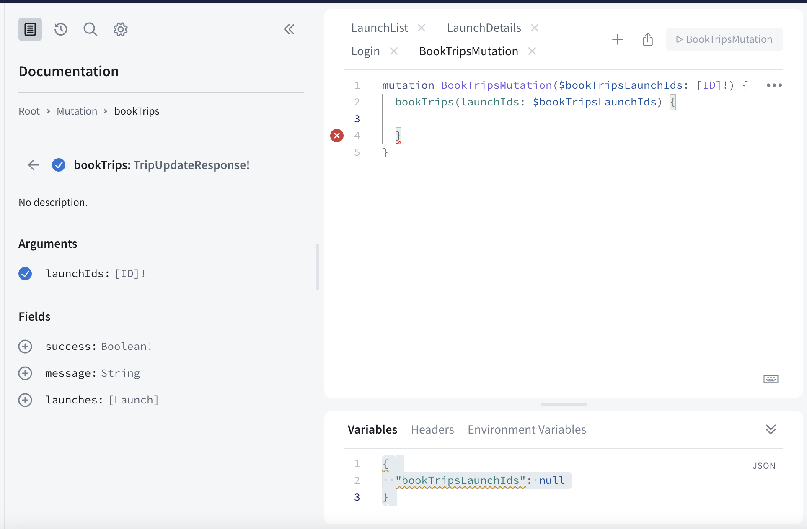
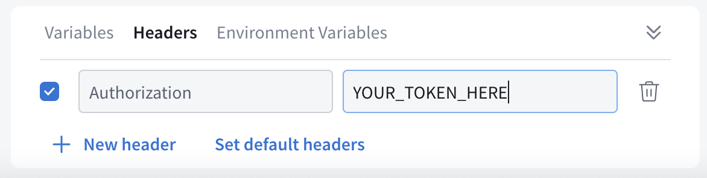
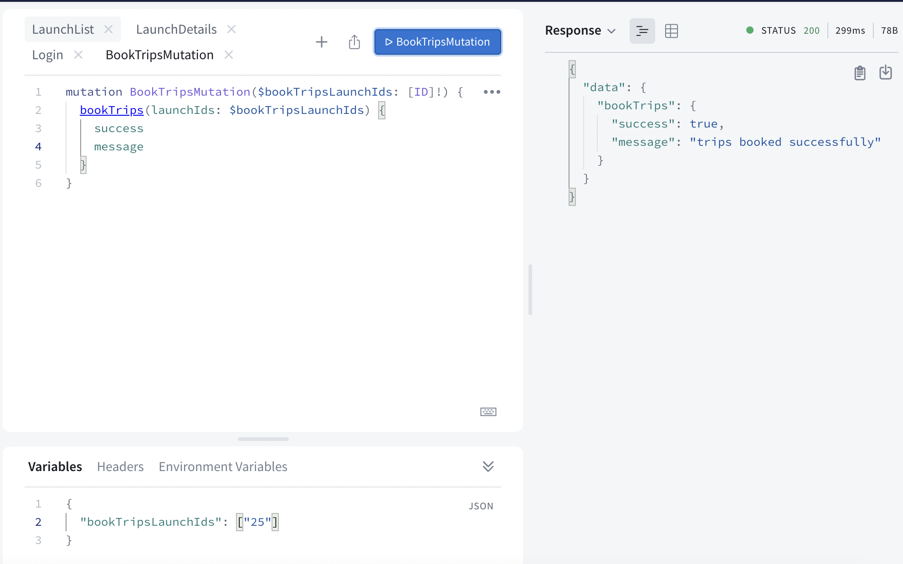
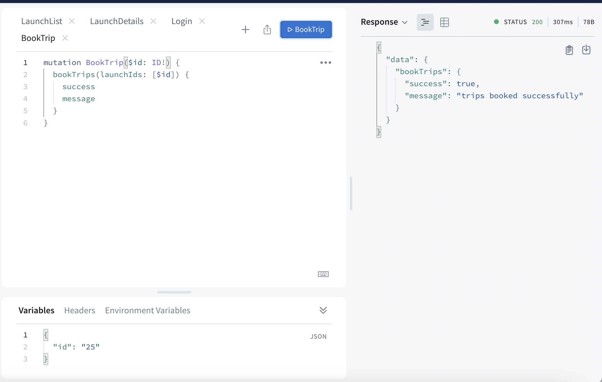
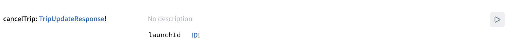
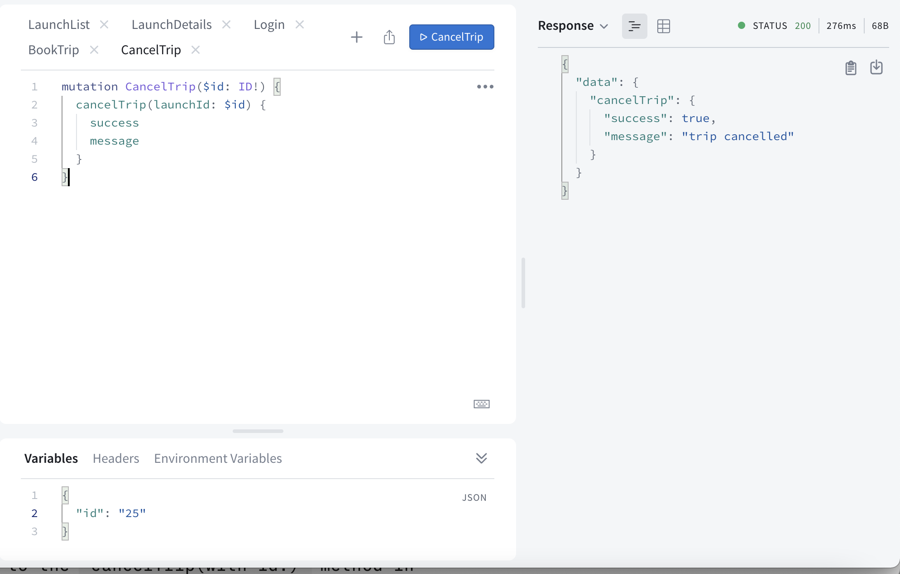

In this section, you'll learn how to build authenticated mutations and handle information returned from those mutations, enabling you to book and cancel trips in your app.

## Add authentication handling

Before you can book a trip, you need to be able to pass your authentication token along to the example server. To do that, let's dig a little deeper into how iOS's `ApolloClient` works.

The `ApolloClient` uses something called a `NetworkTransport` under the hood. By default, the client creates a `RequestChainNetworkTransport` instance to handle talking over HTTP to your server.

A `RequestChain` runs your request through an array of `ApolloInterceptor` objects which can mutate the request and/or check the cache before it hits the network, and then do additional work after a response is received from the network.

The `RequestChainNetworkTransport` uses an object that conforms to the `InterceptorProvider` protocol in order to create that array of interceptors for each operation it executes. There are a couple of providers that are set up by default, which return a fairly standard array of interceptors.

The nice thing is that you can also add your own interceptors to the chain anywhere you need to perform custom actions. In this case, you want to have an interceptor that will add your token.

First, create the new interceptor. Go to **File > New > File...** and create a new **Swift File**. Name it **TokenAddingInterceptor.swift**, and make sure it's added to the **RocketReserver** target. Open that file, and add the following code:

```swift title="TokenAddingInterceptor.swift"
import Foundation
import Apollo

class TokenAddingInterceptor: ApolloInterceptor {
    func interceptAsync<Operation: GraphQLOperation>(
        chain: RequestChain,
        request: HTTPRequest<Operation>,
        response: HTTPResponse<Operation>?,
        completion: @escaping (Result<GraphQLResult<Operation.Data>, Error>) -> Void) {

        // TODO
    }
}
```

Next, import `KeychainSwift` at the top of the file so you can access the key you stored in the keychain in the last step of the tutorial:

```swift title="TokenAddingInterceptor.swift"
import KeychainSwift
```

Then, replace the `TODO` within the `interceptAsync` method with code to get the token from the keychain, and add it to your headers if it exists:

```swift title="TokenAddingInterceptor.swift"
let keychain = KeychainSwift()
if let token = keychain.get(LoginViewController.loginKeychainKey) {
    request.addHeader(name: "Authorization", value: token)
} // else do nothing

chain.proceedAsync(request: request,
                   response: response,
                   completion: completion)
```

An array of `ApolloInterceptor`s which are handed off to each request to perform in order is set up by an object conforming to the `InterceptorProvider` protocol. There's a `DefaultInterceptorProvider` which has an array with most of the Interceptors you'd want to use.

You can also make your own object conforming to `InterceptorProvider` - or, in this case, since the interceptor only needs to be added to the beginning of the list to run before all the other interceptors, you can subclass the existing `DefaultInterceptorProvider`.

Go to **File > New > File...** and create a new **Swift File**. Name it **NetworkInterceptorProvider.swift**, and make sure it's added to the **RocketReserver** target. Add code which inserts your `TokenAddingInterceptor` before the other interceptors provided by the `DefaultInterceptorProvider`:

```swift title="NetworkInterceptorProvider.swift"
import Foundation
import Apollo

class NetworkInterceptorProvider: DefaultInterceptorProvider {
    override func interceptors<Operation: GraphQLOperation>(for operation: Operation) -> [ApolloInterceptor] {
        var interceptors = super.interceptors(for: operation)
        interceptors.insert(TokenAddingInterceptor(), at: 0)
        return interceptors
    }
}
```

> Another way to do this would be to copy and paste the list interceptors provided by the `DefaultInterceptorProvider` (which are all public), and then place your interceptors in the points in the array where you want them. However, since in this case we can run this interceptor first, it's simpler to subclass.

Next, go back to your `Network` class. Replace the `ApolloClient` with an updated `lazy var` which creates the `RequestChainNetworkTransport` manually, using your custom interceptor provider:

```swift title="Network.swift"
class Network {
    static let shared = Network()

    private(set) lazy var apollo: ApolloClient = {
        let client = URLSessionClient()
        let cache = InMemoryNormalizedCache()
        let store = ApolloStore(cache: cache)
        let provider = NetworkInterceptorProvider(client: client, store: store)
        let url = URL(string: "https://apollo-fullstack-tutorial.herokuapp.com/graphql")!
        let transport = RequestChainNetworkTransport(interceptorProvider: provider,
                                                     endpointURL: url)
        return ApolloClient(networkTransport: transport, store: store)
    }()
}
```

Now, go back to **TokenAddingInterceptor.swift**.
Click on the line numbers to add a breakpoint at the line where you're instantiating the `Keychain`:



Build and run the application. Whenever a network request goes out, that breakpoint should now get hit. If you're logged in, your token will be sent to the server whenever you make a request!

## Add the `BookTrip` mutation

In [Sandbox](https://studio.apollographql.com/sandbox/explorer?endpoint=https%3A%2F%2Fapollo-fullstack-tutorial.herokuapp.com), open the Schema tab by clicking its icon, select the `Mutations`, and take a look at the `bookTrips` mutation:



Click the play button to the right to open this mutation in Explorer. Click the plus button to add the `bookTrips` mutation:



You can see in the left sidebar that this takes an argument of an array of IDs (which was added as `$bookTripsLaunchIds`), and the object returned from the operation has three properties:

* A `success` boolean indicating whether the booking succeeded
* A `message` string to display to the user
* A list of `launches` the current user has booked

Click the plus signs next to `success` and `message` to add those to your operation.

In the "Variables" section of Sandbox Explorer, add an array of identifiers. In this case, we'll use a single identifier to book one trip:

```json title="(Sandbox Explorer)"
{"bookTripsLaunchIds": ["25"]}
```

Next, directly next to the word "Variables", you'll see the word "Headers". Click that to bring up the headers section. Click the "New Header" button, and add "Authorization" in the header key text box and paste the token you got back in the last section for the value:



Now, click the Submit Operation button to run your authorized query. You'll get back information regarding the trips (or in this case, trip) you've just booked.

> Note: If you receive an error that says "Cannot read property 'id' of null", that means your user was not found based on the token you passed through. Make sure your authorization header is properly formatted and that you're actually logged in!



With a mutation written like this, you can book any number of trips you want at the same time. However, the booking mechanism in our application will only let you book one trip at a time.

Luckily, there's an easy way to update the mutation so it's required to only take a single object. First, update the name of your operation in Explorer to the singular `BookTrip` (and remove `Mutation` since that will be added for us by code generation). Next, update the mutationto take a single `$id`, then pass an array containing that `$id` to the `bookTrips` mutation:

```graphql title="(Sandbox Explorer)"
mutation BookTrip($id:ID!) {
  bookTrips(launchIds:[$id]) {
    success
    message
  }
}
```

This is helpful because the Swift code generation will now generate a method that only accepts a single `ID` instead of an array, but you'll still be calling the same mutation under the hood, without the backend needing to change anything.

In the Variables section of Sandbox Explorer, update the JSON dictionary to use `id` as the key, and remove the array brackets from around the identifier:

```json title="(Sandbox Explorer)"
{"id": "25"}
```

Click the Submit Operation button to run your updated query. The response you get back should be identical to the one you got earlier:



Now that you've fleshed out your operation, it's time to put it into the app. Go to **File > New > File... > Empty**, and name this file `BookTrip.graphql`. Paste in the final query from the Sandbox Explorer.

Build the application to run the code generation. Then, in `DetailViewController.swift`, fill in the `bookTrip` method with the code to book your trip based on the flight's ID:

```swift title="DetailViewController.swift"
private func bookTrip(with id: GraphQLID) {
  Network.shared.apollo.perform(mutation: BookTripMutation(id: id)) { [weak self] result in
    guard let self = self else {
      return
    }
    switch result {
    case .success(let graphQLResult):
      if let bookingResult = graphQLResult.data?.bookTrips {
        // TODO
      }

      if let errors = graphQLResult.errors {
        // From UIViewController+Alert.swift
        self.showAlertForErrors(errors)
      }
    case .failure(let error):
      self.showAlert(title: "Network Error",
                     message: error.localizedDescription)
    }
  }
}
```


Then, update the `cancelTrip` method print the ID of the flight being cancelled (you'll be adding the actual cancellation in the next step):

```swift title="DetailViewController.swift"
private func cancelTrip(with id: GraphQLID) {
  print("Cancel trip \(id)")
  // TODO: Add code to cancel trip
}
```

Next, update the `bookOrCancelTapped` method to use the two methods you've just added instead of `print`ing:

```swift title="DetailViewController.swift"
if launch.isBooked {
  self.cancelTrip(with: launch.id)
} else {
  self.bookTrip(with: launch.id)
}
```

In `bookTrip`, replace the `TODO` with code to handle what comes back in the `success` property:

```swift title="DetailViewController.swift"
if bookingResult.success {
  self.showAlert(title: "Success!",
                 message: bookingResult.message ?? "Trip booked successfully")
} else {
  self.showAlert(title: "Could not book trip",
                 message: bookingResult.message ?? "Unknown failure.")
}
```

You've now got the code to book a trip. Before you run it, let's add the code to cancel a trip as well.

## Add the `CancelTrip` mutation

The process for the `CancelTrip` mutation is similar to the one for `BookTrip`. Go back to the Sandbox's Schema tab, select Mutations,e and look at the `cancelTrip` mutation's documentation:



Click the play button to the right to open this operation in Explorer, add a new tab to Explorer for this new operation, then click the plus button to create your operation:


Check off `success` and `message` again to add those properties to the list of ones you want to get back with your cancellation information.

Again, Explorer's gotten a little verbose here, so update your operation's name and variables to be a little shorter:

```graphql title="(Sandbox Explorer)"
mutation CancelTrip($id: ID!) {
  cancelTrip(launchId: $id) {
    success
    message
  }
}
```

One key difference from `bookTrips` is that you're only allowed to cancel one trip at a time because only one `ID!` is accepted as a parameter.

In the Variables section of Sandbox Explorer, you can use the exact same JSON that you used for `BookTrip` (because it also used a single identifier called "id"):

```json title="(GraphiQL)"
{"id": "25"}
```

Make sure that in the Headers section, you add your authorization token again (the token added to the tab with `BookTrip` won't carry over to this new tab):


Click the Submit Operation button to cancel the trip, and you should see a successful request:



It works! Once again, go back to Xcode and create a new empty file, and name it `CancelTrip.graphql`. Paste in the final query from Sandbox Explorer. Build the application without running it to cause the code generation to see this new mutation and generate code for it.

Next, go to the `cancelTrip(with id:)` method in `DetailViewController.swift`. Replace the `print` statement with code that makes the call to cancel the trip:

```swift title="DetailViewController.swift"
Network.shared.apollo.perform(mutation: CancelTripMutation(id: id)) { [weak self] result in
  guard let self = self else {
    return
  }
  switch result {
  case .success(let graphQLResult):
    if let cancelResult = graphQLResult.data?.cancelTrip {
      if cancelResult.success {
        // TODO
      }
    }

    if let errors = graphQLResult.errors {
      // From UIViewController+Alert.swift
      self.showAlertForErrors(errors)
    }
  case .failure(let error):
    self.showAlert(title: "Network Error",
                   message: error.localizedDescription)
  }
}
```


In `cancelTrip(with id:)`, replace the `TODO` with code to handle what comes back in that mutation's `success` property:

```swift title="DetailViewController.swift"
if cancelResult.success {
  self.showAlert(title: "Trip cancelled",
                 message: cancelResult.message ?? "Your trip has been officially cancelled.")
} else {
  self.showAlert(title: "Could not cancel trip",
                 message: cancelResult.message ?? "Unknown failure.")
}
```

Build and run the application. Select any launch and try to book it. You'll get a success message, but you'll notice that the UI doesn't update, even if you go out of the detail view and back into it again.

Why is that? Because the trip you've got stored locally in your cache still has the old value for `isBooked`.

There are a number of ways to change this, a couple of which you'll learn in the next section. For now we'll focus on the one that requires the fewest changes to your code: re-fetching the booking info from the network.

## Force a fetch from the network

The `fetch` method of `ApolloClient` provides defaults for most of its parameters, so if you're using the default configuration, the only value you need to provide yourself is the `Query`.

However, an important parameter to be aware of is the `cachePolicy`. By default, this has the value of `returnCacheDataElseFetch`, which does essentially what it says on the label: it looks in the current cache (by default an in-memory cache) for data, and fetches it from the network if it's not present.

If the data *is* present, the default behavior is to return the local copy to prevent an unnecessary network fetch. However, this is sometimes not the desired behavior (especially after executing a mutation).

There are [several different cache policies available to you](../caching/#specifying-a-cache-policy), but the easiest way to absolutely force a refresh from the network that still updates the cache is to use `fetchIgnoringCacheData`. This policy bypasses the cache when going to the network, but it also stores the results of the fetch in the cache for future use.

Update the `loadLaunchDetails` method to take a parameter to determine if it should force reload. If it should force reload, update the cache policy from the default `.returnCacheDataElseFetch`, which will return data from the cache if it exists, to `.fetchIgnoringCacheData`:

```swift title="DetailViewController.swift"
private func loadLaunchDetails(forceReload: Bool = false) {
  guard
    let launchID = self.launchID,
    (forceReload || launchID != self.launch?.id) else {
      // This is the launch we're already displaying, or the ID is nil.
      return
  }

  let cachePolicy: CachePolicy
  if forceReload {
    cachePolicy = .fetchIgnoringCacheData
  } else {
    cachePolicy = .returnCacheDataElseFetch
  }

  Network.shared.apollo.fetch(query: LaunchDetailsQuery(launchId: launchID), cachePolicy: cachePolicy) { [weak self] result in
    // (Handling of the network call's completion remains the same)
  }
}
```

Next, add the following line to **both** the `bookingResult.success` and `cancelResult.success` branches in their respective methods before showing the alerts:

```swift title="DetailViewController.swift"
self.loadLaunchDetails(forceReload: true)
```

Run the application. When you book or cancel a trip, the application will fetch the updated state and update the UI with the correct state. When you go out and back in, the cache will be updated with the most recent state, and the most recent state will display.

In the next section, you'll learn how to use [subscriptions](./tutorial-subscriptions/) with the Apollo client. 
