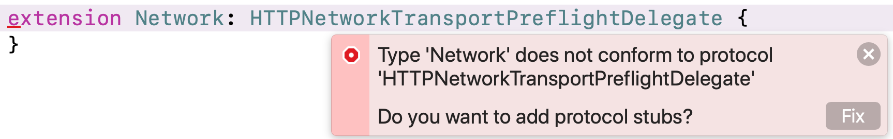
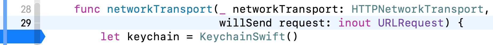
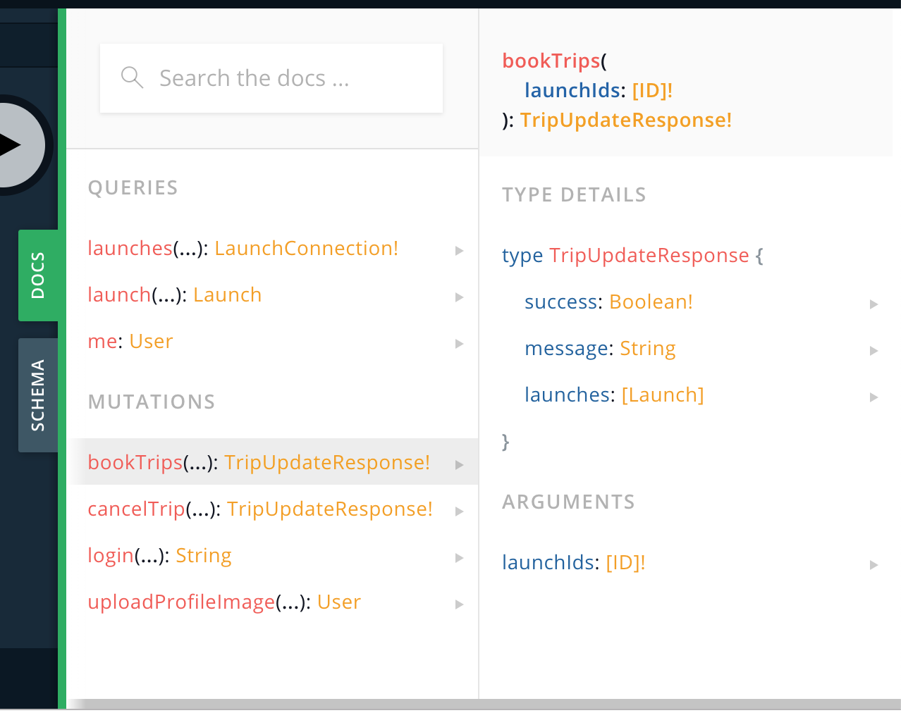
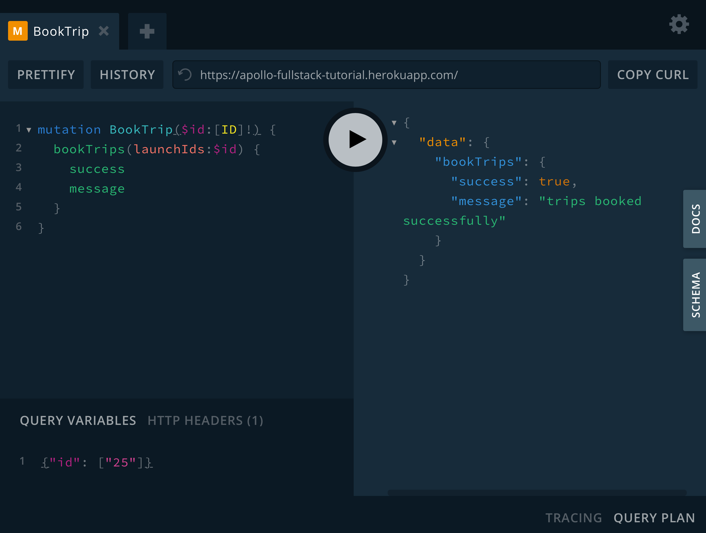
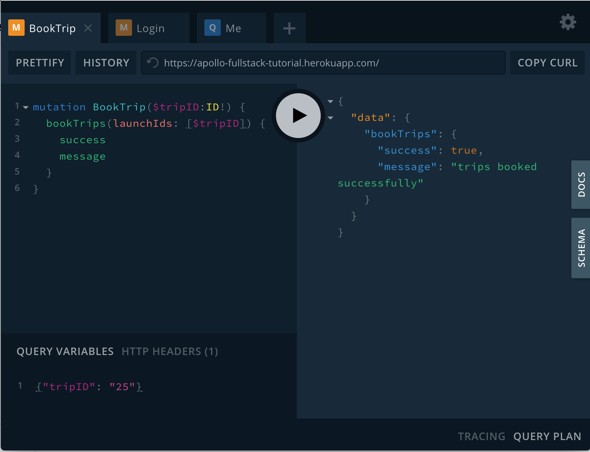

In this section, you'll learn how to build authenticated mutations and handle information returned from those mutations, enabling you to book and cancel trips in your app.

## Add authentication handling

Before you can book a trip, you need to be able to pass your authentication token along to the example server. To do that, let's dig a little deeper into how Apollo Client works. 

The `ApolloClient` uses something called a `NetworkTransport` under the hood. By default, the client creates an `HTTPNetworkTransport` instance to handle talking over HTTP to your server.

If you need to do anything before a request hits the wire but after Apollo has done most of the configuration for you, there's a delegate protocol called `HTTPNetworkTransportPreflightDelegate` that allows you to do that. 

Open `Network.swift` and add an extension to conform to that delegate: 

```swift:title=Network.swift
extension Network: HTTPNetworkTransportPreflightDelegate { 

}
```

You'll get an error telling you that protocol stubs must be implemented, and asking you if you want to fix this. Click **Fix**.



Two protocol methods will be added: `networkTransport(_:shouldSend:)` and `networkTransport(_:willSend:)`. 

The `shouldSend` method enables you to make sure a request should go out to the network at all. This is useful for things like checking that your user is logged in before trying to make a request. 

However, you're not going to use that functionality in this application. Update the method to have it return `true` all the time:

```swift:title=Network.swift  
func networkTransport(_ networkTransport: HTTPNetworkTransport, 
                      shouldSend request: URLRequest) -> Bool {
	return true
}
```

The `willSend` request is the last thing that can manipulate the request before it goes out to the network. Because the request is passed as an `inout` variable, you can manipulate its contents directly. 

Update the `willSend` method to add your token as the value for the `Authorization` header: 

```swift:title=Network.swift
func networkTransport(_ networkTransport: HTTPNetworkTransport, 
                      willSend request: inout URLRequest) {
  let keychain = KeychainSwift()
  if let token = keychain.get(LoginViewController.loginKeychainKey) {
    request.addValue(token, forHTTPHeaderField: "Authorization")
  } // else do nothing
}
```

Next, you need to make sure that Apollo knows that this delegate exists. To do that, you need to do something that Apollo Client has thus far been doing for you under the hood: instantiating the `HTTPNetworkTransport`.

In the primary declaration of `Network`, update your `lazy var` to create this transport and set the `Network` object as its delegate, then pass it through to the `ApolloClient`: 

```swift:title=Network.swift
private(set) lazy var apollo: ApolloClient = {
 let httpNetworkTransport = HTTPNetworkTransport(url: URL(string: "https://apollo-fullstack-tutorial.herokuapp.com/")!)
 httpNetworkTransport.delegate = self
 return ApolloClient(networkTransport: httpNetworkTransport)
}()
```

Click on the line numbers to add a breakpoint at the line where you're instantiating the `Keychain`: 



Build and run the application. Whenever a network request goes out, that breakpoint should now get hit. If you're logged in, your token will be sent to the server whenever you make a request. 

Now it's time to book a trip! 🚀

## Add the `BookTrip` mutation

In GraphiQL, open the Docs tab and take a look at the `bookTrips` mutation:



You can use this mutation to book multiple trips at once and get back:

* A `success` boolean indicating whether the booking succeeded
* A `message` string to display to the user
* A list of `launches` the current user has booked

Start by adding a basic mutation in GraphiQL that passes in an array of trip identifiers, and then asks for the `success` and `message` back from the server: 

```graphql:title=(GraphiQL)
mutation BookTrips($tripIDs:[ID]!) {
  bookTrips(launchIds:$tripIDs) {
    success
    message
  }
}
```

In the `Query Variables` section of GraphiQL, add an array of identifiers. In this case, we'll use a single identifier to book one trip:

```json:title=(GraphiQL)
{"tripIDs": ["25"]}
```

In the `HTTP Headers` section of GraphiQL, add an authorization header to pass through the token you received when you logged in:

```json:title=(GraphiQL)
{ "Authorization" :"YOUR_TOKEN"}
```

Now, click the play button to run your authorized query in GraphiQL. You'll get back information regarding the trips (or in this case, trip) you've just booked. 

> Note: If you receive an error that says "Cannot read property 'id' of null", that means your user was not found based on the token you passed through. Make sure your authorization header is properly formatted and that you're actually logged in!



With a mutation written like this, you can book any number of trips you want at the same time. However, the booking mechanism in our application will only let you book one trip at a time.

Luckily, there's an easy way to update the mutation so it's required to only take a single object. Update your mutation to take a single `$id`, then pass an array containing that `$id` to the `bookTrips` mutation: 

```graphql:title=(GraphiQL)
mutation BookTrip($id:ID!) {
  bookTrips(launchIds:[$id]) {
    success
    message
  }
}
```

This is helpful because the Swift code generation will now generate a method that only accepts a single ID instead of an array, but you'll still be calling the same mutation under the hood, without the backend needing to change anything. 

In the `Query Variables` section of GraphiQL, update variables to use `tripID` as the key, and remove the array brackets from around the identifier: 

```json:title=(GraphiQL)
{"id":"25"}
```

Click the play button to run your updated query in GraphiQL. The response you get back should identical to the one you got earlier:



Now that you've fleshed out your query, it's time to put it into the app. Go to **File > New > File... > Empty**, and name this file `BookTrip.graphql`. Paste in the final query from GraphiQL. 

In `DetailViewController.swift`, add a new method to book your trip based on the flight's ID:

```swift:title=DetailViewController.swift
private func bookTrip(with id: GraphQLID) {
  Network.shared.apollo.perform(mutation: BookTripMutation(id: id)) { [weak self] result in
    guard let self = self else {
      return 
    }
    switch result {
    case .success(let graphQLResult):
      if let bookingResult = graphQLResult.data?.bookTrips {
        // TODO
      }

      if let errors = graphQLResult.errors {
        self.showAlertForErrors(errors)
      }
    case .failure(let error):
      self.showAlert(title: "Network Error",
                     message: error.localizedDescription)
    }
  }
}
```


Update the `cancelTrip` method to also take the flight's ID (you'll be adding the actual cancellation in the next step): 

```swift:title=DetailViewController.swift
private func cancelTrip(with id: GraphQLID) {
  print("Cancel trip \(id)")
}
```

Next, update the `bookOrCancelTapped` method to use the two methods you've just added instead of printing: 

```swift:title=DetailViewController.swift
if launch.isBooked {
  self.cancelTrip(with: launch.id)
} else {
  self.bookTrip(with: launch.id)
}
```

In `bookTrip`, replace the `TODO` with code to handle what comes back in the `success` property: 

```swift:title=DetailViewController.swift
if bookingResult.success {
  self.showAlert(title: "Success!",
                 message: bookingResult.message ?? "Trip booked successfully")
} else {
  self.showAlert(title: "Could not book trip",
                 message: bookingResult.message ?? "Unknown failure.")
}
```

You've now got the code to book a trip. Before you run it, let's add the code to cancel a trip as well. 

## Add the `CancelTrip` mutation

The process for the `CancelTrip` mutation is similar to the one for `BookTrip`. Go back to GraphiQL and look at the `cancelTrip` mutation's documentation:


One key difference from `bookTrips` is that you're only allowed to cancel one trip at a time (only one `ID!` is accepted as a parameter).

In GraphiQL, add a new mutation that allows you to cancel a booked trip and find out whether the cancellation succeeded: 

```graphql:title=(GraphiQL)
mutation CancelTrip($id:ID!) {
  cancelTrip(launchId:$id) {
    success
    message
  }
}
```

In the `Query Variables` section of GraphiQL, you can use the exact same JSON that you used for `BookTrip` (because it also used a single identifier): 

```json:title=(GraphiQL)
{"id": "25"}
```

Make sure that in the `HTTP Headers` section of GraphiQL, your authorization token is still set up:

```json:title=(GraphiQL)
{ "Authorization" :"(your token)"}
```

Click the play button to cancel the trip, and you should see a successful request: 


It works! Once again, go to **File > New > File... > Empty**, and name this file `CancelTrip.graphql`. Paste in the final query from GraphiQL. Build the application without running it to cause the code generation to see this new mutation and generate code for it.

Next, go to the `cancelTrip(with id:)` method in `DetailViewController.swift`. Replace the `print` statement with code that makes the call to cancel the trip: 

```swift:title=DetailViewController.swift
Network.shared.apollo.perform(mutation: CancelTripMutation(id: id)) { [weak self] result in
  guard let self = self else {
    return
  }
  switch result {
  case .success(let graphQLResult):
    if let cancelResult = graphQLResult.data?.cancelTrip {
      if cancelResult.success {
        // TODO
      }

    if let errors = graphQLResult.errors {
      self.showAlertForErrors(errors)
    }
  case .failure(let error):
    self.showAlert(title: "Network Error",
                   message: error.localizedDescription)
  }
}
```


In `cancelTrip(with id:)`, replace the `TODO` with code to handle what comes back in that mutation's `success` property: 

```swift:title=DetailViewController.swift
if cancelResult.success {
  self.showAlert(title: "Trip cancelled",  
                 message: cancelResult.message ?? "Your trip has been officially cancelled.")
} else {
  self.showAlert(title: "Could not cancel trip", 
                 message: cancelResult.message ?? "Unknown failure.")
}
```

Build and run the application. Select any launch and try to book it. You'll get a success message, but you'll notice that the UI doesn't update. 

Why is that? Because the trip you've got stored locally still has the old value for `isBooked`. 

There are a number of ways to change this, a couple of which you'll learn in the next section. For now we'll focus on the one that requires the fewest changes to your code: re-fetching the booking info from the network.

## Force a fetch from the network

The `fetch` method of `ApolloClient` provides defaults for most of its parameters, so if you're using the default configuration, the only value you need to provide yourself is the `Query`. 

However, an important parameter to be aware of is the `cachePolicy`. By default, this has the value of `returnCacheDataElseFetch`, which does essentially what it says on the label: it looks in the current cache (by default an in-memory cache) for data, and fetches it from the network if it's not present. 

If the data *is* present, the default behavior is to return the local copy to prevent an unnecessary network fetch. However, this is sometimes not the desired behavior (especially after executing a mutation). 

There are [several different cache policies available to you](../caching/#specifying-a-cache-policy), but the easiest way to absolutely force a refresh from the network that still updates the cache is to use `fetchIgnoringCacheData`. This policy bypasses the cache when going to the network, but it also stores the results of the fetch in the cache for future use. 

Update the `loadLaunchDetails` method to take a parameter to determine if it should force reload. If it should force reload, update the cache policy from the default `.returnCacheDataElseFetch`, which will return data from the cache if it exists, to `.fetchIgnoringCacheData`:

```swift:title=DetailViewController.swift
private func loadLaunchDetails(forceReload: Bool = false) {
  guard
    let launchID = self.launchID,
    (forceReload || launchID != self.launch?.id) else {
      // This is the launch we're alrady displaying, or the ID is nil.
      return
  }
        
  let cachePolicy: CachePolicy
  if forceReload {
    cachePolicy = .fetchIgnoringCacheCompletely
  } else {
    cachePolicy = .returnCacheDataElseFetch
  } 
        
  Network.shared.apollo.fetch(query: LaunchDetailsQuery(id: launchID), cachePolicy: cachePolicy) { [weak self] result in
    // (Rest of this remains the same)
  }
}
```

Next, add the following line to **both** the `bookingResult.success` and `cancelResult.success` branches in their respective methods:

```swift:title=DetailViewController.swift
self.loadLaunchDetails(forceReload: true)
``` 

Run the application. When you book or cancel a trip, the application will fetch the updated state and update the UI with the correct state. When you go out and back in, the cache will be updated with the most recent state, and the most recent state will display. 

This works well, but it could be more efficient. In the [next section](./tutorial-fragments-and-cache/), you'll learn more about how to get details in a reusable fashion and how to work with the cache directly.
