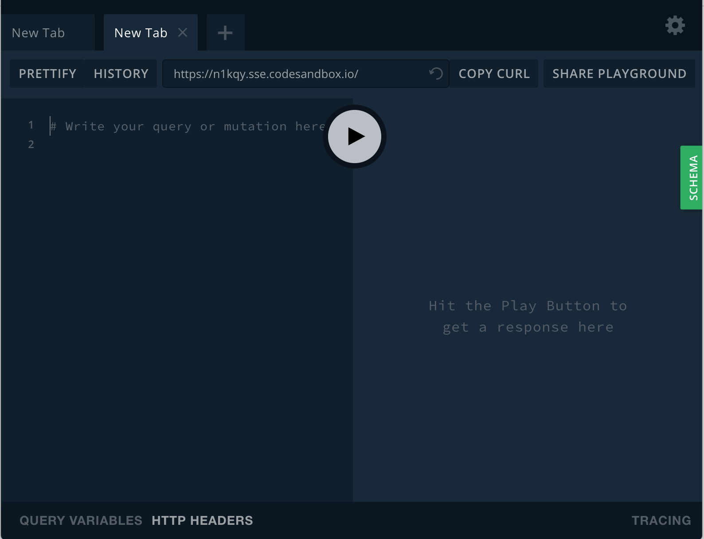
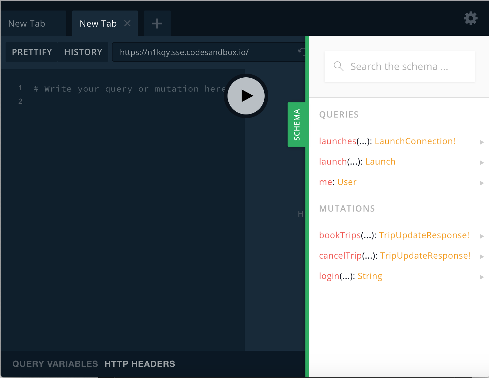
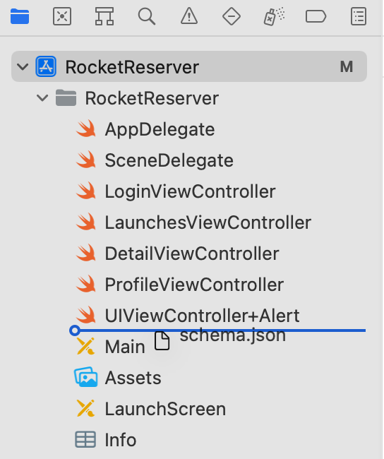

## Explore your server's schema

This tutorial uses a modified version of the GraphQL server you build as part of [the Apollo full-stack tutorial](https://www.apollographql.com/docs/tutorial/introduction/). You can visit [`https://n1kqy.sse.codesandbox.io/`](https://n1kqy.sse.codesandbox.io/) to start it up and open the GraphiQL tool to explore its schema:



The schema defines which GraphQL operations your server can execute. Click **Schema** on the right-hand side to view a list of the possible queries and mutations you can run:




## Download your server's schema

The Apollo iOS SDK needs a local copy of your server's schema to generate code from it. To accomplish this, the Apollo CLI includes a `schema:download` command that enables you to fetch the schema from a GraphQL server.

To use the Apollo CLI from Xcode, add a **Run Script** build phase to your app:

1. Select the `xcodeproj` file in the Project Navigator, and then select the `RocketReserver` application target: 

    

2. A list of tabs appears. Select the **Build Phases** tab: 

    

3. Click the `+` button above the list of existing phases and select **New Run Script Phase**:

    

    This adds a new Run Script build phase to the bottom of your list of build phases.
    
4. Drag the newly created phase up between "Dependencies" and "Compile Sources":

    

5. Double-click the name of the build phase to rename it to **Apollo CLI**:

    

6. Expand the Apollo CLI phase. Paste the **Swift Package Manager Run Script** from [Adding a code generation build step](/installation/#adding-a-code-generation-build-step) into the text area. This script uses your schema to generate the code that the Apollo iOS SDK uses to interact with your server.

7. Before the script can generate code, it needs a local copy of your GraphQL server's schema. For now, **comment out the last line** of the script you pasted and add the following line below it:

    ```sh
    "${SCRIPT_PATH}"/run-bundled-codegen.sh schema:download --endpoint="https://n1kqy.sse.codesandbox.io/"
    ```

    This line runs the Apollo CLI's `schema:download` command, which downloads the schema to a `schema.json` file at the same level of your project as the `AppDelegate.swift` file.

8. Build your project to execute the script. In Finder, navigate to the folder that contains your `AppDelegate.swift` file. The folder should now include the downloaded `schema.json` file. Drag this file from Finder into Xcode:

    

    When Xcode offers to add the schema file, make sure **all targets are unchecked** to reduce the size of your application bundle: 

    

    You don't need to add the schema to any targets, because it is only used to generate code that _is_ added to targets.

Your server's schema is now available locally. Next, you'll [create your first operation against the schema](./tutorial-execute-query).
