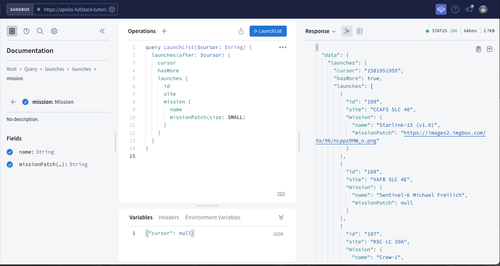
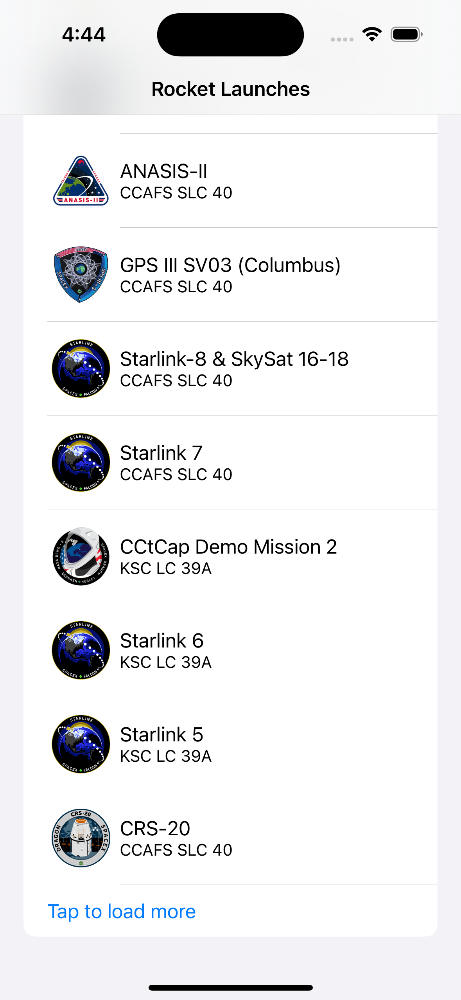
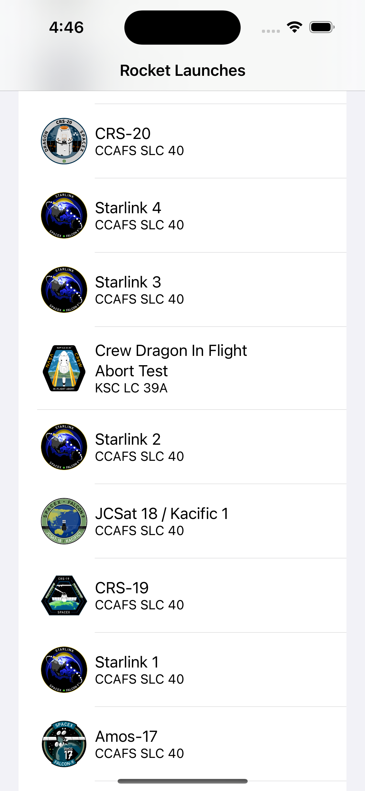

As you might have noticed, the object returned from the `LaunchListQuery` is a `LaunchConnection`. This object has a list of launches, a pagination cursor, and a boolean to indicate whether more launches exist.

When using a cursor-based pagination system, it's important to remember that the cursor gives you a place where you can get all results after a certain spot, regardless of whether more items have been added in the interim.

In the previous section, you hardcoded the `SMALL` size argument directly in the GraphQL query, but you can also define arguments programmatically using variables. You will use them here to implement pagination.

## Add a `cursor` variable

In `LaunchList.graphql`, add a `cursor` variable. In GraphQL, variables are prefixed with the dollar sign.

```graphql title="LaunchList.graphql"
query LaunchList($cursor: String) { # highlight-line
  launches(after: $cursor) { # highlight-line
    hasMore
    cursor
    launches {
      id
      site
      mission {
        name
        missionPatch(size: SMALL)
      }
    }
  }
}
```

Now re-run code generation to update the GraphQL code.

You can experiment with GraphQL variables in Sandbox Explorer by using the pane under the main body of the operation named **Variables**. If you omit the `$cursor` variable, the server returns data starting from the beginning: 



## Update `LaunchListViewModel` to use `cursor`

First, you need to hang on to the most recently received `LaunchConnection` object.

Add a variable to hold on to this object, as well as a variable for the most recent request,  at the top of the `LaunchListViewModel.swift` file near your `launches` variable:

```swift title="LaunchListViewModel.swift"
@Published var launches = [LaunchListQuery.Data.Launches.Launch]()
@Published var lastConnection: LaunchListQuery.Data.Launches? // highlight-line
@Published var activeRequest: Cancellable? // highlight-line
@Published var appAlert: AppAlert?
@Published var notificationMessage: String?
```

Next, let's update our `loadMoreLaunches()` method to use the `cursor` property as well as manage the `lastConnection` and `activeRequest` properties:

```swift title="LaunchListViewModel.swift"
private func loadMoreLaunches(from cursor: String?) { // highlight-line
    self.activeRequest = Network.shared.apollo.fetch(query: LaunchListQuery(cursor: cursor ?? .null)) { [weak self] result in // highlight-line
        guard let self = self else {
            return
        }

        self.activeRequest = nil // highlight-line

        switch result {
        case .success(let graphQLResult):
            if let launchConnection = graphQLResult.data?.launches {
                self.lastConnection = launchConnection// highlight-line
                self.launches.append(contentsOf: launchConnection.launches.compactMap({ $0 }))
            }

            if let errors = graphQLResult.errors {
                self.appAlert = .errors(errors: errors)
            }
        case .failure(let error):
            self.appAlert = .errors(errors: [error])
        }
    }
}
```

Now implement the `loadMoreLaunchesIfTheyExist()` method to check if there are any launches to load before attempting to load them. Replace the `TODO` with the following code:

```swift title="LaunchListViewModel.swift"
func loadMoreLaunchesIfTheyExist() {
    guard let connection = self.lastConnection else {
        self.loadMoreLaunches(from: nil)
        return
    }

    guard connection.hasMore else {
        return
    }

    self.loadMoreLaunches(from: connection.cursor)
}
```

## Update UI Code

Next, go to `LaunchListView` and update our task to call the newly implemented `loadMoreLaunchesIfTheyExist()` method:

```swift title="LaunchListView.swift"
.task {
    viewModel.loadMoreLaunchesIfTheyExist() // highlight-line
}
```

Now update the `List` to optionally add a button to load more launches at the end of the list:

```swift title="LaunchListView.swift"
List {
    ForEach(0..<viewModel.launches.count, id: \.self) { index in
        LaunchRow(launch: viewModel.launches[index])
    }
    if viewModel.lastConnection?.hasMore != false { // highlight-line
        if viewModel.activeRequest == nil { // highlight-line
            Button(action: viewModel.loadMoreLaunchesIfTheyExist) { // highlight-line
                Text("Tap to load more") // highlight-line
            } // highlight-line
        } else { // highlight-line 
            Text("Loading...") // highlight-line
        } // highlight-line
    } // highlight-line
}
```

## Test pagination

Build and run the app, when you scroll to the bottom of the list you should see a row that says `Tap to load more`



When you tap that row, the next set of launches will be fetched and loaded into the list. If you continue this process eventually the `Tap to load more` button will no longer be displayed because all launches have been loaded.



Next, you'll [complete the details view](tutorial-complete-details-view) that will allow you to book a seat on a launch.
