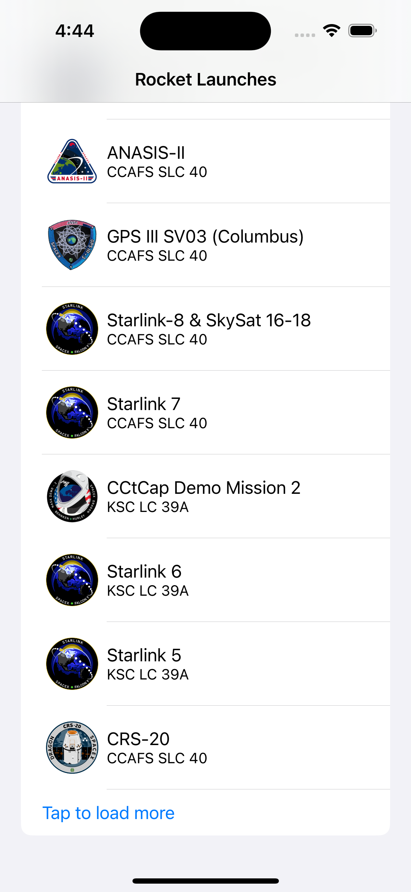
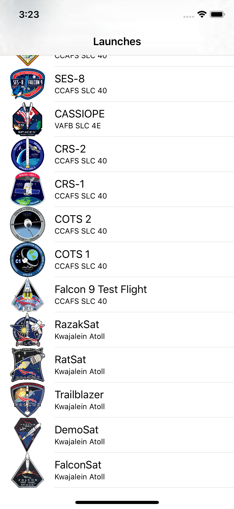

As mentioned earlier, the object returned from the `LaunchListQuery` is a `LaunchConnection`. This object has a list of launches, a pagination cursor, and a boolean to indicate whether more launches exist. 

When using a cursor-based pagination system, it's important to remember that the cursor gives you a place where you can get all results after a certain spot, regardless of whether more items have been added in the interim. 

You're going to use a second section in the TableView to allow your user to load more launches as long as they exist. But how will you know if they exist? First, you need to hang on to the most recently received `LaunchConnection` object.

Add a variable to hold on to this object at the top of the `LaunchesViewController.swift` file near your `launches` variable:

```swift title="LaunchesViewController.swift"
private var lastConnection: LaunchListQuery.Data.Launch?
```

Next, you're going to take advantage of a type from the Apollo library. Add the following to the top of the file:

```swift title="LaunchesViewController.swift"
import Apollo
```

Then, below `lastConnection`, add a variable to hang on to the most recent request: 

```swift title="LaunchesViewController.swift"
private var activeRequest: Cancellable?
```

Next, add a second case to your `ListSection` enum:

```swift title="LaunchesViewController.swift"
enum ListSection: Int, CaseIterable {
  case launches
  case loading
}
```

This allows loading state to be displayed and selected in a separate section, keeping your `launches` section tied to the `launches` variable. 

This will also cause a number of errors because you're no longer exhaustively handling all the cases in the enum - let's fix that.

In `tableView(_:, numberOfRowsInSection:)`, add handling for the `.loading` case, which returns `0` if there are no more launches to load: 

```swift title="LaunchesViewController.swift"
case .loading:
  if self.lastConnection?.hasMore == false {
    return 0
  } else {
    return 1
  }
```

Remember here that if `lastConnection` is nil, there *are* more launches to load, since we haven't even loaded a first connection. 

Next, add handling for the `.loading` case to `tableView(_, cellForRowAt:)`, showing a different message based on whether there's an active request or not:

```swift title="LaunchesViewController.swift"
case .loading:
  if self.activeRequest == nil {
    cell.textLabel?.text = "Tap to load more"
  } else {
    cell.textLabel?.text = "Loading..."
  }
```

Next, you'll need to provide the cursor to your `LaunchListQuery`. The good news is that the `launches` API takes an optional `after` parameter, which accepts a cursor. 

To pass a variable into a GraphQL query, you need to use syntax that defines that variable using a `$name` and its type. You can then pass the variable in as a parameter value to an API which takes a parameter.

What does this look like in practice? Go to `LaunchList.graphql` and update just the first two lines to take and use the cursor as a parameter: 

```graphql title="LaunchList.graphql"
query LaunchList($cursor:String) {
  launches(after:$cursor) {
```

Build the application so the code generation picks up on this new parameter. You'll still see one error for a non-exhaustive switch, but this is something we'll fix shortly.

Next, go back to `LaunchesViewController.swift` and update `loadLaunches()` to be `loadMoreLaunches(from cursor: String?)`, hanging on to the active request (and nil'ing it out when it completes), and updating the last received connection: 

```swift title="LaunchesViewController.swift"
private func loadMoreLaunches(from cursor: String?) {
  self.activeRequest = Network.shared.apollo.fetch(query: LaunchListQuery(cursor: cursor)) { [weak self] result in
    guard let self = self else {
      return
    }
    
    self.activeRequest = nil
    defer {
      self.tableView.reloadData()
    }
    
    switch result {
    case .success(let graphQLResult):
      if let launchConnection = graphQLResult.data?.launches {
        self.lastConnection = launchConnection
        self.launches.append(contentsOf: launchConnection.launches.compactMap { $0 })
      }
    
      if let errors = graphQLResult.errors {
        let message = errors
                        .map { $0.localizedDescription }
                        .joined(separator: "\n")
        self.showAlert(title: "GraphQL Error(s)",
                       message: message)
    }
    case .failure(let error):
      self.showAlert(title: "Network Error",
                     message: error.localizedDescription)
    }
  }
}
```

Then, add a new method to figure out if new launches need to be loaded:

```swift title="LaunchesViewController.swift"
private func loadMoreLaunchesIfTheyExist() {
  guard let connection = self.lastConnection else {
    // We don't have stored launch details, load from scratch
    self.loadMoreLaunches(from: nil)
    return
  }
    
  guard connection.hasMore else {
    // No more launches to fetch
    return
  }
    
  self.loadMoreLaunches(from: connection.cursor)
}
```

Update `viewDidLoad` to use this new method rather than calling `loadMoreLaunches(from:)` directly:

```swift title="LaunchesViewController.swift"
override func viewDidLoad() {
  super.viewDidLoad()
  self.loadMoreLaunchesIfTheyExist()
}
```

Next, you need to add some handling when the cell is tapped. Normally that's handled by `prepare(for segue:)`, but because you're going to be reloading things in the current view controller, you won't want the segue to perform at all. 

Luckily, you can use `UIViewController`'s  `shouldPerformSegue(withIdentifier:sender:)` method to say, "In this case, don't perform this segue, and take these other actions instead."

This method was already overridden in the starter project. Update the code within it to perform the segue for anything in the `.launches` section and _not_ perform it (instead loading more launches if needed) for the `.loading` section. Replace the `TODO` and everything below it with: 


```swift title="LaunchesViewController.swift"     
 guard let listSection = ListSection(rawValue: selectedIndexPath.section) else {
  assertionFailure("Invalid section")
  return false
}

switch listSection {
  case .launches:
    return true
  case .loading:
    self.tableView.deselectRow(at: selectedIndexPath, animated: true)

    if self.activeRequest == nil {
      self.loadMoreLaunchesIfTheyExist()
    } // else, let the active request finish loading

    self.tableView.reloadRows(at: [selectedIndexPath], with: .automatic)
    
    // In either case, don't perform the segue
    return false
  }
}
```

Finally, even though you've told the segue system that you don't need to perform the segue for anything in the `.loading` case, the _compiler_ still doesn't know that, and it requires you to handle the `.loading` case in `prepare(for segue:)`. 

However, your code should theoretically never reach this point, so it's a good place to use an `assertionFailure` if you ever hit it during development. This both satisfies the compiler and warns you loudly and quickly if your assumption that something is handled in `shouldPerformSegue` is wrong. 

Add the following to the `switch` statement in `prepare(for segue:)`

```swift title="LaunchesViewController.swift"
case .loading:
  assertionFailure("Shouldn't have gotten here!")
```

Now, when you build and run and scroll down to the bottom of the list, you'll see a cell you can tap to load more rows: 




When you tap that cell, the rows will load and then redisplay. If you tap it several times, it reaches a point where the loading cell is no longer displayed, and the last launch was SpaceX's original FalconSat launch from Kwajalien Atoll:





Congratulations, you've loaded all of the possible launches! But when you tap one, you still get the same boring detail page. 

Next, you'll [make the detail page a lot more interesting](./tutorial-detail-view/) by taking the ID returned by one query and passing it to another.
