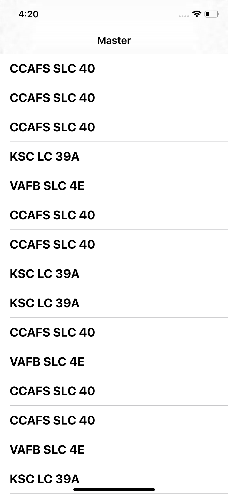
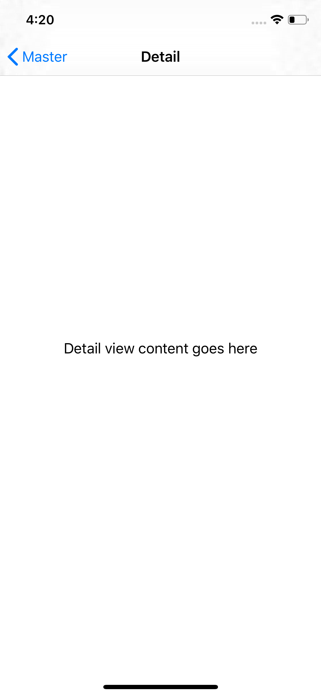
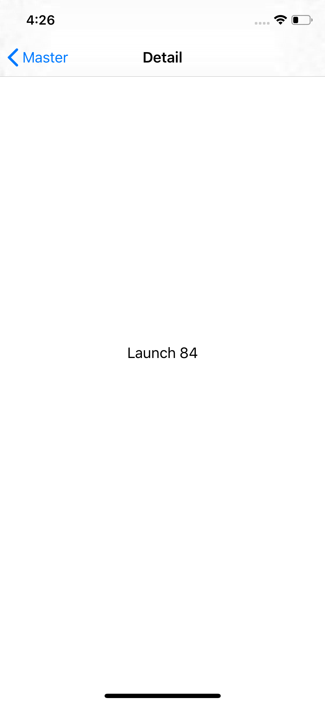
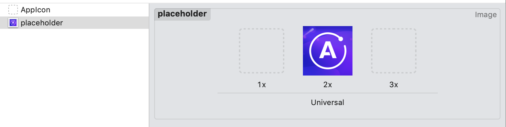
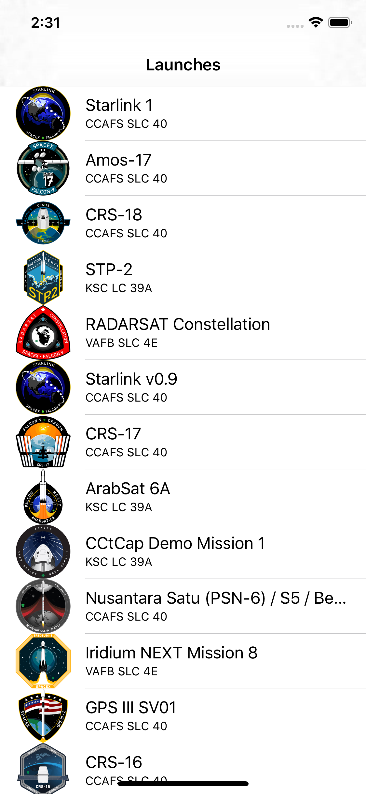

Now that your app can execute queries against a GraphQL server, you can reflect the results of those queries in your UI.

## Display the list of launches

Now let's add properties to display the results of the `LaunchListQuery` you built in the previous tutorial step. 

At the top of `LaunchesViewController.swift`, add a new property to store the launches that the query returns: 

```swift title="LaunchesViewController.swift"
var launches = [LaunchListQuery.Data.Launch.Launch]()
```

Why the long name? Each query returns its own nested object structure to ensure that when you use the result of a particular query, you can't ask for a property that isn't present. Because this screen will be populated by the results of the `LaunchListQuery`, you need to display subtypes of that particular query.

Next, add an enum that helps handle dealing with sections (we'll add more items to the enum later): 

```swift title="LaunchesViewController.swift"
enum ListSection: Int, CaseIterable {
  case launches
}
```

## Fill in required methods

Now we can update the various `UITableViewDataSource` methods to use the result of our query.

For `numberOfSections(in:)`, you can use the `allCases` property from `CaseIterable` to provide the appropriate number of sections:

```swift title="LaunchesViewController.swift"
override func numberOfSections(in tableView: UITableView) -> Int {
  return ListSection.allCases.count
}
```

For `tableView(_:numberOfRowsInSection:)`, you can try instantiating a `ListSection` enum object. If it doesn't work, that's an invalid section, and if it does, you can `switch` directly on the result. In this case, you'll want to return the count of launches:

```swift title="LaunchesViewController.swift"
override func tableView(_ tableView: UITableView, numberOfRowsInSection section: Int) -> Int {
  guard let listSection = ListSection(rawValue: section) else {
    assertionFailure("Invalid section")
    return 0
  }
        
  switch listSection {
  case .launches:
    return self.launches.count
  }
}
```

For `tableView(_:cellForRowAt:)`, you can use the existing cell dequeueing mechanism, the same section check as in `tableView(_:numberOfRowsInSection)`, and then configure the cell based on what section it's in.

For this initial section, grab a launch out of the `launches` array at the index of `indexPath.row`, and update the `textLabel` to display the launch site:

```swift title="LaunchesViewController.swift"
override func tableView(_ tableView: UITableView, cellForRowAt indexPath: IndexPath) -> UITableViewCell {
  let cell = tableView.dequeueReusableCell(withIdentifier: "Cell", for: indexPath)

  guard let listSection = ListSection(rawValue: indexPath.section) else {
    assertionFailure("Invalid section")
    return cell
  }
    
  switch listSection {
  case .launches:
    let launch = self.launches[indexPath.row]
    cell.textLabel?.text = launch.site
  }
    
  return cell
}
```

Your table view has all the information it needs to populate itself when the `launches` array has contents. Now it's time to actually get those contents from the server. 

First, add a method to load the launches. You'll use a setup similar to the one you used to set this up in the `AppDelegate` earlier. 

However, you need to make sure that a call doesn't try to call back and use elements that are no longer there, so you'll check to make sure that the `LaunchesViewController` hasn't been deallocated out from under you by passing in `[weak self]` and unwrapping `self` before proceeding with updating the UI. 

Replace the `TODO` in `loadLaunches` with the following: 

```swift title="LaunchesViewController.swift"
private func loadLaunches() {
  Network.shared.apollo
    .fetch(query: LaunchListQuery()) { [weak self] result in
    
    guard let self = self else {
      return
    }

    defer {
      self.tableView.reloadData()
    }
            
    switch result {
    case .success(let graphQLResult):
      // TODO
    case .failure(let error):
      // From `UIViewController+Alert.swift`
      self.showAlert(title: "Network Error",
                     message: error.localizedDescription)
    }
  }
}
```


`GraphQLResult` has both a `data` property and an `errors` property. This is because GraphQL allows partial data to be returned if it's non-null. 

In the example we're working with now, we could theoretically obtain a list of launches, and then an error stating that a launch with a particular ID could not be retrieved. 

This is why when you get a `GraphQLResult`, you generally want to check both the `data` property (to display any results you got from the server) _and_ the `errors` property (to try to handle any errors you received from the server). 

Replace the `// TODO` in the code above with the following code to handle both data and errors:

```swift title="LaunchesViewController.swift"
if let launchConnection = graphQLResult.data?.launches {
  self.launches.append(contentsOf: launchConnection.launches.compactMap { $0 })
}
        
if let errors = graphQLResult.errors {
  let message = errors
        .map { $0.localizedDescription }
        .joined(separator: "\n")
  self.showAlert(title: "GraphQL Error(s)",
                 message: message)    
}
```

Finally, you'd normally need to actually call the method you just added to kick off the call to the network when the view is first loaded. Take a look at your `viewDidLoad` and note that it's already set up to call `loadLaunches`: 

```swift title="LaunchesViewController.swift"
override func viewDidLoad() {
  super.viewDidLoad()
  self.loadLaunches()
}
```

Build and run the application. After the query completes, a list of launch sites appears: 



However, if you attempt to tap one of the rows, the app displays the detail view controller with the placeholder text you can see in the storyboard, instead of any actual information about the launch:





To send that information through, you need to build out the `LaunchesViewController`'s `prepareForSegue` method, and have a way for that method to pass the `DetailViewController` information about the launch.

## Pass information to the detail view

Let's update the `DetailViewController` to be able to handle information about a launch. 

Open `DetailViewController.swift` and note that there's a  property below the list of `IBOutlet`s:  

```swift title="DetailViewController.swift"
var launchID: GraphQLID? {
  didSet {
    self.loadLaunchDetails()
  }
}
```

This settable property allows the `LaunchesViewController` to pass along the identifier for the selected launch. The identifier will be used later to load more details about the launch. 

For now, update the `configureView()` method to use this property (if it's there) to show the launch's identifier: 

```swift title="DetailViewController.swift"
func configureView() {
  // Update the user interface for the detail item.
  guard
    let label = self.missionNameLabel,
    let id = self.launchID else {
      return
  }

  label.text = "Launch \(id)"
  // TODO: Adjust UI based on whether a trip is booked or not
}
```

> **Note**: You're also unwrapping the `missionNameLabel` because even though it's an Implicitly Unwrapped Optional, it won't be present if `configureView` is called before `viewDidLoad`.

Next, back in `LaunchesViewController.swift`, update the `prepareForSegue` method to obtain the most recently selected row and pass its corresponding launch details to the detail view controller. Replace the `TODO` and below with the following: 

```swift title="LaunchesViewController.swift"
guard let selectedIndexPath = self.tableView.indexPathForSelectedRow else {
  // Nothing is selected, nothing to do
  return
}
    
guard let listSection = ListSection(rawValue: selectedIndexPath.section) else {
  assertionFailure("Invalid section")
  return
}
    
switch listSection {
case .launches:
  guard
    let destination = segue.destination as? UINavigationController,
    let detail = destination.topViewController as? DetailViewController else {
      assertionFailure("Wrong kind of destination")
      return
  }

  let launch = self.launches[selectedIndexPath.row]
  detail.launchID = launch.id
  self.detailViewController = detail
}
```

Build and run, and tap on any of the launches. You'll now see the launch ID for the selected launch when you land on the page:



The app is working! However, it doesn't provide much useful information. Let's fix that.

## Add more info to the list view

Go back to `LaunchList.graphql`. Your query is already fetching most of the information you want to display, but it would be nice to display both the name of the mission and an image of the patch. 

Looking at the schema in Sandbox Explorer , you can see that `Launch` has a property of `mission`, which allows you to get details of the mission. A mission has both a `name` and a `missionPatch` property, and the `missionPatch` can optionally take a parameter about what size something needs to be.

Because loading a table view with large images can impact performance, ask for the name and a `SMALL` mission patch. Update your query to look like the following:

```graphql title="LaunchList.graphql"
query LaunchList {
  launches {
    hasMore
    cursor
    launches {
      id
      site
      mission {
        name
        missionPatch(size: SMALL)
      }
    }
  }
}
```

When you recompile, if you look in `API.swift`, you'll see a new nested type, `Mission`, with the two properties you requested.

Go back to `LaunchesViewController.swift` and add the following import of one of the libraries that was already in your project to the top of the file:

```swift title="LaunchesViewController.swift"
import SDWebImage
```

You'll use this shortly to load an image based on a URL.

Next, open up your Asset your Asset Catalog, `Assets.xcassets`. You'll see an image named "Placeholder": 



You'll use this image as a placeholder to show while the mission patch images are loading. 

Now go back to `LaunchesViewController.swift`. In `tableView(cellForRowAt:)`, once the cell is loaded, add the following code to help make sure that before the cell is configured, it clears out any stale data:

```swift title="LaunchesViewController.swift"
cell.imageView?.image = nil
cell.textLabel?.text = nil
cell.detailTextLabel?.text = nil
```

> **Note**: In a custom `UITableViewCell`, you'd do this by overriding `prepareForReuse` rather than resetting directly in the data source. However, since you're using a stock cell, you have to do it here. 

Next, in the same method, go down to where you're setting up the cell based on the section. Update the code to use the launch mission name as the primary text label, the launch site as the detail text label, and to load the mission patch if it exists:
    
```swift title="LaunchesViewController.swift"
switch listSection {
case .launches:
  let launch = self.launches[indexPath.row]
  cell.textLabel?.text = launch.mission?.name
  cell.detailTextLabel?.text = launch.site
    
  let placeholder = UIImage(named: "placeholder")!
    
  if let missionPatch = launch.mission?.missionPatch {
    cell.imageView?.sd_setImage(with: URL(string: missionPatch)!, placeholderImage: placeholder)
  } else {
    cell.imageView?.image = placeholder
  }
}
```

Build and run the application, and you will see all the information for current launches populate: 




If you scroll down, you'll see the list includes only about 20 launches. This is because the list of launches is **paginated**, and you've only fetched the first page. 

Now it's time to learn [how to use a cursor-based loading system to load the entire list of launches](./tutorial-pagination/).
