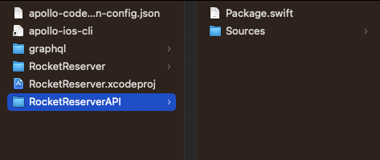
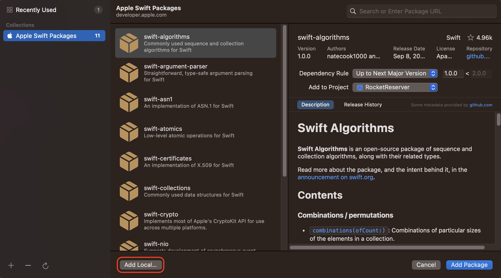
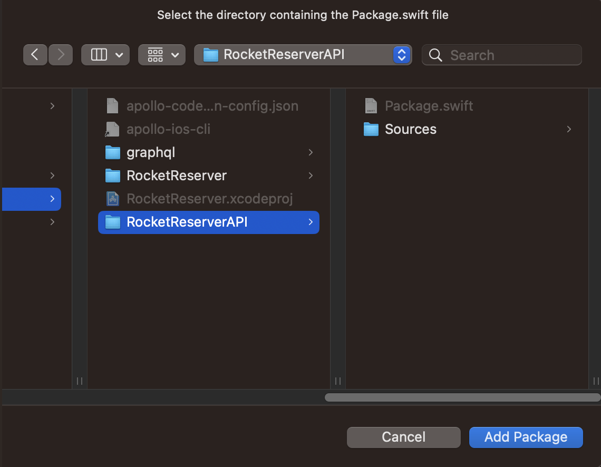
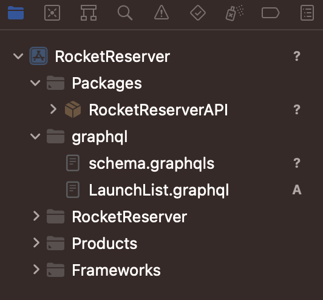
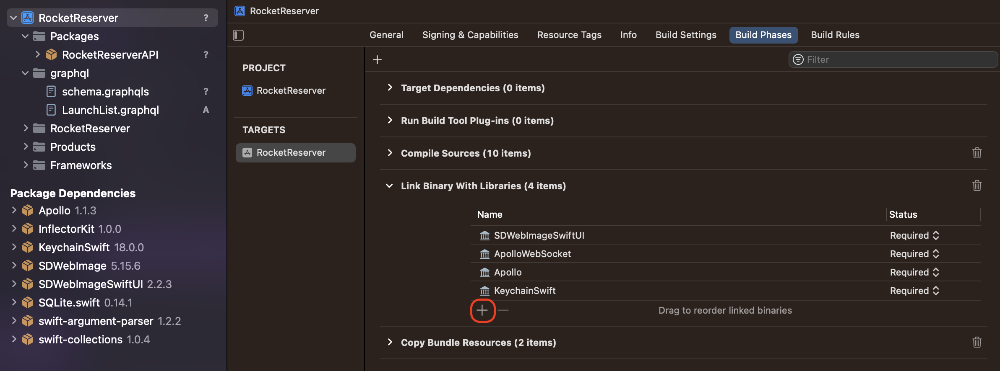
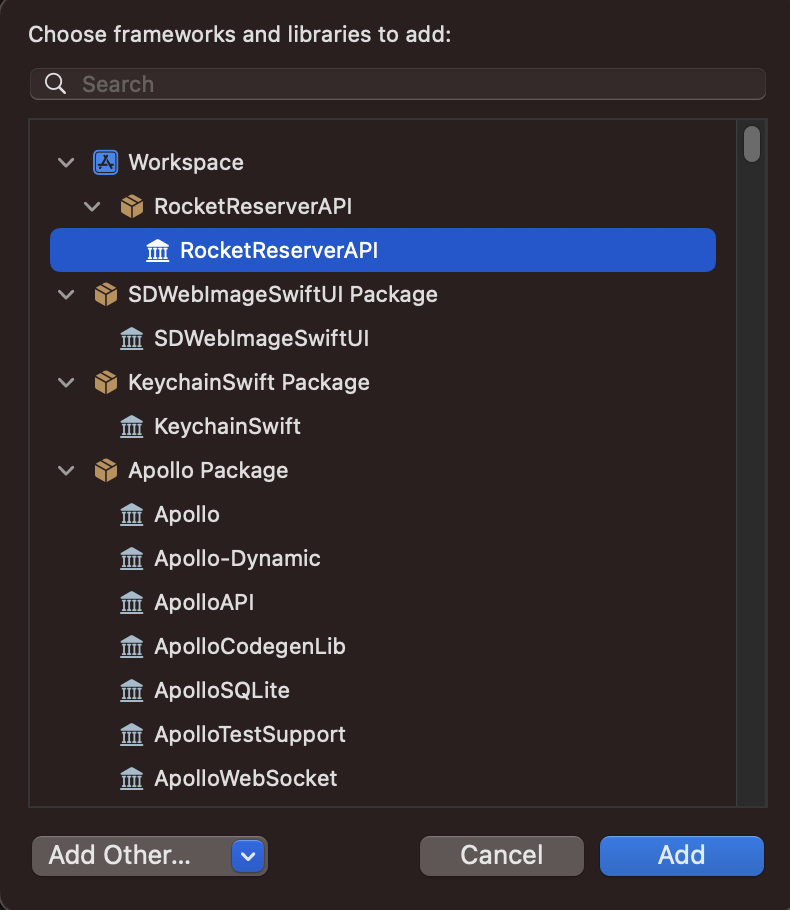

Now that we have both a schema and a query file, it's time to run code generation. To run code generation run the following command in Terminal from your project directory:

```bash
./apollo-ios-cli generate
```

You should now see a new `RocketReserverAPI` folder in your project directory which contains the Swift package containing your generated source code.



> For more information on code generation such as different [module types](https://www.apollographql.com/docs/ios/code-generation/codegen-configuration#module-type) you can generate or [different ways to run code generation](https://www.apollographql.com/docs/ios/code-generation/run-codegen-in-swift-code) see the documentation.

## Add the generated SPM package to your project

With the code generated, next we need to add the generated SPM package to the project.

1. In Xcode go to **File > Add Packages...**, in the Add Package dialog select **Add Local...**



2. Select the `RocketReserverAPI` folder in the file dialog, then click **Add Package**



3. You should now see the `RocketReserverAPI` package included in your project



4. Next, in Xcode select the project, then the `RocketReserver` target, and go to **Build Phases**. Under the **Link Binary With Libraries** section click the **+** sign



5. In the dialog that pops up, select the `RocketReserverAPI` library and click **Add**



## Examine the generated code

In the Xcode project hierarchy, navigate to `RocketReserver/Packages/RocketReseverAPI/Sources/Operations/Queries/LaunchListQuery.graphql.swift`. It defines a root class, `LaunchListQuery`, with many nested structs below it. If you compare the structs to the JSON data returned in Sandbox Explorer, you see that the structure matches. These structs include properties only for the fields that your query requests.

Try commenting out the `id` property in `LaunchList.graphql` using a `#`, saving, then running code generation again. When the code generation completes, the innermost `Launch` now only includes the built-in `__typename` and the requested `site` property.

Uncomment `id` in `LaunchList.graphql` and re-run code generation to restore the property.

Now that you've generated code and had a chance to see what's in there, it's time to get everything working end to end! Next, you will [Execute your first query.](tutorial-execute-first-query)