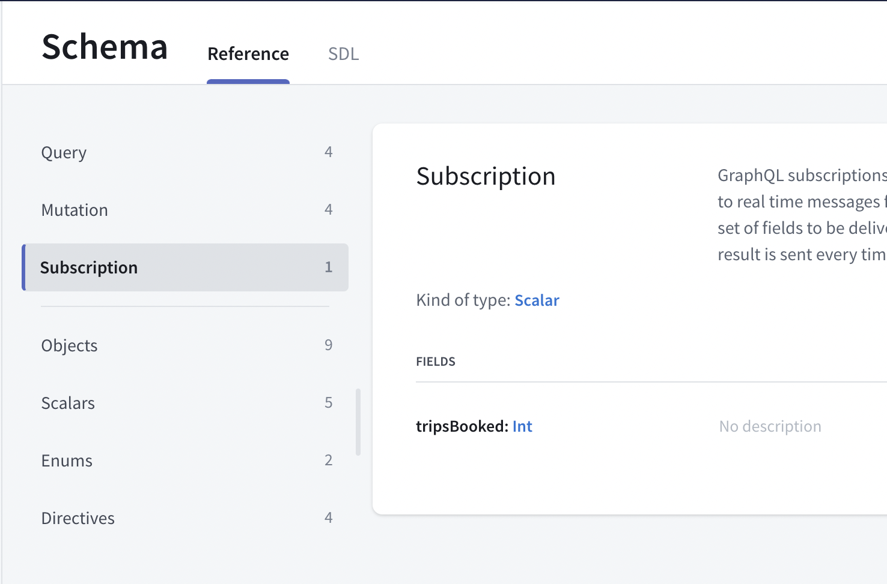
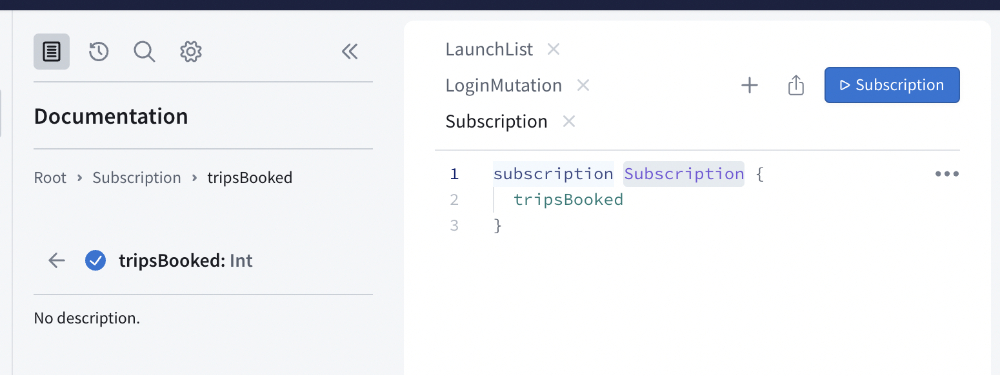
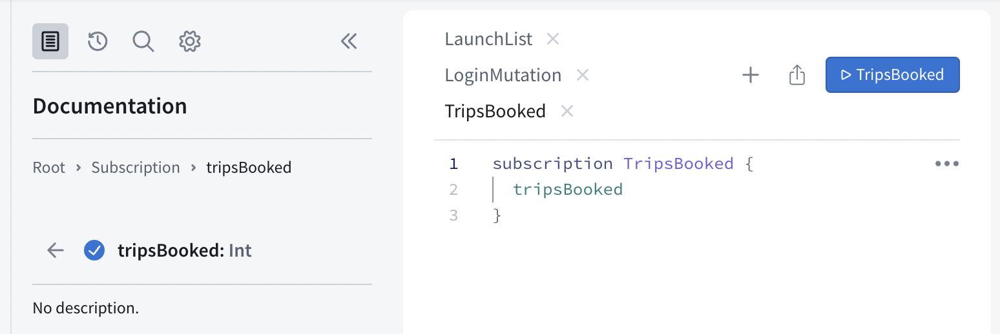
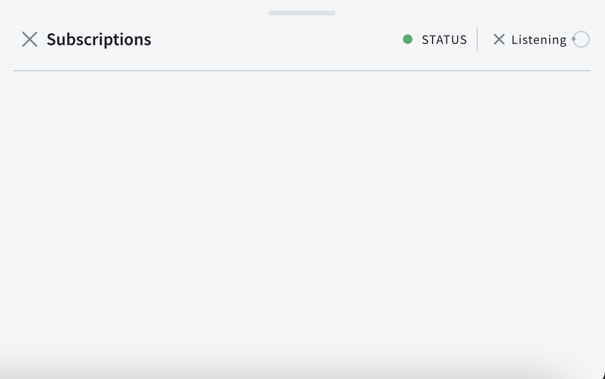
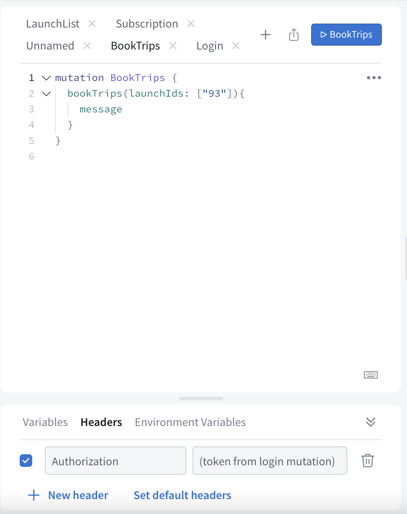
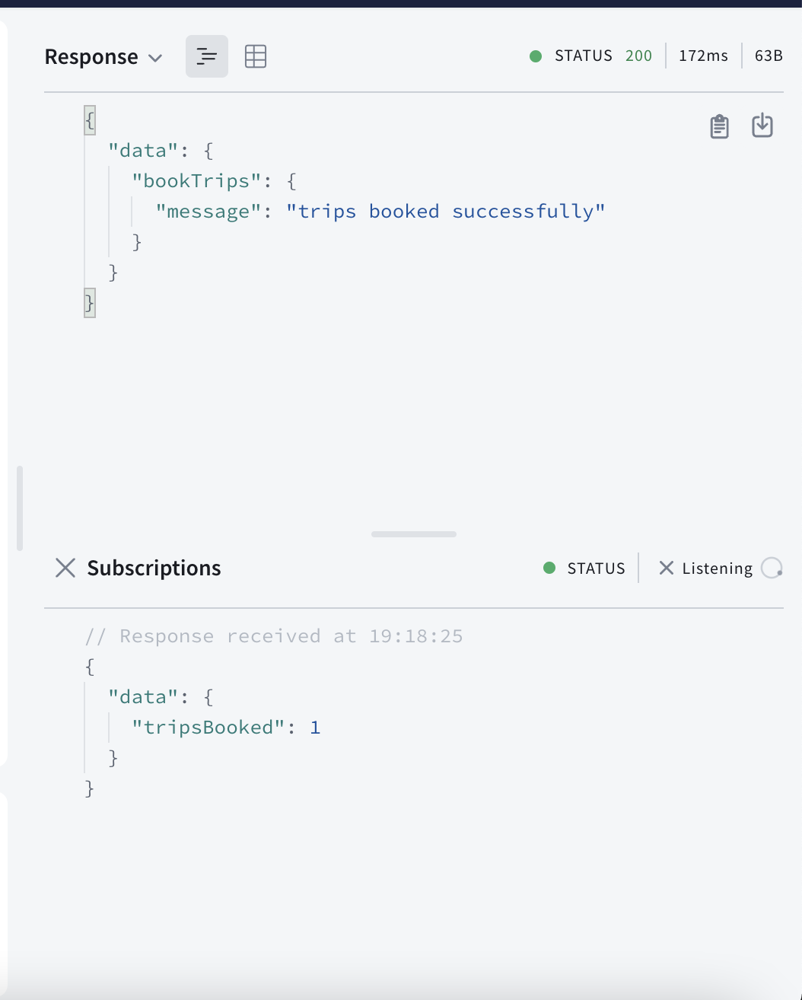
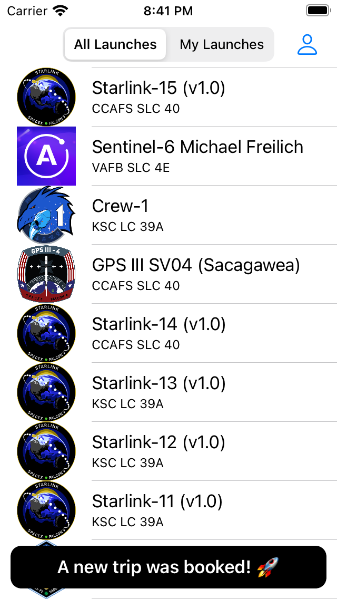

In this section, you will use subscriptions to get notified whenever someone books a flight 🚀! [Subscriptions](https://graphql.org/blog/subscriptions-in-graphql-and-relay/) allow you to be notified in real time whenever an event happens on your server. The [fullstack backend](https://apollo-fullstack-tutorial.herokuapp.com/graphql) supports subscriptions based on [WebSockets](https://en.wikipedia.org/wiki/WebSocket).


## Write your subscription

Open your [Sandbox](https://studio.apollographql.com/sandbox/explorer?endpoint=https%3A%2F%2Fapollo-fullstack-tutorial.herokuapp.com%2Fgraphql) back up, click on the Schema tab at the far left. In addition to `queries` and `mutations`, you will see a third type of operations, `subscriptions`. Click on subscriptions to see the `tripsBooked` subscription:



This subscription doesn't take any argument and returns a single scalar named `tripsBooked`. Since you can book multiple trips at once, `tripsBooked` is an `Int`. It will contain the number of trips booked at once or -1 if a trip has been cancelled.

Click the play button to the far right of `tripsBooked` to open the subscription in Explorer. Open a new tab, then check the `tripsBooked` button to have the subscription added:



Again, rename your subscription so it's easier to find:



Click the Submit Operation button, and your subscription will start listening to events. You can tell it's up and running because a panel will pop up at the lower left where subscription data will come in:



## Test your subscription

Open a new tab in Explorer. In this new tab, add code to book a trip like on [step 8](tutorial-mutations), but with a hard-coded ID:

```graphql
mutation BookTrip {
  bookTrips(launchIds: ["93"]){
    message
  }
}
```

Do not forget to include the authentication header. At the bottom of the Sandbox Explorer pane where you add operations, there's a `Headers` section:



Click the Submit Operation button. If everything went well, you just booked a trip! At the top of the right panel, you'll see the success JSON for your your `BookTrip` mutation, and below it, updated JSON for the `TripsBooked` subscription:



Continue booking and/or canceling trips, you will see events coming in the subscription panel in real time. After some time, the server might close the connection and you'll have to restart your subscription to keep receiving events.

## Add the subscription to the project

Now that your subscription is working, add it to your project. Create an empty file named `TripsBooked.graphql` next to your other GraphQL files and paste the contents of the subscription. The process is similar to what you've already done for queries and mutations:

```graphql title="TripsBooked.graphql"
subscription TripsBooked {
  tripsBooked
}
```

Build your project, and the subscription will be picked up and added to your `API.swift` file.

## Configure your ApolloClient to use subscriptions

> This tutorial uses the [`graphql-ws`](https://github.com/apollographql/subscriptions-transport-ws/blob/master/PROTOCOL.md) protocol, implemented by the [`subscriptions-transport-ws`](https://github.com/apollographql/subscriptions-transport-ws) library. **That library is no longer actively maintained.** We recommend using the [`graphql-ws`](https://www.npmjs.com/package/graphql-ws) library instead, which implements its own WebSocket subprotocol, `graphql-transport-ws`. Note that the two libraries do not use the same WebSocket subprotocol and you need to ensure that your servers, clients, and tools use the **same library and subprotocol**. For more information and examples, see [GraphQL over WebSocket protocols](../subscriptions#graphql-over-websocket-protocols).

In `Network.swift`, you'll need to set up a transport which supports subscriptions in addition to general network usage. In practice, this means adding a `WebSocketTransport` which will allow real-time communication with your server.

First, at the top of the file, add an import for the **ApolloWebSocket** framework to get access to the classes you'll need:

```swift title="Network.swift"
import ApolloWebSocket
```

Next, in the lazy declaration of the `apollo` variable, immediately after `transport` is declared, set up what you need to add subscription support to your client:

```swift title="Network.swift"
// 1
let webSocket = WebSocket(
  url: URL(string: "wss://apollo-fullstack-tutorial.herokuapp.com/graphql")!,
  protocol: .graphql_ws
)

// 2
let webSocketTransport = WebSocketTransport(websocket: webSocket)

// 3
let splitTransport = SplitNetworkTransport(
  uploadingNetworkTransport: transport,
  webSocketNetworkTransport: webSocketTransport
)

// 4
return ApolloClient(networkTransport: splitTransport, store: store)
```

What's happening here?

1. You've created a web socket with the server's web socket URL - `wss://` is the protocol for a secure web socket.
2. You've created a `WebSocketTransport`, which allows the Apollo SDK to communicate with the web socket.
3. You've created a `SplitNetworkTransport`, which can decide whether to use a web socket or not automatically, with both the `RequestChainNetworkTransport` you had previously set up, and the `WebSocketTransport` you just set up.
4. You're now passing the `splitTransport` into the `ApolloClient`, so that it's the main transport being used in your `ApolloClient`.

Now, you're ready to actually use your subscription!

## Display a view when a trip is booked/cancelled

In `LaunchesViewController`, add a new variable just below `activeRequest` to hang on to a reference to your subscription so it doesn't get hammered by ARC as soon as it goes out of scope:

```swift title="LaunchesViewController.swift"
private var activeSubscription: Cancellable?
```

Next, just above the code for handling Segues, add code for starting and handling the result of a subscription:

```swift title="LaunchesViewController.swift"
// MARK: - Subscriptions

private func startSubscription() {
          activeSubscription = Network.shared.apollo.subscribe(subscription: TripsBookedSubscription()) { result in
            switch result {
            case .failure(let error):
                self.showAlert(title: "NetworkError",
                               message: error.localizedDescription)
            case .success(let graphQLResult):
                if let errors = graphQLResult.errors {
                    self.showAlertForErrors(errors)
                } else if let tripsBooked = graphQLResult.data?.tripsBooked {
                    self.handleTripsBooked(value: tripsBooked)
                } else {
                    // There was no data and there were no errors, do nothing.
                }
            }
        }
    }
}

private func handleSubscriptionEvent() {
   print("Trips booked: \(value)")
}
```

Finally, add a line to `viewDidLoad` which actually starts the subscription:

```swift title="LaunchesViewController.swift"
override func viewDidLoad() {
    super.viewDidLoad()
    self.startSubscription()
    self.loadMoreLaunchesIfTheyExist()
}
```

Build and run your app and go back to Sandbox Explorer, and select the tab where you set up the `BookTrip` mutation. Book a new trip while your app is open, you'll see a log print out:

```
Trips booked: 1
```

Cancel that same trip, and you'll see another log:

```
Trips booked: -1
```

Now, let's display that information in a view! Replace the `print` statement in `handleTripsBooked` with code to use the included `NotificationView` to show a brief alert at the bottom of the screen with information about a trip being booked or cancelled:

```swift title="LaunchesViewController.swift"
private func handleTripsBooked(value: Int) {
        var message: String
        switch value {
        case 1:
            message = "A new trip was booked! 🚀"
        case -1:
            message = "A trip was cancelled! 😭"
        default:
            self.showAlert(title: "Unexpected value",
                           message: " Subscription returned unexpected value: \(value)")
            return
        }

        NotificationView.show(in: self.navigationController!.view,
                              with: message,
                              for: 4.0)
    }
```

Build and run the application to your simulator, then use Studio to send bookings and cancellations again, and your iOS app should see some shiny new notifications pop up:



And you've done it! You've completed the tutorial.

## More resources

There are way more things you can do with the Apollo iOS SDK, and the rest of this documentation includes info on more advanced topics like:

- Using [fragments](../fragments/)
- Working with [custom scalars](../fetching-queries/#notes-on-working-with-custom-scalars)
- [Caching](../caching/)

Feel free to ask questions by either [opening an issue on our GitHub repo](https://github.com/apollographql/apollo-ios/issues), or [joining the community](http://community.apollographql.com/new-topic?category=Help&tags=mobile,client).

And if you want dig more and see GraphQL in real-world apps, you can take a look at these open source projects using Apollo iOS:

* https://github.com/GitHawkApp/GitHawk
* [open a PR if you have an example app that should be here!]
