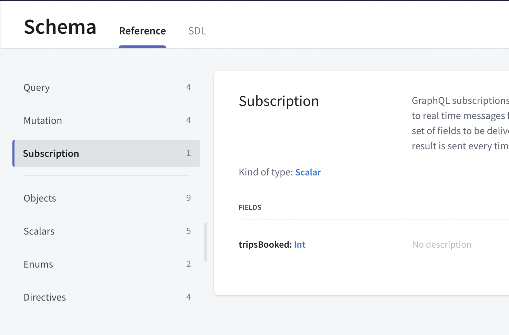
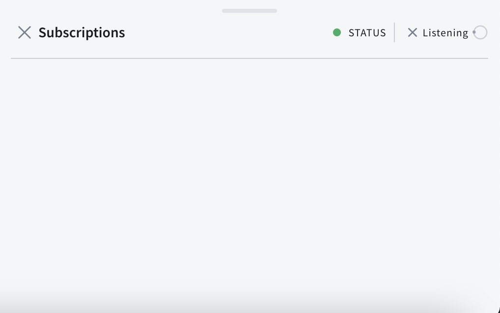

In this section, you will use subscriptions to get notified whenever someone books a flight 🚀! [Subscriptions](https://graphql.org/blog/subscriptions-in-graphql-and-relay/) allow you to be notified in real time whenever an event happens on your server. The [fullstack backend](https://apollo-fullstack-tutorial.herokuapp.com/graphql) supports subscriptions based on [WebSockets](https://en.wikipedia.org/wiki/WebSocket).

## Write your subscription

Open your [Sandbox](https://studio.apollographql.com/sandbox/explorer?endpoint=https%3A%2F%2Fapollo-fullstack-tutorial.herokuapp.com/graphql) back up, click on the Schema tab at the far left. In addition to `queries` and `mutations`, you will see a third type of operations, `subscriptions`. Click on subscriptions to see the `tripsBooked` subscription:



This subscription doesn't take any arguments and returns a single scalar named `tripsBooked`. Since you can book multiple trips at once, `tripsBooked` is an `Int`. It will contain the number of trips booked at once or -1 if a trip has been cancelled.

Click the play button to the far right of `tripsBooked` to open the subscription in Explorer. Open a new tab, then check the `tripsBooked` button to have the subscription added:


Again, rename your subscription so it's easier to find:


Click the Submit Operation button, and your subscription will start listening to events. You can tell it's up and running because a panel will pop up at the lower right where subscription data will come in:



## Test your subscription

Open a new tab in Explorer. In this new tab, add code to book a trip like on [step 8](tutorial-mutations), but with a hard-coded ID:

```graphql
mutation BookTrip {
  bookTrips(launchIds: ["93"]){
    message
  }
}
```

Do not forget to include the authentication header. At the bottom of the Sandbox Explorer pane where you add operations, there's a `Headers` section:


Click the Submit Operation button. If everything went well, you just booked a trip! At the top of the right panel, you'll see the success JSON for your your `BookTrip` mutation, and below it, updated JSON for the `TripsBooked` subscription:


Continue booking and/or canceling trips, you will see events coming in the subscription panel in real time. After some time, the server might close the connection and you'll have to restart your subscription to keep receiving events.

## Add the subscription to your project

Now that your subscription is working, add it to your project. Create an empty file named `TripsBooked.graphql` next to your other GraphQL files and paste the contents of the subscription. The process is similar to what you've already done for queries and mutations:

```graphql title="TripsBooked.graphql"
subscription TripsBooked {
  tripsBooked
}
```

Now run code generation in Terminal to generate the code for your subscription.

## Configure your ApolloClient to use subscription

In `Network.swift`, you'll need to set up a transport which supports subscriptions in addition to general network usage. In practice, this means adding a `WebSocketTransport` which will allow real-time communication with your server.

First, at the top of the file, add an import for the **ApolloWebSocket** framework to get access to the classes you'll need:

```swift title="Network.swift"
import ApolloWebSocket
```

Next, in the lazy declaration of the `apollo` variable, immediately after `transport` is declared, set up what you need to add subscription support to your client:

```swift title="Network.swift"
private(set) lazy var apollo: ApolloClient = {
    let client = URLSessionClient()
    let cache = InMemoryNormalizedCache()
    let store = ApolloStore(cache: cache)
    let provider = NetworkInterceptorProvider(client: client, store: store)
    let url = URL(string: "https://apollo-fullstack-tutorial.herokuapp.com/graphql")!
    let transport = RequestChainNetworkTransport(interceptorProvider: provider, endpointURL: url)

    let webSocket = WebSocket( // highlight-line
        url: URL(string: "wss://apollo-fullstack-tutorial.herokuapp.com/graphql")!, // highlight-line
        protocol: .graphql_ws // highlight-line
    ) // highlight-line

    let webSocketTransport = WebSocketTransport(websocket: webSocket) // highlight-line

    let splitTransport = SplitNetworkTransport( // highlight-line
        uploadingNetworkTransport: transport, // highlight-line
        webSocketNetworkTransport: webSocketTransport // highlight-line
    ) // highlight-line

    return ApolloClient(networkTransport: splitTransport, store: store) // highlight-line
}()
```

What's happening here?

1. You've created a web socket with the server's web socket URL - `wss://` is the protocol for a secure web socket.
2. You've created a `WebSocketTransport`, which allows the Apollo SDK to communicate with the web socket.
3. You've created a `SplitNetworkTransport`, which can decide whether to use a web socket or not automatically, with both the `RequestChainNetworkTransport` you had previously set up, and the `WebSocketTransport` you just set up.
4. You're now passing the `splitTransport` into the `ApolloClient`, so that it's the main transport being used in your `ApolloClient`.

Now, you're ready to actually use your subscription!

## Use your subscription

To use the subscription you created, go to `LaunchListViewModel.swift` and start by adding a new variable to hold the subscription:

```swift title="LaunchListViewModel.swift"
@Published var launches = [LaunchListQuery.Data.Launches.Launch]()
@Published var lastConnection: LaunchListQuery.Data.Launches?
@Published var activeRequest: Cancellable?
var activeSubscription: Cancellable? // highlight-line
@Published var appAlert: AppAlert?
@Published var notificationMessage: String?
```

Now, replace the `TODO` in the `startSubscription()` method with the following code:

```swift title="LaunchListViewModel.swift"
func startSubscription() {
    activeSubscription = Network.shared.apollo.subscribe(subscription: TripsBookedSubscription()) { [weak self] result in
        guard let self = self else {
            return
        }

        switch result {
        case .success(let graphQLResult):
            if let tripsBooked = graphQLResult.data?.tripsBooked {
                self.handleTripsBooked(value: tripsBooked)
            }

            if let errors = graphQLResult.errors {
                self.appAlert = .errors(errors: errors)
            }
        case .failure(let error):
            self.appAlert = .errors(errors: [error])
        }
    }
}
```

Next, update the `init()` method to the following:

```swift title="LaunchListViewModel.swift"
init() {
    Network.shared.apollo.fetch(query: LaunchListQuery(cursor: nil)) { result in
    // ...
    startSubscription()//highlight-line
}
```

Notice in `LaunchListView.swift` there is already a line to handle displaying a view from the subscription:

```swift title="LaunchListView.swift"
.notificationView(message: $viewModel.notificationMessage)
```

## Test your subscription

Build and run the application, now whenever a trip is booked or cancelled (from either in the app detail view or from the Sandbox Explorer) you should see a small notification pop up at the bottom of the screen:


Congratulations, you've completed the tutorial!

## More resources

There are way more things you can do with the Apollo iOS SDK, and the rest of this documentation includes info on more advanced topics like:

- Using [fragments](../fragments/)
- Working with [custom scalars](../fetching-queries/#notes-on-working-with-custom-scalars)
- [Caching](../caching/)

Feel free to ask questions by either [joining our Discord server](https://discord.gg/GraphOS) or [joining the Apollo GraphQL Forum](http://community.apollographql.com/new-topic?category=Help&tags=mobile,client).
