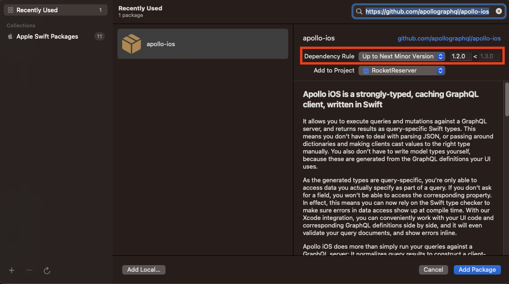
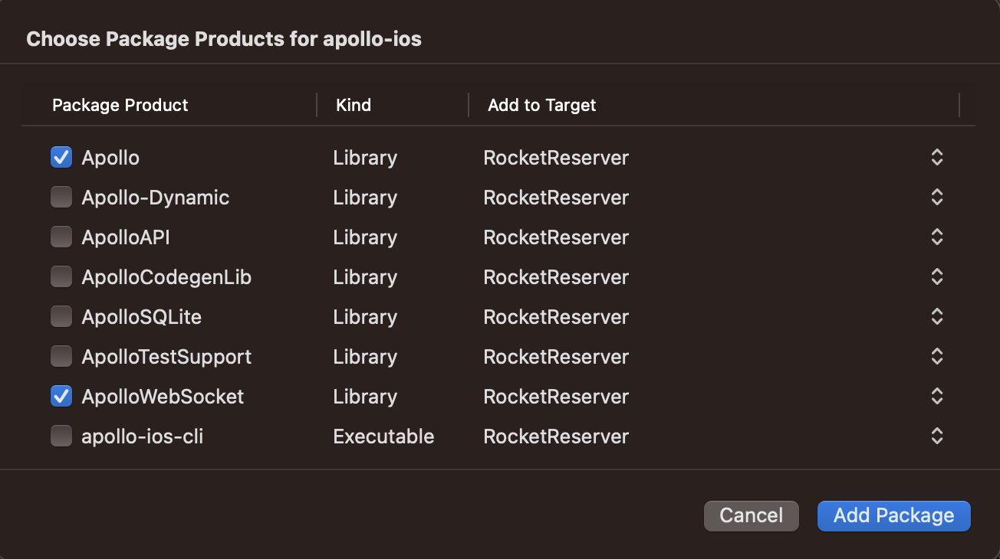

In this part of the tutorial, you'll get set up in a new project with the Apollo iOS SDK, and generate your first code. 

## Starting a new project in Xcode

Open up Xcode. If you see the **Welcome to Xcode** screen, select **Create a new Xcode project**:

If you don't see that screen, go to **File > New > Project...** in the menus: 

Either of those will bring you to the template chooser for a new project. Select **iOS** at the top and **Single View App**:

Then hit **Next**. You'll be brought to the options page for your new project. Name the project **RocketReserver**, make sure the language is **Swift**, and the User Interface is **SwiftUI**:

It's probably also a good idea in the long term to make sure the unit and UI test checkboxes are checked. Hit **Next**. You'll then be prompted to select where to save your new project. Pick a place on your computer that's easy to find, such as your Desktop, and hit **Finish**.

Xcode will open your new project for you, and you'll see an extremely basic new SwiftUI project:

Next, you'll add a dependency on the `apollo-ios` repo and Apollo libraries using Swift Package Manager, aka SPM. In the menu, go to **File > Swift Packages> Add Package Dependency...**:

This will open a dialog allowing you to select what dependency you wish to add. Add the git URL for the iOS repo, [`https://github.com/apollographql/apollo-ios.git`](https://github.com/apollographql/apollo-ios.git)

Remember the `.git` part, otherwise there could be some weirdness in setting things up later! Hit the **Next** button, and Xcode will check out the repository in git and analyze the library for you. When it's done, it'll show you a panel asking if you want to use up to the next major version of the library. 

While in most cases, this works well, since Apollo is still at v0.x.x, breaking changes can occur in minor versions. Update the dropdown to use the **Next minor** version of the library:

Then hit next. You'll then get a list of the packages which are included with this library. For this tutorial, select the main **Apollo** target and the **ApolloWebSocket** target:

Then hit **Finish**. SPM will go out and fetch your dependencies, and when it completes you'll be able to see them in a separate section of the project navigator: 

> **Note:** Due to Swift Package Manager not having implemented [Target-Based Dependency Resolution](https://github.com/apple/swift-evolution/blob/master/proposals/0226-package-manager-target-based-dep-resolution.md) yet, you'll still see the `SQLite` dependency even though you didn't check the box for `ApolloSQLite`. 

Now you've got your project set up, and the Apollo dependencies added. It's time to start pulling together the things you need to build your API!

## Setting up a CodeSandbox

https://codesandbox.io/s/fullstack-tutorial-server-n1kqy

https://n1kqy.sse.codesandbox.io/