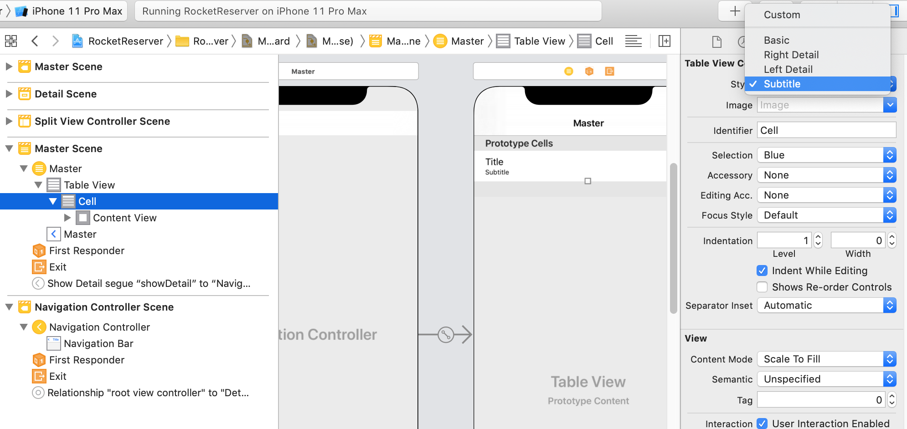
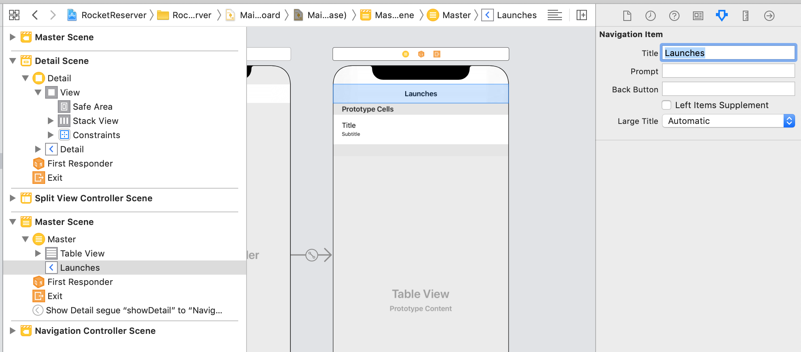

import DetailUISetupPanel from "./components/detail_ui_setup_panel.mdx"


In the first part of this tutorial, you got everything set set up to allow you to communicate with the server. Now, it's time to power your UI with the result of those queries!

In **MasterViewController.swift**, delete the following pieces of boilerplate you're not going to need (in top to bottom of the file order): 

- The `objects` property
- Everything in `viewDidLoad` except the `super.viewDidLoad()` call.
- The entire `insertNewObject()` method.
- The contents of `prepareForSegue()` (but not the method itself)
- The entire `tableView(_, canEditRowAt:)` method.
- The entire `tableView(_, commit:, forRowAt:)` method.

Next, you'll add properties and update the boilerplate code to display the results of the `LaunchListQuery` you built in the last part of the tutorial. 

At the top of the file, add a new property to store the loaded launches: 

```swift
var launches = [LaunchListQuery.Data.Launch.Launch]()
```

Why the long name? Each query returns its own nested objects to ensure that when you use the result of a particular query, you can't ask for a property that isn't going to be there. Since this screen is going to be populated by the results of the `LaunchListQuery`, you'll need to display sub-types of that query.

Add an enum which will help handle dealing with sections: 

```swift
enum ListSection: Int, CaseIterable {
  case launches
}
```

(Don't worry, there will be more than one eventually 🤓). 

Next, update the various `UITableViewDataSource` methods. For `numberOfSections(in:)`, you can use the `allCases` property from `CaseIterable` to provide the appropriate number of sections:

```swift
override func numberOfSections(in tableView: UITableView) -> Int {
  return ListSection.allCases.count
}
```

For `tableView(_:numberOfRowsInSection:)`, you can try instantiating a `ListSection` enum object. If it doesn't work, that's an invalid section, and if it does, you can `switch` directly on the result. In this case, you'll want to return the count of launches:

```swift
override func tableView(_ tableView: UITableView, numberOfRowsInSection section: Int) -> Int {
  guard let listSection = ListSection(rawValue: section) else {
    assertionFailure("Invalid section")
    return 0
  }
        
  switch listSection {
  case .launches:
    return self.launches.count
  }
}
```

For `tableView(_:cellForRowAt:)`, you can use the existing cell dequeueing mechansim, the same section check as in `tableView(_:numberOfRowsInSection)`, and then configure the cell based on what section it's in.

For this initial section, grab a launch out of the `launches` array at the index of `indexPath.row`, and update the `textLabel` to display the launch site:

```swift
override func tableView(_ tableView: UITableView, cellForRowAt indexPath: IndexPath) -> UITableViewCell {
  let cell = tableView.dequeueReusableCell(withIdentifier: "Cell", for: indexPath)

  guard let listSection = ListSection(rawValue: indexPath.section) else {
    assertionFailure("Invalid section")
    return cell
  }
    
  switch listSection {
  case .launches:
    let launch = self.launches[indexPath.row]
    cell.textLabel?.text = launch.site
  }
    
  return cell
}
```

Your table view has all the information it needs to populate itself when the `launches` array has contents. Now it's time to actually get those contents from the server. 

First, add a really basic method to handle showing errors at the end of your file: 

```swift
private func showErrorAlert(title: String, message: String) {
  let alert = UIAlertController(title: title,
                                message: message,
                                preferredStyle: .alert)
  self.present(alert, animated: true)
}
```

Next, add a method to load the launches. You'll use basically the same setup as you did when you were setting this up in the `AppDelegate` earlier. 

However, you need to make sure that a call doesn't try to call back and use elements that are no longer there, so you'll check to make sure that the `MasterViewController` hasn't been deallocated out from under you by passing in `[weak self]` and unwrapping `self` before proceeding with updating the UI:

```swift
private func loadLaunches() {
  Network.shared.apollo
    .fetch(query: LaunchListQuery()) { [weak self] result in
    
      guard let self = self else {
        return
      }

      defer {
        self.tableView.reloadData()
      }
            
      switch result {
      case .success(let graphQLResult):
        // TODO
      case .failure(let error):
        self.showErrorAlert(title: "Network Error",
                            message: error.localizedDescription)
      }
}
```


`GraphQLResult` has both `data` property and an `errors` property. This is because GraphQL is designed to allow partial data to be returned if it's not non-null. 

In the example we're working with now, we could theoretically get a list of launches, and then an error stating that a launch with a particular ID could not be constructed. 

This is why when you get a `GraphQLResult`, you generally want to check both the `data` property, to display any results you got from the server, AND the `errors` property, to try to handle any additional errors you received from the server. 

Replace the `// TODO` in the code above with the following code to handle both data and errors:

```swift
if let launchConnection = graphQLResult.data?.launches {
  self.launches.append(contentsOf: launchConnection.launches.compactMap { $0 })
}
        
if let errors = graphQLResult.errors {
  let message = errors
        .map { $0.localizedDescription }
        .joined(separator: "\n")
  self.showErrorAlert(title: "GraphQL Error(s)",
                      message: message)    
}
```

Finally, you'll need to actually call the method you just added to kick off making the call to the network when the view is first loaded. Update your `viewDidLoad` to also call `loadLaunches`: 


```swift
override func viewDidLoad() {
  super.viewDidLoad()
  self.loadLaunches()
}
```

Build and run the application, and after a brief stint where the view is empty, you'll see a list of 

// TODO: Initial Screenshot

However, if you attempt to tap one of the rows, the app display the detail with the the placeholder text you can see in the storyboard rather than any actual information about the launch. 

To send that information through, you'll need to build out the `MasterViewController`'s `prepareForSegue` method, and have a way for that method to pass `DetailViewController` information about the launch.

## Passing information to the Detail view

You'll start by updating the `DetailViewController` to be able to handle information about a launch. 

Open **DetailViewController.swift**, and delete the `detailItem` property at the bottom of the class, since you're not going to be using it. Next, add a new property at the top of the class:  

```swift
var launchID: GraphQLID? {
  didSet {
    self.configureView()
  }
}
```

This settable property will allow `MasterViewController` to pass the identifier for the selected launch through. The identifier will be used later to load more details about the launch. 

For now, though, start by updating the `configureView()` method to use this new property (if it's there) instead of the `detailItem` property you just deleted: 

```swift
func configureView() {
  // Update the user interface for the detail item.
  guard
    let label = self.detailDescriptionLabel,
    let id = self.launchID else {
      return
  }

  label.text = "Launch \(id)"
}
```

> **Note**: You're also unwrapping the `detailDescriptionLabel` because even though it's an Implicitly Unwrapped Optional, it won't be present if `configureView` gets called before `viewDidLoad`.

Next, back in **MasterViewController.swift**, update the `prepareForSegue` method to get the most recently selected row, and use that to find the launch to pass information about to the detail view controller: 

```swift
override func prepare(for segue: UIStoryboardSegue, sender: Any?) {
  guard let selectedIndexPath = self.tableView.indexPathForSelectedRow else {
    // Nothing is selected, nothing to do
    return
  }
    
  guard let listSection = ListSection(rawValue: selectedIndexPath.section) else {
    assertionFailure("Invalid section")
    return
  }
    
  switch listSection {
  case .launches:
    guard
      let destination = segue.destination as? UINavigationController,
      let detail = destination.topViewController as? DetailViewController else {
        assertionFailure("Wrong kind of destination")
        return
    }
    
    let launch = self.launches[selectedIndexPath.row]
    detail.launchID = launch.id
    self.detailViewController = detail
  }
}
```

One slightly unrelated detail: In **SceneDelegate.swift**, there was one spot that relied on the `detailItem` property you deleted earlier, which will cause an error . Follow the error to this spot, and replace the erroring line with:

```swift
if topAsDetailController.launchID == nil {
```

Build and run, and tap on any of the launches. You'll now see the launch ID for the selected launch when you land on the page!

// TODO: Screenshot of launch ID being passed in. 

## Adding more info to the list

The app is working! However, it's pretty ugly, and doesn't give you a ton of useful information. It's time to spiff it up and modify queries a bit to create a better user experience. 

First, take advantage of one of the built-in styles for `UITableViewCell` to display more information without having to do much work. Go to **Main.storyboard**, select the **Master Scene** which includes the TableView and the default cell. 

Open the flippy triangles in the left sidebar of interface builder until you get to **Cell**. Select that element, then go to the **Attributes Inspector** in the right sidebar of Xcode. At the top, there's a drop-down which will allow you to select a style for your table view cell. Select **Subtitle**:



Also, while you're here, this is a good time to give the main TableView a name that better reflects what it's actually showing. Select the navigation item and rename it from `Master` to `Launches`:



Next, go back to **LaunchList.graphql**. You've already got most of the information you want to display, but it would be nice to display both the name of the mission and an image of the patch. 

Looking at the schema in GraphiQL, you can see that `Launch` has a property of `mission`, which will allow you to get details of the mission. A mission has both a name and a `missionPatch` property, and the `missionPatch` can optionally take a parameter about what size something needs to be.

Since loading a TableView with large images can be a real performance hog, ask for the name and a small mission patch. Update your query to look like the following:

```graphql
query LaunchList {
  launches {
    hasMore
    cursor
    launches {
      id
      site
      mission {
        name
        missionPatch(size: SMALL)
      }
    }
  }
}
```

When you recompile, if you look in **API.swift**, you'll see a new nested type, `Mission`, with the two properties you requested.

Since `missionPatch` returns a URL string to an image that can be displayed, you'll want to have a fairly easy setup to display images based on URLs. 

To save time, go to **File > Swift Packages > Add Package Dependency...** and add a depenency on **SDWebImage**. Paste in the URL to its git repo, [`https://github.com/SDWebImage/SDWebImage.git`](https://github.com/SDWebImage/SDWebImage.git), and then select SDWebImage from the list of libraries Xcode offers you once it resolves the repo. 

Once SDWebImage has finished installing, go back to **MasterViewController.swift** and add the following import to the top of the file:

```swift
import SDWebImage
```

You'll use this shortly to load an image based on a URL.

Next, download this image:


and drag it into your Asset Catalog, **Assets.xcassets**. Name it **placeholder**:


You'll use this image as (surprise!) a placeholder to show while the mission patch images are loading. 

Now go back to **MasterViewControl..e**In `tableView(cellForRowAt:)`, once the cell is loaded, add the following code to help make sure that before the cell is configured, it has any stale data cleared out:

```swift
cell.imageView?.image = nil
cell.textLabel?.text = nil
cell.detailTextLabel?.text = nil
```

Next, in the same method, go down to where you're setting up the cell based on the section. Update the code to use the launch mission name as the primary text label, the launch site as the detail text label, and to load the mission patch if it exists:
    
```swift 
switch listSection {
case .launches:
  let launch = self.launches[indexPath.row]
  cell.textLabel?.text = launch.mission?.name
  cell.detailTextLabel?.text = launch.site
    
  let placeholder = UIImage(named: "placeholder")!
    
  if let missionPatch = launch.mission?.missionPatch {
    cell.imageView?.sd_setImage(with: URL(string: missionPatch)!, placeholderImage: placeholder)
  } else {
    cell.imageView?.image = placeholder
  }
}
```

Build and run the application, and you will see all the information for current launches populate: 


Yay! But if you scroll down, you'll see there's only about 20 launches - this is because the list of launches is paginated, and you've only got the first page. 

Now it's time to learn how to use a cursor-based loading system to load the entire list of launches.

## Loading more launches

You probably noticed that the immediate object returned from the `LaunchListQuery` is a `LaunchConnection`. This has a list of launches, a cursor, and a boolean to indicate whether more launches exist. 

When using a cursor-based pagination system, it's important to remember that the cursor gives you a place where you can get all results after a certain spot, regardless of whether more items have been added in the interim. 

You're going to use a second section in the TableView to allow your user to load more launches as long as they exist. But how will you know if they exist? First, you'll need to hang on to the most recently received `LaunchConnection` object.

Add a variable to hold on to this object at the top of the file near your `launches` variable:

```swift
private var lastConnection: LaunchListQuery.Data.Launch?
```

Next, you're going to take advantage of a type from the Apollo library, so at the top of the file, you need to add:

```swift
import Apollo
```

Then, below `lastConnection`, add a variable to hang on to the most recent request: 

```swift
private var activeRequest: Cancellable?
```

Next, add a second case to your `ListSection` enum:

```swift
enum ListSection: Int, CaseIterable {
  case launches
  case loading
}
```

This will allow loading state to be displayed and selected in a separate section, keeping your `launches` section tied to the `launches` variable. 

Next, in `tableView(_:, numberOfRowsInSection:)`, add handling for the `.loading` case which returns 0 rows if there are no more launches to load: 

```swift
case .loading:
if self.lastConnection?.hasMore == false {
    return 0
  } else {
    return 1
  }
}
```

Remember here that if `lastConnection` is nil, there *are* more launches to load, since we haven't even loaded a first connection. 

Next, add handling for the `.loading` case to `tableView(_, cellForRowAt:)`, showing a different message based on whether there's an active request or not:

```swift
case .loading:
  if self.activeRequest == nil {
    cell.textLabel?.text = "Tap to load more"
  } else {
    cell.textLabel?.text = "Loading..."
  }
}
```

Next, you'll need to provide the cursor to your `LaunchListQuery`. The good news is that the `launches` API takes an optional `after` parameter, which accepts a cursor. 

To pass a variable into a GraphQL query, you need to use syntax that defines that variable using a `$name` and its type. You can then pas the variable in as a parameter value to an API which takes a parameter.

What does this look like in practice? Go to **LaunchList.graphql**, and update just the first two lines to take and use the cursor as a parameter: 

```graphql
query LaunchList($cursor:String) {
  launches(after:$cursor) {
```

Next, go back to **MasterViewController.swift** and update `loadLaunches()` to be `loadMoreLaunches(from cursor: String?)`, hanging on to the active request (and nil'ing it out when it completes), and updating the last received connection: 

```swift
private func loadMoreLaunches(from cursor: String?) {
  self.activeRequest = Network.shared.apollo.fetch(query: LaunchListQuery(cursor: cursor)) { [weak self] result in
    guard let self = self else {
      return
    }
    
    self.activeRequest = nil
    defer {
      self.tableView.reloadData()
    }
    
    switch result {
    case .success(let graphQLResult):
      if let launchConnection = graphQLResult.data?.launches {
        self.lastConnection = launchConnection
        self.launches.append(contentsOf: launchConnection.launches.compactMap { $0 })
      }
    
      if let errors = graphQLResult.errors {
        let message = errors
                        .map { $0.localizedDescription }
                        .joined(separator: "\n")
        self.showErrorAlert(title: "GraphQL Error(s)",
                            message: message)
    }
    case .failure(let error):
      self.showErrorAlert(title: "Network Error",
                          message: error.localizedDescription)
    }
  }
}
```

Then, add a new method to figure out if new launches need to be loaded:

```swift
private func loadMoreLaunchesIfTheyExist() {
  guard let connection = self.lastConnection else {
    // We don't have stored launch details, load from scratch
    self.loadMoreLaunches(from: nil)
    return
  }
    
  guard connection.hasMore else {
    // No more launches to fetch
    return
  }
    
  self.loadMoreLaunches(from: connection.cursor)
}
```

Update `viewDidLoad` to use this new method rather than calling `loadMoreLaunches(from:)` directly:

```swift
override func viewDidLoad() {
  super.viewDidLoad()
  self.loadMoreLaunchesIfTheyExist()
}
```

Next, you need to add some handling when the cell is tapped. Normally, that's handled by `prepare(for segue:)`, but since you're going to be re-loading things in the current view controller, you won't want the segue to perform at all. 

Luckily, Apple thought of this and provided a method you can override called `shouldPerformSegue(withIdentifier:sender:)` that allows you to say "in this case, this segue should not be performed, and these other actions should be taken. 

Override this method, and add code to perform the segue for anything in the `.launches` section, but to not perform it (and instead load more launches if needed) to the `.loading` section:


```swift
override func shouldPerformSegue(
    withIdentifier identifier: String, 
    sender: Any?
) -> Bool {
  guard let selectedIndexPath = self.tableView.indexPathForSelectedRow else {
    return false
  }
          
  guard let listSection = ListSection(rawValue: selectedIndexPath.section) else {
    assertionFailure("Invalid section")
    return false
  }
        
switch listSection {
  case .launches:
    return true
  case .loading:
    self.tableView.deselectRow(at: selectedIndexPath, animated: true)

    if self.activeRequest == nil {
      self.loadMoreLaunchesIfTheyExist()
    } // else, let the active request finish loading

    self.tableView.reloadRows(at: [selectedIndexPath], with: .automatic)
    
    // In either case, don't perform the segue
    return false
  }
}
```

Finally, even though you've told the segue system that you don't need the segue performed for anything in the `.loading` case, the compiler still doesn't know that and will be demanding you handle the `.loading` case in `prepare(for segue:)`. 

However, you should theoretically never get to this point, so it's a good place to use an `assertionFailure` if you ever hit it during development. This both satisfies the compiler and warns you loudly and quickly if your assumption that something is handled in `shouldPerformSegue` is wrong. 

Add the following to the `switch` statement in `prepare(for segue:)`

```swift
case .loading:
  assertionFailure("Shouldn't have gotten here!")
```

Now, when you build and run and scroll down to the bottom of the list, you'll see a cell you can tap to load more rows: 


When you tap that cell, the rows will load and then redisplay. If you tap it several times, it'll get to a point where the loading cell is no longer displayed, and the last launch was SpaceX's original Falcon launch from Kwajalien Atoll:


Congratulations, you've now loaded all of the possible launches! But when you tap one, you'll still get the same boring detail page. 

Next, you'll make the detail page a lot more interesting by taking the ID returned by one query and passing it to another!

## Getting more details for the detail page

To get more information to show on the detail page, you could do a couple of different things: 

- You could request all the details you want to display for every single  of the launches in the `LaunchList` query, and then pass that retrieved object on to the `DetailViewController`. 
- You could use the identifier of the launch to request all the details you want to display just for the selected launch using a different query. 

The first option *can* seem easier if there's not a substantial difference in size between what you're requesting for a list vs. a detail page. 

However, remember that part of the advantage of GraphQL over REST is that you only need to get the minimum amount of data needed to display a certain page. If you're not going to be displaying additional information, how much of your user's battery and bandwidth can you save, and how many unnecessary database calls on your backend can you prevent by not asking for something until you need it?

This is especially the case when you have a fairly small query for a list view, but a *much* larger query for a detail view. Passing the identifier and then fetching based on that is considered a best practice, so even though the amount of data in this case doesn't differ greatly, you'll build out a query to help fetch details based on the ID so you'll know how to do it in the future. 

Create a new empty file and name it **LaunchDetails.graphql**. In this file, you'll add the details you want to display in the detail view. First, you'll want to go back to GraphiQL and make sure that your query works!

Start by typing in the query name, and passing in an ID. Then, try calling the singular `launch` method, which takes the ID as a property: 

```graphql
query LaunchDetails($id:ID) {
  launch(id:$id) {
    id  
  }
}
```

You'll see a warning in GraphiQL: 


This bit can be VERY confusing for Swift developers in particular, because GraphQL's assumptions about nullability are essentially the opposite of Swift's. 

In Swift, if you don't annotate a property's type with either a question mark or an exclamation point, that property is non-nullable. 

In GraphQL, if you don't annotate a field's type with an exclamation point, that field is considered *nullable*. This is becasue GraphQL fields are **nullable by default**. 

In order to say a GraphQL field can't be null, it has to be annotated with a `!`. This makes some Swift developers twitchy, as avoiding force-unwraps is considered good practice. However, remember that with GraphQL, you're *not* force-unwrapping. You're simply stating that a field can't be null.

Be aware of this when switching back and forth frequently between Swift and GraphQL files, because it can cause some real confusion.

That aside, switch back to GraphiQL. Start by adding the properties you're already requesting in the `LaunchList` query, but use `LARGE` for the mission patch size since the patch will be displayed much larger:


```graphql
query LaunchDetails($id:ID!) {
  launch(id: $id) {
    id
    site
    mission {
      name
      missionPatch(size:LARGE)
    }
  }
}
```

Next, look at the schema to see what other fields are available. For this example, we'll get the available fields on the `Launch`'s `Rocket` field, and also whether the launch has been booked or not. Add the following below the closing brace for `mission`: 
 
```graphQL
rocket {
  name
  type
}
isBooked
```

At the bottom of GraphiQL's left panel, you'll see two tabs named "Query Variables" and "HTTP Headers". In "Query Variables", add the following:

```
{ "id": "25" }
```

This tells GraphiQL to fill in the value of the `$id` variable with the value `"25"` when it runs the query. Press the big play button, and you should get some results back for the launch with ID 25: 


Now that you've confirmed it worked, copy the query, and paste it into your **LaunchDetails.graphql** file.

Now that you know what you're planning to ask for, it's time to set up the UI for the detail screen. Go to **DetailViewController.swift**. Delete the `self.detailDescriptionLabel` outlet, and replace it with the following list of outlets:

```swift
@IBOutlet private var missionPatchImageView: UIImageView!
@IBOutlet private var missionNameLabel: UILabel!
@IBOutlet private var rocketNameLabel: UILabel!
@IBOutlet private var launchSiteLabel: UILabel!
@IBOutlet private var bookCancelButton: UIBarButtonItem!
```

Now go to **Main.storyboard**, and go to the **Detai Scene**. Delete the existing label. 

This next (collapsed) section covers setting up constraints in detail to match the way things work in the sample application. You're welcome to use the five outlets listed above in an alternate setup if you'd prefer, but screenshots for the remainder of these tutorials will be based on this section. 

To follow the precise UI setup instructions, expand this panel:

<DetailUISetupPanel />

In the end, your detail view controller should look like this in the storyboard (or roughly like it in whatever alternate setup you've decided to use): 


Now it's time to hook everything up! Head back to **DetailViewController.swift**

Delete the existing contents of `configureView()`. In their place, start by adding a check that we have something to display, and a place to display it:

```
guard
  self.missionNameLabel != nil,
  let launch = self.launch else {
    return
}
```   
    
Next, it's time to display all the informaton you've gotten from your GraphQL server. Remember that GraphQL properties are nullable by default, so you'll often need to provide handling for when a given property is nil. 

Add the following code below the `guard` statement you just added:
   
```swift 
self.missionNameLabel.text = launch.mission?.name
self.title = launch.mission?.name

let placeholder = UIImage(named: "placeholder")!
    
if let missionPatch = launch.mission?.missionPatch {
  self.missionPatchImageView.sd_setImage(with: URL(string: missionPatch)!, placeholderImage: placeholder)
} else {
  self.missionPatchImageView.image = placeholder
}

if let site = launch.site {
  self.launchSiteLabel.text = "Launching from \(site)"
} else {
  self.launchSiteLabel.text = nil
}
    
if 
  let rocketName = launch.rocket?.name ,
  let rocketType = launch.rocket?.type {
    self.rocketNameLabel.text = "🚀 \(rocketName) (\(rocketType))"
} else {
  self.rocketNameLabel.text = nil
}
    
if launch.isBooked {
  self.bookButton.title = "Cancel trip"
  self.bookButton.tintColor = .red
} else {
  self.bookButton.title = "Book now!"
  self.bookButton.tintColor = self.view.tintColor
}
```

Build and run the application When you tap into the detail screen, you should now see the full details: 


You'll notice that many of the more recent launches have a rocket type of `FT`. If you load more launches a couple times, you'll get to some rockets that have different rocket types: 


## Recap

In this part of the tutorial, you have: 

- Updated your query to get more information
- Updated your app to pass information between screens
- Created a second query to get more information than was necessary for the first query
- Used all the data you've received from your queries to populate your user interface. 

You may have noticed that every single launch you drill into has the `Book Now!` button - nothing is booked yet, because you haven't had a way to make changes. 

Now it's time to [learn how to make changes to objects in your graph with mutations](tutorial_3).